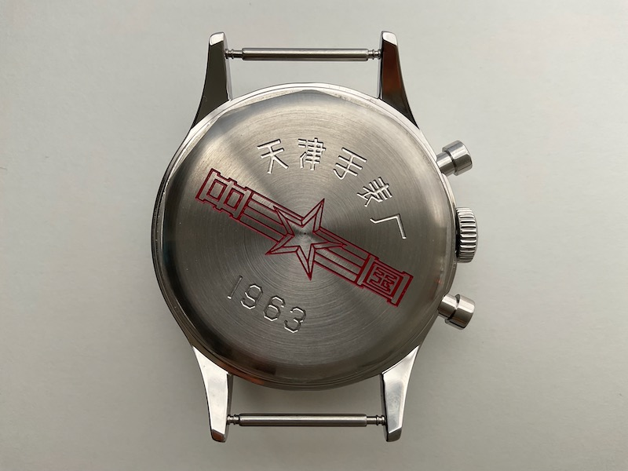

# AliExpressなら男の夢が実現できる。腕時計コレクターへの道

我が名はぴーたん。ようやく副業？のIT火消し人稼業の消火活動が落ち着いた。

今回も自分が焼死寸前だったがメンバー全員救出に成功した。火事に不思議の出火無しだと思い知った。

そんなこんなで脳味噌にいささか焦げ目と精神的ダメージがついた状態で11月11日を迎えた。

独身の日セールはこの連載として外せない。漢の夢らしくレーザービームや轟音を放つ奴が欲しい気がするが、食指が動くような物が全然無い場所、それがAliExpressだ。
まずは結婚を機に断捨離を食らったデジタルオシロスコープやら、まともに使えなそうなスペクトラムアナライザなどグラフマニアの心を大いに満たすものをポチっておいた。まとまった時間がとれたところでレビューする。

今回勢い余ってポチったのは、腕時計だ。ちょうどSNSのクラウドファンディング広告で「憧れのトゥールビヨンが16.8万円!」みたいな広告が流れてきたり、カード会員向けの情報誌の通販コーナーにアナログ腕時計が出ていたりした。
値段から推測して、これらは中国製に違いない。そして一見する限り工作精度も悪くなさそうだ。

筆者の深圳勤務時代、別チーム客先の支援で日系時計メーカーの部品工場など訪問したことがある。工場の中はちょっと状態が良くなかった。
筆者の兄も中国に遊びに来たときに、趣味の腕時計を1万円程度で数本買っていったが当時は日差5分から1分程度でおもちゃだった。

あれから15年、中国人男性の時計にかける情熱が時計製造業の技術水準をどこまで磨いたか確認してみようとして、AliExpressを探していたらイカした奴を見つけてしまった。

＜写真＞筆者と劉デスクが一発で心を奪われた漢の腕時計。漢はオトコと読みたいが、中華だからカンかもしれない。

筆者の背中に電流が流れた気がした。筆者は隠れ共産趣味者だからわかる、この製品は同類マニアが企画した本物のニセモノだ。
北京軍事博物館のミュージアムショップで買い損ねた紅焼牛肉の缶詰ミリタリー飯の横にこういうのが並んでいた。正直に言って欲しい。

そうして、筆者は中華腕時計沼に堕ちていくことになってしまった。これが案外よく出来ているので、侮れないというのが筆者の感想だ。

## トゥールビヨンが3,800円？案の定の結果に苦笑い

まず商品リストを見て、日本のクラウドファンディングで16.8万円で売られているトゥールビヨンを探してみた。AliExpressではだいたい5万円台である。

この価格差で100人集めたら、1,000万円くらいの粗利が出るはずだ。値段は3倍になっているのでよい子のみんなはAliExpressで3つ買った方が良いだろう。ただし腕は二本しかないし、嫁にグーパンくらう危険性はある。

今回の記事で最初に訴えたかったのは、こういう国際価格と国内価格の乖離の話だ。お、安いと思ったら、深呼吸してAliExpressで探してみようと言うことだ。

しかしここまで安いと別の沼にハマる、という巨大な罠があって筆者はまんまとハマってしまったのである。ミイラ取りがミイラになるとはまさにこのこと。

そんなわけで筆者が立っているのは沼の入り口である、説明書きに「トゥールビヨン」と書いてあるものを見つけた。デザインもシンプルで悪くない。その上、値段は驚きの3,800円だ。
なにかの売れ残りの訳ありでトゥールビヨンが3,800円というラッキーなら、分解して遊んでみたいし普段使いに使えるのではないかと思ってポチってみた。とどいたのがコイツだ。

＜写真＞　案の定、誇大広告だった。きっと販売店はトゥールビヨンが何であるのか理解していないのだろう

結論からいうと、トゥールビヨンでもなんでもなく、ただのテンプがシースルーで見える時計だった。値段が値段なので怒る気にもなれないので紛争は開始しなかった。

日差は平面においた状態で5秒-20秒程度と、かなり優秀。実用時計で3,800円は安いだろう。定価であればゼロが一個多くてもおかしくない。
加齢で目が悪くなってしまった筆者は時計修理を趣味リストに加えることができないので、この値段であればオーバーホール無しで使い捨てにしていくのも悪くないのでは無いかと考えた。一発目はアタリを引いた。よし、次いくぞ。

これに広告をつけて、2万円で売れたら良い商売になるだろうなと思った。

## 中華腕時計沼の魅力にはまる。ちなみに注文でも豪快にハマる

いよいよ本題の中華クロノグラフだ。2万円弱という結構良いお値段だったが、中国旅行にも行けないしということで迷い無くポチった。

注文から2週間以上過ぎた。さて、一本目のレビューを終えてそろそろ届かないかとわくわくしていたところだ。
一応事前にお知らせが届いていた中国の電源逼迫問題によるディレイ。システム上では出荷登録されていたので油断していた。
ところが突然、配送キャンセルのお知らせが届いた。

＜写真＞AliExpress運営側への対策か、システム上は出荷した体にして、時間を稼いでいた模様だ。

年末のレビュー完成に間に合わないのも困るので、目立たない別の店で似たようなものを注文した。
そしたら夜遅くに再発送の連絡が届いた。別の店で再発注したやつどうするんだ？そういうのホントやめてほしい。

この担当者ポンコツ感、中国ではこれが普通だ。だめなやつの最後の尻拭いが客にまわってくる。
中国ビジネスで購買担当はみんなこの罠で疲弊していくのだ。深圳でいまでも働いている先輩たちには頭が下がる。

＜写真＞　画面を見ていたら、「餌」と書かれていた。機械翻訳なのでわからないでもないが微妙なキモチだ

最初の店は似たような商品をあげまくって検索も汚しまくっている。声がでかい奴がのさばるのは中国あるあるパターン。
AliExpressは買い物エクスペリエンスも中国の商城（ショッピングモール）そのままで、よほど安物を割り切って買うか、ガチ中華好きでなければ許せないだろう。

## とどいたぞ、これが夢の中華ミリタリークロノグラフだ

そして、筆者のもとに念願のブツが届いた。直径40mmの少し厚めのクロノグラフ。
この時計は1963年をモチーフにしたもので、いまの中国で使われている簡字体の文字は1964年から利用開始のため「中國製造」と繁字体を使っているところがチャームポイントだ。

この時計は10日ほど筆者の机の上で動き続けているが、日差はやはり10秒から20秒と実用時計として優秀である。特筆すべきは「付け心地が妙に良い」ことだ。中華もので使用感が良いというのはあまり経験が無いのだが、これは買って良かった気がする。

青焼きの針も綺麗だし、傾けると色が変わる少しレトロなセピア色の文字盤も上品で良い。色は2色に抑えられているので、ガチャガチャ感を感じない。復古物を綺麗に現代風にまとめるとは、機械式中華時計の製造技術もここまで来たのかと妙に感心してしまった。

15年前に見かけた中華パチ物ブランド時計にあったような、線のガタガタ加減で妙に感じるパチ物感が感じられない。製造装置が良くなったのだろう。

＜写真＞　裏の機械部分を見ると、人造サファイアが7個見える。

ルーペで見る限り、2万円未満という値段を考えれば充分な過度な加工はされていないが綺麗にできている。調べてみたらやはり天津シーガル社製のムーブメントTY2901のようだ。

緩急調整ネジが見当たらないので、調整しながら使うことはできなさそうだが、値段からいってそういうものでもないだろう。

そんな具合に三週間ほどいじくり回していたら、発注のドタバタで別の店で注文したサイズ違いのものも届いた。普通だったら「やってしまったなー」と思うのだが、正直な気持ちとしては、二個目が届くのが少し待ち遠しかった。

こちらは一回り小さい直径38mmのものだ。竜頭の形状など細部は結構違うが、デザインは大体同じだ。刻印の字体は簡字体になっている。
裏側はシースルーではなく、実にうさんくさい中国の暑苦しいデザインが刻印されている。
これはいかにも中国の博物館ミュージアムショップで売っているようなチープな意匠で、土産物として雰囲気があって嫌いでは無い。

 

＜写真＞　この力強い共産デザイン　自分が子供の頃の中国物産はこのノリだったと懐かしむ

気になる日差は5秒ほど。ストップウォッチ機能を使うと駆動キャパシティが足りなくて、時計が遅れる気がするのは多分気のせいでは無い。
これも値段からいって調整しながら使うようなものではなさそうだ。こちらはちょっと付け心地が良くないのだが、柔らかいバンドに交換すれば問題ないだろう。

11/11のセールで買ってクリスマスのネタに仕込んでいたのだが、実際にはお年玉になってしまった。
またつまらぬゴミを買ってしまったとつぶやきたいところだが、共産趣味者の集まるガチ中華宴会で絶賛されそうな気がしている。

そういえば、池袋のガチ中華のカラオケで羊囓協会＆麻辣連盟総帥たちと肩を組んで中国軍歌を歌っていたら若い中国人店員さんたちから奇妙な視線で見られた気がした。
俺たち相当ズレてる。

## AliExpressで垣間見た中華腕時計沼は恐ろしく深い

実は更にネタがあった。今回購入した時計は、実は本家天津シーガルの製品のインスパイヤ()品だということだ。モデルになった本物はTY1901を使い5,500本の生産で、シリアルナンバー入りだそうである。お値段は560米ドル。
今回、遅れて届いた38mmのモデルはほぼこれのコピーである。

https://www.seagullwatchcompany.com/collections/frontpage/products/seagull-1963-mechanical-chronograph-watch-re-issued-edition-fkjb

うーん、今回もまんまとやられてしまったが、あまり後悔はしていない。そして、オリジナルのモデル名「FKJB」で検索すると世界には中華腕時計マニアという人種がけっこう居ることがわかった。かなり本気でレビューしている。

普通の商業記事であれば酷評の対象だろうが、実際に手に取ると欠点まで実に憎めない製品たちで筆者の手元で暮らすことになった。

また、1963年中国空軍クロノグラフという趣味腕時計のジャンルが発生していることが興味深かった。中国と日本のマニアとは言語を超えて仲良くなれそうな気がする。

ここまで読んで頂いた読者の方へ。コロナが落ち着いたら、北京近郊の「中国航空博物館」は空軍の地下格納庫をそのまま展示スペースにした言葉では言い表せないほど素晴らしい場所なので、ぜひ訪問してほしい。
近くにある「中国人民解放軍坦克博物館（戦車博物館）」もオススメだ。両方とも実にやる気なく、引退した航空機が朽ち果てるように転がしてあって侘びさびを感じる。

＜写真＞　大学生には軍事教練があるお国柄　軍事に対するタブー感があまりなくモノとして楽しむ文化がある

そしていま、劉デスクに「これを買え」とけしかけられているのは、金色のドラゴン模様のバリバリの中華趣味時計。こんなのを腕にはめてたら、中華マフィアの構成員だと思われるに違いない。

「いや、これに金突っ込むなら、グランドセイコー買うために貯金するよ」と返事をしたものの、酔っ払った勢いでなぜか手元に届きそうで怖いのだ。

