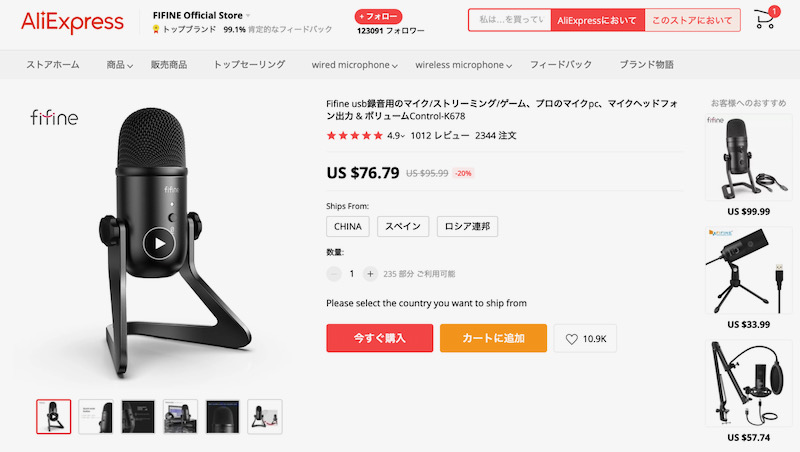
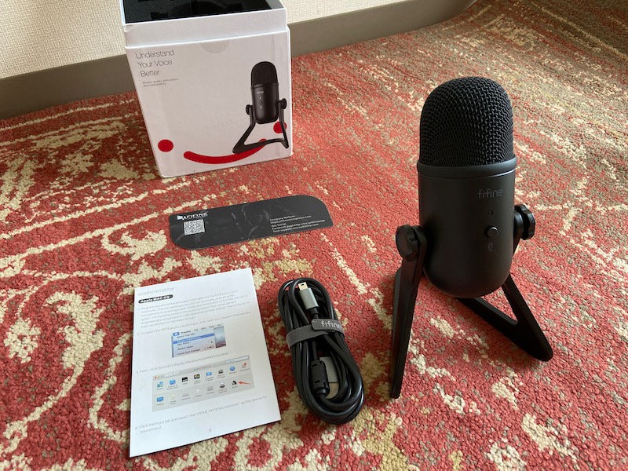
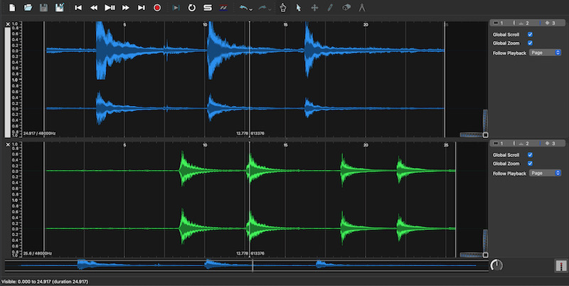
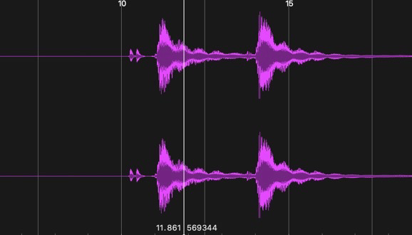
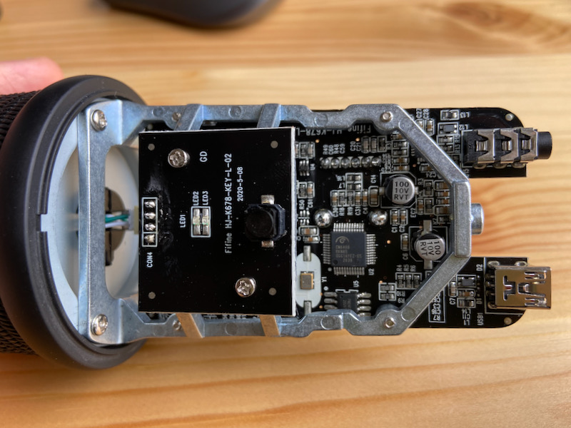
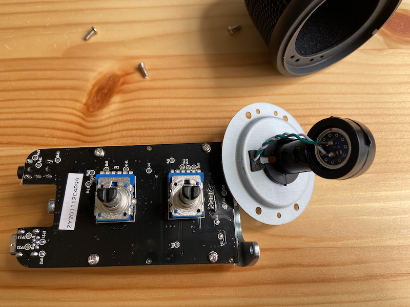
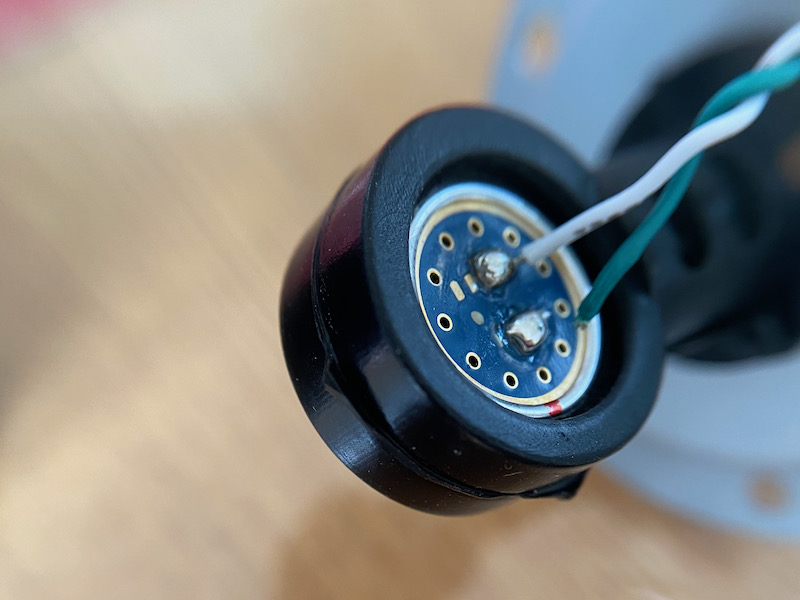
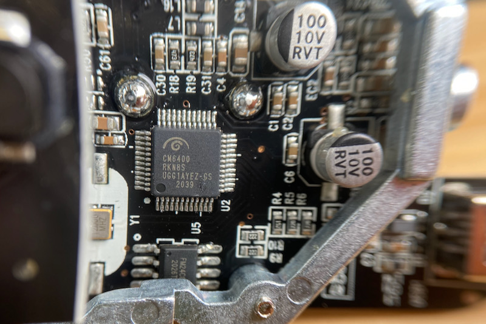

# 中華コンデンサーマイクは分解修理してからがスタートだった

我が名はぷーたん。求職活動のためWeb面接をほぼ毎日している。Web会議でほぼYouTuber状態のため、先日ついかっとなってLogicoolの「C980」カメラと「Blueマイクロフォンズ Yeti」マイクを導入した。

一つ買うと、もう一台ほしくなるのがマニアの性（さが）である。

AliExpressをぼーっと見ていたら、Yetiのそっくりさんを発見したのだ。

 

＜写真＞　たぶん、詳しい人でも間違えてポチるほど何かに似ているように思える

面白いから買って比較してみることにした。デスク劉氏は「値段高っ、案外使えたりするかもね」と予想していたが、確かにその通り「荒削りだが悪くない製品」であった。

問題は、製造不良で修理の必要があったことである。修理自体は難しくは無かったが、海外通販で良くあることということで紹介したい。

## テレワークなどリモート会議でマイクの重要性が高まった

筆者は積極的に求職活動中だが、仕事の案件が増えてきたためWeb会議を毎日数本実施している。
残念ながら直近で最終面接を終えたものは見送りになってしまったが、これだけ頻繁にいろんな人と会議をしていると気がつくことがある。

通話相手の声の音質に大きく差があり、相手の声から頭に入ってくる情報により自分の反応速度と回答品質がずいぶん違うことに気がついた。

結論としては、Bluetooth接続のヘッドフォンの相手はサンプリングレートが低いような音がする。理解するのにほんの少し余計な時間がかかる。これは自分の声も相手に対して同じように悪く聞こえているだろう。

就職は数百万円の金額の話なので、少しでも早く良い仕事を得たい筆者は、迷うこと無く外部マイクを導入することにした。再就職後も毎日使うだろう。導入したのはLogicoolの「Blueマイクロフォンズ Yeti」(アーム付属のYeticaster、以下「Yeti」と表記する)である。モニタの上をまたぐように設置することで作業スペース節約とキーボード打鍵音を極力拾わない形にしたかった。

「Yeti」についてはYouTubeなどにたくさんのレビューが上がっている。良い製品だと思うし、仕事で毎日使うなら値段はとても安い。

世の中の会社は在宅勤務の社員に対しちょっと良いマイクを経費で買ってあげて欲しい。そんなに悪くない投資のはずだ。

## 中華らしいそっくりさんを発見したので迷わずポチ

そうはいっても安い物を欲しくなるのが人間の常。きっとAliExpressなら面白い物があるに違いないと探したら、 あからさまなインスパイ「ヤ」系（パクリの婉曲な表現）の実にハオい製品を発見した。

それがこの「FIFINE K678」である。一目見ればわかる、Yetiを意識したデザインだ。おまけに接続端子もmini-USBときている。最近の中華ガジェットは端子だけでもUSB-Cにするのに、徹底してインスパイヤしているのが潔い。

＜写真＞ FIFINE K678

国際便は10日ほどで到着してしまった。

## レビュー用に測定を始めたら、いきなり壊れていた

早速箱をあけて、動作確認をする。まだAliExpressの受け取り連絡はしてはいけない。壊れていることが多いのだ。案の定故障品をつかんでしまった。

測定をしてみると、左右チャンネルの音量が派手に狂っている。イメージ上段青い波形が「FIFINE K678」, 下段緑の波形が「Yeti」である。

＜写真＞　もしかしてこういうものかと思ったが、いや違うだろということで分解を決意した。

おそらく、マイクモジュールが電気的に不安定になっているのだろうと推測した。筆者は真空管アンプを何台か製作したことがあり、アナログ回路の不調ではよくあるハンダ割れの症状に思えたのだ。

ボリュームつまみを引き抜き、底面のネジ一本を外すだけで基板は出てきた。原因は簡単にわかった。コンデンサーマイクのモジュールの根元のケーブルがハンダ不良になっていて切断されていて、軽く押し当てられてくっついた状態だったのだ。

これでマイク自体は動いているように見えるので検品をすり抜けたのだろう。もしかしたら検品はサンプリングで、動作確認は実施していなかったかも知れないが。

ケーブルの被膜を少し調整し、新しいハンダを盛ってくっつけたら、綺麗に信号がそろうようになった。

＜写真＞　上下同じ波形になった。モノラルマイクだから左右そろって当然

## 基板を眺め、音質を確認してみる

製品の造りを見てみよう。外殻部分は分厚いダイキャス製、基板を留めるフレームもダイキャスでできており、大変立派なものであった。基板も整然とパーツが配置され、一見して「出来が良い」のがわかる。基板上においてアナログ的な配慮は見えなかったが、それでも見るだけで感心する出来だ。

＜写真＞　三次元的に作られているフレームがイカす

マイクを固定する部分も180度間違えないように、嵌合の出っ張りの数を1:2に変えて組み付けミスが起きないようにしてあり、非熟練の担当者が組み立てを行ってもこれであれば間違えようがない。メカ設計者の腕も良さそうだ。

＜写真＞　キャップ部分の造りも裏側から見て良くできている

唯一、コンデンサーマイクモジュールの接続部分は断線に対する工夫があったほうが良かったと思うが、壊れていなければこんなものだろう。

＜写真＞　マイクモジュール根元が断線していたが、ハンダ付けしなおして解決した

使用しているオーディオチップは「CM6400」というCMEDIA社（台湾）のもの。DAC/ADCとUSBドライバーを内蔵している。このあたりは日本を遙か彼方に置き去りにして電脳製造業先進国となった中国ですら、台湾パーツが強いようだ。

＜写真＞ 部品の並びが綺麗で好感を持てる

音質に関しては、音の抜けという点では優秀でYetiと大きな違いを感じなかった。ただし外音を細かく拾う傾向がある。他に違いはというと、付属のヘッドフォン端子から出てくる音が少しこもる傾向があり、ホワイトノイズも比較的多めだった。

すくなくとも普通の人なら気にしないレベルで動作している。

## 結論としては、YetiとFIFINE K678のどちらを買うべきか

マイクの性能としては、FIFINEのコンデンサーマイクで十分である。直接の音の抜けは違いがわからない程度だ。ただし外音抑制のチューニングがしっかりされていないのか、執務スペース外の家族の活動や窓の外の道路の音まで丁寧に拾ってくれるのが難点ではある。

壊れていたら自分で原因を調べて、返金交渉などすることになるので、AliExpressでの購入は難度高め。少し訳ありの品物を弄るのが好きな人にとっては面白い。値段が低いのは魅力だ。

そうすると一般的には国内で「Yeti」を買ってしまうのが手っ取り早い。 「Yeti」であればポンと設置するだけで値段以外の不満は出ないだろう。値段が高い分、機能的にも優れている。

両方購入してはじめてわかるが、トラブル防止やリセールバリューを考えれば値段の差はほぼないと考えて良い。普通の人は「Yeti」を買おう。激しいのがお好きな変人は「FIFINE K678」も悪くはない選択肢だ。
