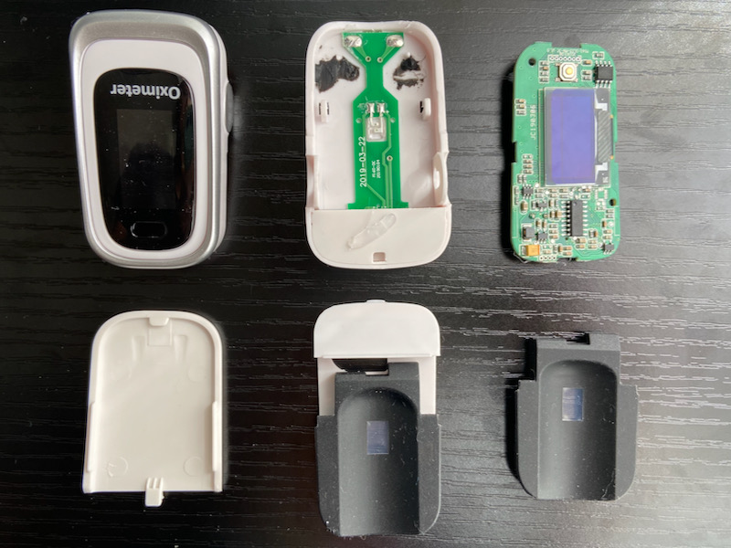
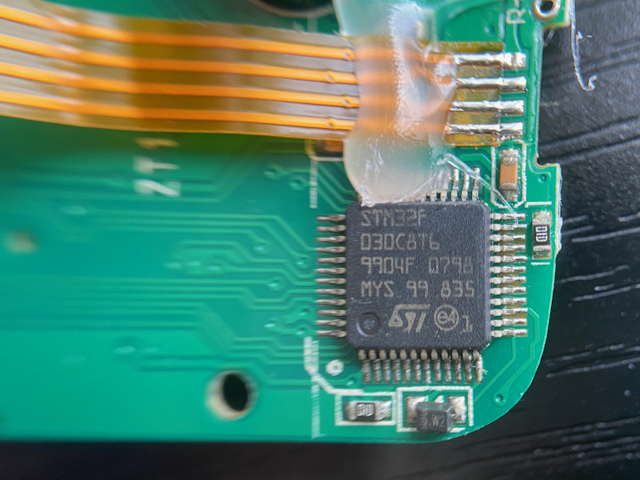

# 中華パルスオキシメーターをAliExpressで買ってみたが侮れなかった

我が名はぴーたん。IoTアーキテクトの仕事を探し一年以上無職だったが希望叶わず、初夏にようやく数件の別業界オファーがあり再就職することになった。

ペンネームは「ぷーたん」から「ぴーたん」に戻すことが出来た。しかし長期籠城戦の結果、我が家の家計は破綻寸前だ。

筆者の本職は自称データーエンジニア兼アナリストだが、周囲からはIT消防士としての評判が高い。今回も指名でお声がかかったところに駆けつけた。
現場は案の定、目立った炎は見えないが一酸化炭素中毒のようにメンバーが順番に消えていく現場で、一番やばいタイプだった。採用マネージャーも1ヶ月を待たず突然いなくなった。

息が出来ないような嫌な職場の空気の中で、もっと前向きな案件もあったのに火中の栗を拾ったことを呪いながら「この現場片付けたら、また気儘なぷーたろーに戻るんだ」と、死亡フラグを立てている。

一応、3ヶ月で初期消火に成功したが、そんな中でもAliExpressでの買い物を記事にしなければいけないと思っていた。

＜写真　今回のターゲットはコイツだ＞

8月上旬のある日。コロナ陽性者数のグラフを見た筆者はふと気がつくことがあった。病床数もたりなければ保健所のロジスティクスも飽和している。
買い物に行く小売りスーパーチェーンのニュースリリースには店舗でのコロナ発生のお知らせが並び、在宅ワークをしている元同僚もコロナに感染し入院する人が出た。
在宅で比較的リスクの低い筆者も主夫として買い物に行っている限り、コロナ感染の可能性は低くはない。

筆者はデータギークでセンサーマニアである。プローブをあてて数字や波形が出てくるセンサーとかメーターと名のつくものが大好きだ。
本職はデーターアナリストを名乗っていて仕事の基本は計測だと偉そうなことを言っているが、ただ本能的に光る奴と数字が出るやつが好きなだけだ。

いま筆者が試すべきテーマは、中華パルスオキシメーターだ。実は現行AppleWatchやGarminのスマートウォッチにはSPO2(酸素血中濃度)センサーが搭載されていて、子供時代にぜんそく持ちだった筆者の物欲が高まっていた。

国産のものは欲しいけれども医療現場優先だ。医療従事者でないと買えないという都合もある。喘息持ちのAliExpress人柱としてはいますぐ試したい。というわけでポチった。値段もおもちゃの価格だから全く期待していなかった。
結論としては、数値低めに出るものの案外使えそうだというものだった。

また、比較対象として台湾製の日本の医療機器認証を取得したものを購入した。こいつがなかなかのアタリだった。こっちだけで買い物山脈の記事が書ける気がする。

ワクチンがある程度行き渡ったので、次にパルスオキシメーターが注目されるのはアウトブレイク発生で第6波の流行になると思うが、高いものでもないので体温計の横に置いておくのもいいかもしれないと思っている。

## 先に台湾製の比較用が届いた。「Leadtek、生きていたのか！」

AliExpressでの買い物は、去年(2020)は1ヶ月から2ヶ月近くかかるものもあった。最近はずいぶん改善されてきたが、3週間は見ておいたい。とくに最近は中国と米国の間のコンテナ費用が高騰してるとかで、あらゆる物流が遅くなっている。
コロナにかかってからの注文では間に合わないこと確実だ。Yahoo,Amazon等でも同じような中華パルスオキシメーターが立派なお値段で並んでいるが、リードタイムは一週間以上。

この状況で保健所貸し出しのパルスオキシメーターが届かなかったら呼吸器系が強くない筆者は生き延びられる気がしなかった。

実はAmazonで比較用に中華パルスオキシメーターを注文したのだが、業者側が発送してくれなかったのでキャンセルして少し高価な台湾製を再注文した。台湾製は10日ほどで届いた。

届いたブツはこれだ。

(写真)

Leadtek、なんかどっかで聞いたことがある名前だ。筆者の脳内にあるのは25年前のアキバのATショップ勤務時代にあるあの会社だ。
ついこのあいだまでグラボでたまに名前を聞いていた。最近ちょっとグラボで名前聞かないなー、しかし同名の別会社か？と思って調べてみた。

予想外にも同じLeadtek社で、現在はコンシューマー向けグラボよりも、GPUと画像解析技術をもとに医療情報分析装置などスマート医療に軸足を移していたのだった。

https://www.leadtek.com/jp/about/region/

パルスオキシメーターの製品については、2019年にAlvital社を買収して医療IoT事業に参入していたということだ。そして今回購入した 「8D01B」は日本の医療機器認証も取得している。

台湾医療機器メーカー Leadtek 日本医療機器認証取得済 パルスオキシメータ「8D01B」の販売を開始
https://www.nikkan.co.jp/releases/view/122262

動作確認に指を差し込むと、96%付近からだんだん数値が安定していき、深呼吸をしながら呼吸を整えると100%に達した。

「Leadtek、生きていたのか！」とすこししんみりしながら、医療機器メーカーと新聞に書かれるようになってしまったかつての頼れる相棒に複雑な心境だ。
念のためLeadtekのグラボを通販で探してみたら、日本ではほとんど終売となっているようだった。

PCマニアだったら、無用なリスクをとらず素直に付き合いの長いLeadtekの製品を買っておくのがオススメだ。
説明書を読んでも25年前のような英語のペラ一枚ではなく、安心感も完璧だった。

## 忘れた頃にやってくるのがAliExpress し8かし製品は予想外にまともだった。

秋葉原で中華パルスオキシメーターが山積みで安値販売されているというニュースを見かけた。
AliExpressでもAmazonでも中国発送でえらく時間かかるので、結論としては周囲にコロナ疑いが発生したら秋葉原にダッシュするのが最適解だ。
私の注文した中華パルスオキシメーターはLeadtekの記事書き始めてもまだ来ない。今回は夏休みの自由研究のつもりだったが夏休みは終わってしまった。

そして仕事でかなり酸欠状態だったので到着予定日をとっくに過ぎて待っていることを忘れていた。到着予定から10日オーバーで中華パルスオキシメーターが到着した。

箱を開ける前に気がついたのは、いままで引いてきたハズレのやつとはちょっと違うぞという直感である。箱は配送の都合でボコボコではあったが、印刷されている文章は非常にまともだ。

(写真)

箱をあけて、マニュアルを確認する。構成は以下となっている。これはわかっているプロのマニュアル製作者が作っていると一発でわかるものだった。

＜写真＞　あれ、要点を押さえていて、結構まともかもしれないと思うマニュアル

1. Safety
2. Introduction
3. Installation, Setup and Operation
4. Maintenance
5. Specification

本体に電池をセットし、電源を入れて指を差し込むと、測定値が表示されはじめた。Leadtekよりも1%ほど低く表示する傾向があるが、息を止めたり深呼吸したりすることで変化を見ている限りでは家庭用としては充分かと感じた。
数字はがんばって測定しまくっても100%に達しなかったので、読み替えでプラス1%すれば大丈夫だ。

ではお約束の分解タイムである。プラスチック外装の精度は高くないので、簡単に爪がひっかかる。

ユニット接続用のフレキシブル基板をハンダ付け部分で破壊してしまったので直すのが面倒だが仕方ない。
この手の製品は分解修理することは考えられて無く、調子悪ければ即交換である。

基板のパーツ配置は整然としていて、ある程度きっちりした性格の設計者がCADを引いたのではないかと思っている。精密な両面スルーホール基板で、よく出来ているなと感心する。

CPUはSTM32Fであった。たぶん1個0.7ドルくらいだと思うのだが、市場販売価格1500円程度の値段に使ってばらまけるのはすごいと思う。

＜写真＞　最近の組込系で良く名前を聞くSTM32F 

心臓部のチップはFitfaithというプリントだった。この名前を調べると、深圳にあった筆者元職場の隣町「街道」が出てきた。記憶では殺伐とした工業地帯である。いまでは大発展しているのであろう。

http://www.fitfaith.com.cn/cn/product/Oximeter-m170.html

高速道路の未整備だった昔の記憶だと有名な華強北路からは車で1時間くらいかかる場所だが、案外このあたりが深圳の核心部になっているのかもしれない。
筆者の働いていた工場は、となりのエプソンさんとまとめて住宅およびショッピングモールになっている。

## まとめ　アキバで見つけたら一個買っておいてもいいかもしれない

いままでAliExpressのエレクトロニクスものでハズレを引きまくってきた筆者だが、ようやくそこそこ値段相応のものを引き当てた気がしている。
同じ製品と思われるものが大手ショッピングモールでも売られている。こちらのルートだとお値段4倍だ。

このパルスオキシメーターであれば、日本の医療機関であれば恐ろしくて使わないだろうが、発展途上国であれば値段の安さもあり充分に実用になるだろう。
家庭用としても一個くらいあっても良い気がしている。ワクチンが済んだとはいえ、コロナにかかってこの製品にお世話になりたくはないが、一個もっていれば家族知人の緊急時に気休めになるだろう。

さいごにお詫び。内部写真撮影で一個ぶっこわしてしまったので、台湾製Leadtekのほうは万が一のアウトブレイクに備えて分解する勇気が無い。弱気でごめんなさい。

