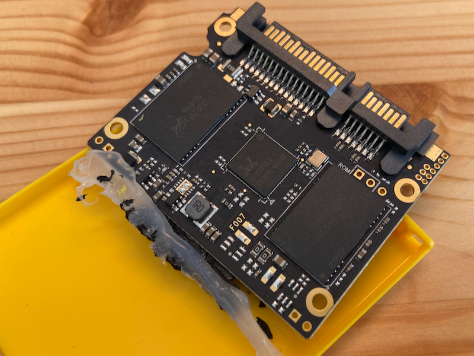

# レアもの中国市場向けUSB-C 外付けSSDドライブを試す。激レア蟹との遭遇


みなさん、KODAKという会社の名前を最近聞いた覚えがあるだろうか？デジカメネイティブ世代の若手の読者の方は存在すら知らないかもしれない。

KODAK社はフィルムカメラ時代の巨人企業であったが、イノベーションのジレンマでデジタル化の波に対応しきれず、いちど倒産してしまった。

そのブランドが切り売りされて中国でひっそりと生きていたのだ。「なんだこれ、黄色いパッケージがかっこよくてイカす、さらに胡散臭そうだ、逝け」と煽られたので、早速AliExpressでポチってみた。


＜写真＞ブランドカラーの黄色いパッケージ

# ぷーたん　まだ無職

我が輩はぷーたん。2月でぴーたんに名前を戻すはずだったのだが、採用最終試験をクリアした会社が突然の会社都合で4月まで採用フリーズすると言い出したのでまだ無職である。契約書サイン前なので反故にされると思っている。
他の会社も最終段階で全滅(1ヶ月ぶり二度目)だった。

最近は弱気になってきて、ライスワークとして不本意な仕事も受け入れなければいけないかと思い始めている。そのため、不安を紛らわすという名目でリモート面接用に単体Webカム（Logicool StreamCam C980)とコンデンサーマイク(Blue Yeticaster)を導入した。


あとは背景にホワイトボードを置く場所があればデータ分析エンジニアのリモート仕事環境としては完璧である。


＜写真＞　あくまでも面接用なのだが、友人たちからは就職せずにYouTuberになると思われているようである。面接は超快適。

リモート基本で働いているIT系企業の人でも、カメラやマイクをケッチっている人は意外と多く、ライティングまで含めて快適な環境を作っている人は数多く面接した限りではまれである。


AliExpressでは、ネタ探しのためいろいろ買い物をしている。デスク左右リングライト用のフレキシブルアームなどのほか、日本では高いチタン製の食器や、Facebookで広告が出ていた携帯スタンドを買ったりネタ探しに余念がない。

Facebookなどでガジェットの広告を見つけたらAliExpressで探すと数分の一の価格で大抵みつかる。もちろんオモチャで即座にゴミ箱行きだった。広告見て欲しくなったらAliExpressで探す、という習慣を持つことで浪費の金額を大きく削減できる。


実を言うと、もう一つカッとなってAliExpressで購入したものが文頭で紹介したKODAKブランドの外付けSSDドライブだ。その黄色いパッケージに、なつかしの恋人に出会った気がしたのだ。


## まずは分解だ、と思ったら分解できなかったので測定からスタート

箱をあけると、案の定チープな外観の本体が出てきた。樹脂の質感があきらかに安い。


買ったらまず分解したうえで、電波法がらみで利用可能か確認するのが我々AliExpressチャレンジャーのデフォルトなので分解にチャレンジしてみたが、背面にネジとそれを隠すパーツもなく、完全はめ殺し構造になっていてまったく歯が立たない。

のこぎりで破壊しながら分解しようとしたのだが、実況を見ていたデスクの劉氏から待ったがかかった。

この外付けSSDドライブは金属ケースで覆われていて、機能的にもおそらく電波法は問題ないだろうと、不本意ながら分解せずに電源投入してケーブルをBelkinのThunderbolt3　40Gbps対応のものを用いて速度計測してみた。

高速を唄っているものではないのだが、USB3.1のSSDにしては微妙に遅い気がする。SATA3ならせめて500MB/sくらい出て欲しい。SATA2なら280MB/sぐらいが天井だと思うので謎のもっさり感がある。

きっとコントローラーが悪いに違いない。


＜写真＞　測定結果

## もう一度分解にチャレンジしてみる。そこで見た物は、深圳湾で有名なアレだった。


もはや外観に未練はないので、硬い殻をぐりぐりすること30分。樹脂部品がぼろぼろになりながらも、ようやく内部の爪が外れるタイミングがやってきた。そして筆者が見た物は、うれしくない蟹だった。


＜写真＞　蟹発見！


黄色い蟹か、深圳の蟹は蟹でもこの蟹は食えないやつだよなと落ち込んでいたら、 「こいつは相当レアものが釣れた！」と、デスク劉氏が大盛り上がりしてくれた。


しかしこの蟹に泣かされたことは両手の指で数え切れない。まずアキバのショップ店員時代も蟹のNICカードはトラブル数ぶっちぎりだった。

IP電話機の開発チームと同居して仕事していたときのある日、いつも徹夜明けの先輩がこんなぼやきを吐いてきた。

「ぴーたんくん、ちょっとこの画面見て。この蟹のEthernetコントローラーチップなんだけどさ、仕様書に書いてあるように信号入れてもどうやってもうごかなくて、出力にスペクトラムアナライザつないだんだけど、やっぱり信号出てないんだよ」

PCヲタクの世界に悪名をとどろかせていたので、最近みかけないと思ったらどっこい案外生きていたのだ。筆者がしらないだけだったかもしれないが、株価も絶好調だ。

話は変わるがこのSSDドライブが生産されたと思われる深圳はつい50年前まではのどかな漁村で、香港との間の海ではいまでも黄油蟹といわれる抱卵した青蟹が有名である。
筆者が深圳に送り込まれていた20年前は実に治安の悪い場所で今とは全く違う街だが、その頃も今も変わらず海鮮が旨い。


深圳の蟹は遠浅の海で育ち、熱帯の暑さのために卵が蟹の体中に回ってしまい中が真っ黄色になるという。これは高級品なので庶民の口には入らないが、少し品質が落ちるものであれば庶民でも食べられる。


＜写真＞　深圳湾エリアで食べた「安い黄油蟹」中身は黄色い蟹味噌が入っている


他にもチップと基板を見てみよう。VLI(VIA Labs, Inc.)の　VLI716 SATA 6Gb/sスペックのUSB-C Bridge controllerである。製造は2017年9月だった。
裏面には25MHzの水晶発振モジュールがついている。


＜写真＞　USB-C Bridge controller。基盤は結構よく出来ている気がする

メモリユニットは振動対策でボンド留めしてあり、ユニット上に実装されたマイクロンのNW946 NAND FlashチップをRealtek RTS5733で制御している。RTS573xのチップ自体は500MB/s以上出る製品にも組み込まれているようなので、ここがボトルネックになっているとは考えにくい。
USBブリッジコントローラーも、メモリのコントローラーも500MB/sくらい出るはずのものなのに、微妙にもっさりした結果は気に入らないが、ストレージ用としては十分という判断なのだろう。



＜写真＞　SATAのSSDモジュールをそのまま乗っけました、以上みたいな

RTS5733のデータを探すと、ロシア語の資料ばかりひっかかるので、その先の探索は諦めた。
中国語の資料をあたっても、中国でもレアものという位置づけらしくPC廃人が収集対象にしているくらいしかわからなかった。
どこかのピンをプルアップかプルダウンすると全速力が出るとか期待したのだが、魔改造は次回のお楽しみだ。もしかしたらチップサイズが小さい性能押さえた版なのかもしれない。


意外なことに問題のコントローラーチップは、デスク劉氏による近似モデルRTS5731の紹介記事が2016年にあった。
RealtekのRTS5731も5733もADATAのSSDで採用された情報は見つかったが、商業的に成功しなかったようだ。

Realtekはリーズナブルな価格が売りの部品メーカーだが、採用は広まらなかったようだ。

https://pc.watch.impress.co.jp/docs/news/event/1003349.html


KODAKという憧れの美女に再会したら、いまの彼女の現実を見てしまった気がした。そのKODAKブランドのSSDがどういう位置づけなのか、少し追いかけてみた。


## イノベーションのジレンマに、人生の酸っぱさ塩っぱさを感じる

KODAKのSSDを検索すると、主に中国で売られていて、そのほか東南アジアやブラジルなど新興国のマーケットに存在している。

化粧箱を見ると、「Dexxon Groupe」というフランスの会社が書かれていた。住所をたどるとパリの北側の倉庫地帯の卸売り業者的な場所だった。

製造していると思われる中国のオフィスは深圳の龍崗区というところの工業区だった。FuturePath（置富科技）という会社でSSDを主に生産しているようだ。

そのものずばりな製品があった。速度も実測値そのままであった。

```
ZF-Type-C SSD X250

Performance: Type-c USB3.1 Gen1 
Read: up to 330 MB/s
Write: up to 290 MB
```

どうやらKODAKのロゴをつけるとある程度売れるマーケットがあると認識されているようだ。しかしそれはフランスなど先進国ではなく、あくまで中国向け。売り場で目をひく付加価値をつけるためのものだと推測している。


アメリカ消費財ブランドの代表の一つだったKODAK社は倒産後にブランドだけ切り売りされたようで、多産多死の中国でまさかの運命の再会をすることになるとは思わなかった。

製品的には中国でもレアなチップをつかっているというだけで極端なチャレンジにならない購入だったが、予想外の品物が転がっているのがAliExpressの楽しみの一つだ。あまり過激なオチもなかったが、ご利用は計画的に。

