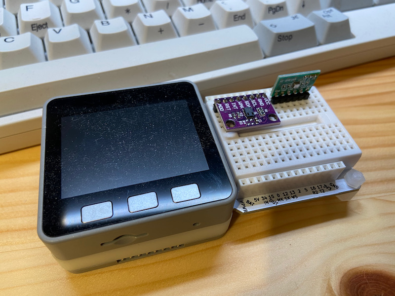

# 安物CO2測定器は地雷だらけだから注意して！AliExpressで買った物を分解した

我が名はぷーたん　5月にクビになってからいまだに無職である。

春にクビになってソーシャルからディスタンスされ、ぷーたろーのまま年越しした。年末に3件3日連続で最終選考落ち連絡を食らった気分はなかなか爽快だった。

そんな中で、金が無いとAliExpressの価格はとても魅力に見えてしまう。毎回外れを引くことにつけては我ながら引きが強いと感心するのだが、冬本番に向けてまたつまらぬゴミを買ってしまった。

そのゴミと同じような商品がAliExpressのみならずAmazonにもたくさん並んでいるので、注意喚起の気持ちで執筆した。
結論から言うと、安いCO2測定器には十分注意してほしい。少し値が張るが後述するNDIR方式のものが無難だと思う。

＜写真＞端的にいってゴミだったCO2測定器

そして、今回は売主に3週間かけて気長に返金交渉をするというチャレンジをしてみた。結果が気になったら最後のほうまで読んで欲しい。

最後にネジを外して分解した結果、妙に納得する結果となった。

同じような外観の製品はAmazonでも5,000-8,000円の価格帯で販売されている。購入の際は十分に気をつけて欲しい。

## コロナ流行の環境で、換気の目安が必要になった。

ちょうど、換気の目安としてCO2測定器を導入したという飲食店の記事を見た。
我が家のアネサマもオフィスの換気が気になり、会社用にCO2測定器が欲しいと言い出した。センサー単体なら我が家に転がっているが、これを会社に持って行かせたらいろいろトラブルがありそうだ。

というわけで、製品としてのCO2測定器を我が家に追加することにした。

また冬といえば鍋シーズン。カセットコンロの活躍する季節だ。
この連載の初期アイデアも、10年ちょっと前に中国から帰ってきたばかりの筆者の殺風景な1Kの部屋で、アマゾンのぺらぺら段ボールの上にコンロを置いて鍋をやっていたときに生まれた。

Impress Watchのサーバを管理しているK氏が「ついうっかりポチって失敗したやつを晒すサービス作るのだ。サービス名はポチっターだ！」と妙なテンションで繰り返していた。
きっと、そのときは密室カセットコンロ鍋で換気わるく、CO2の濃度が上がっていて頭おかしくなっていたと思う。我々の間で「頭おかしい」は最大の褒め言葉だ。

＜写真＞カセットコンロを使うと窓をあけているにもかかわらず、あっというまに1500ppm付近まで行ってしまう

CO2濃度があがると頭がおかしくなると書いたが、あながち嘘では無い。簡単に言えば冷静な判断ができずに事故を起こしやすくなるのだ。
たとえば自動車の内気循環・学生で一杯の教室や締め切った会社の会議室で眠くなる経験がある人も多いだろう。 厚生労働省の資料にもこうある。

「二酸化炭素は、少量であれば人体に影響は見られないが、濃度が高くなると、倦怠感、頭痛、耳鳴り等の症状を訴える者が多くなることから、また、室内の二酸化炭素濃度は全般的な室内空気汚染を評価する１つの指標としても用いられていることから、二酸化炭素の含有率は「百万分の千以下」と定められている。」

https://www.mhlw.go.jp/shingi/2002/07/s0708-1.html

筆者はもう手出し無用と思っているが、25年くらい前のオーバークロックの基本はペルチェ素子に炭酸ガス冷却か液体窒素冷却だった。
そんな旧世紀の冷却テクノロジーを使っている人はもう居ないと思うが、CO2測定器はご家庭でも案外有用である。実測であるが6畳の筆者の居間に二人入って窓を閉め切ると、CO2濃度は簡単に1000を超え1400程度までいってしまう。
夕食のときに鍋をつつけば一瞬で上がる。それどころかテレワークで仕事しているだけでも基準値を軽々超えてしまうのだ。

屋外の新鮮な空気であれば、筆者の実測で430ppm程度をさすはずである。
https://ds.data.jma.go.jp/ghg/kanshi/ghgp/co2_trend.html

仕事のパフォーマンスを維持するために、仕事環境はCO2濃度1000ppm以下でキープしたい。我が家のアネサマは1,000ppmを超えると「空気がよどんでいる」と気がつくようになった。

そういえば以前の職で職場の空気が悪く、筆者含むチーム員が半年で半分メンタルダウンしたことがあった。測定器計測したところ750ppm付近だった。つまり悪いのは空気ではなくマネージャーだった（のちにパワハラで降格）。何事も信頼できる数字を元にして判断する必要がある。

## CO2測定器には当たり外れがある

筆者宅にはすでにCO2測定器が2台、AliExpressでセンサー(MH-Z19B)を買ってArduinoで自作したものが2台、単体センサーで転がしているものが数個ある。

筆者のアパートに居室は3つあるのだが、寝室に置く手頃な測定器が無かったためもう一個追加しようという算段だ。似たようなものがゴロゴロするのはアキバ系ジャンク屋の性癖だからしかたない。
パーツは複数あるのに、家で使うのに適したパーツというものが微妙にないのは同感いただけると思う。

そんなことを考えていたら8月ごろに前の職場の先輩が「Amazonで測定器を1個かったら5個とどいて、返さなくて良いと言われたので一個あげる」と言われていただいたのだが、実際に使うと数値がぐちゃぐちゃ過ぎて申し訳ないけれど捨ててしまった。

実際に使ってみるとデザインは良いものの数値がまったく信頼できず、数百ppm高かったり低かったりで実用にならなかったのだ。
写真で左上の測定器は602を指しているが、いただいた測定器は407を示している。この写真を撮ったときはまだ良い方だったが200の数値は誤差と考えるのは厳しい。

＜写真＞　外気でキャリブレーションすれば430ppm程度を示すはずなのだが、キャリブレーションはできず工場出荷に戻すだけだった

5個送ってきて返品不要、という理由は、おそらく大クレームが発生したので廃棄するにもコストがかかるので、大量に送りつけて処分する方針だったのだろう。
今思えば、これは粗悪品が蔓延する予兆だった。

## CO2測定器は案外お高い。普及にはコストの壁を乗り越える必要がある

最初に買ったCoxfoxブランドの測定器は換気状況と数値が納得いく相関関係を示した。
我が家のアネサマがお気に入りになってくれて、もう一台あっても良さそうだったのだが残念ながら廃盤になっていた。
Amazonを見たらいままで見たことの無いものがたくさん出ている。

Amazonで買うにしても、もの自体はAliExpressと同じであれば、急いでいるわけではないのでAliExpressで購入することにした。
以前は気がつかなかった総揮発性有機化合物（TVOC)が計測できるものもある。そして安い。
赤外線を使ったCO2センサー（Non Dispersive Infrared:NDIR方式）はセンサーモジュール自体が高価なので、パーツコストから逆算すると少なくとも1万円くらいになるし、消費電力が案外大きくバッテリー駆動ができない。

＜写真＞NDIR方式のセンサーを使って作ったCO2環境測定器。金色のセンサーがお高く、組み込み用としては電気を馬鹿食いする

3000円程度で完成品価格にできるような安価なセンサーモジュールができたのだろう。
これが実用になるのであれば、筆者がこそこそやっている不動産管理向けIoTでコストの問題をクリアできるということでポチってみた。

ここで書いておくが、よい子はまねしては駄目だ。この連載は基本的に人柱チャレンジなのだ。

買ったのは製品と、センサー単体である。センサー単体は台湾から郵送だったので結構早く到着した。
今回問題となっている製品のほうは一ヶ月ちょっとで、ようやく手元についた。

## わくわくの製品レビューだが、いきなり駄目なやつだった

待ち時間は結構かかったが、届いた。2020年夏頃よりは配達リードタイムがずいぶん改善された気がする。

箱は中華製品にありがちな無駄に虹色の色彩センスを感じない中華デザインである。
25年前に、アキバのAT互換機屋の店員として地雷パーツばかり見てきた筆者の本能が「こいつ絶対やばい」と訴えてくる。
だって当時とデザインが変わってない。そして箱の左下に書かれた「RoSH」の文字。普通は「RoHS」(危険物質に関する制限令)と書かれると思う。

箱から出てきたのはあきらかにチープな金型で作られた測定器。

＜写真＞じつにハオいイカしたデザインの箱だ

mini-USBで電源を供給し、電源投入する。筆者がひとりでいる部屋は大体500-800ppmを示すはずだ。ところが盛大におかしな数値をたたき出す。

ベランダで外気を使いキャリブレーションを行うが、測定値のオフセットを設定するのではなく、たんなる工場出荷戻し(Factory Reset)と書いてあったので、あまり期待しなかったが状態は改善しなかった。

＜写真＞筆者の居室はふだん500-800 ppm程度。購入した測定器は1451を示していた。

しかたないので、キャリブレーション済みの測定器と並べておかしな数値を示す写真を撮り、セラーに対し 「たぶん初期不良なので返金してください」と連絡した。
そうすると不良の証拠となる動画を送れという。

AliExpressのアプリには動画は登録できないので、結局YouTubeに30分以上の動画をアップしてリンクをシェアするみたいな作業が発生し、もうこの段階で時給割れの「安物買いの銭失い」だった。

ちなみに案の定であるが、セラーからの連絡はここで途絶えた。まあいい、分解が済んだら紛争を起こしてやる。「貴公の首は（以下略）」と心の中でつぶやいてドライバーを手にした。

## 仕方ないので分解する。3000円のCO2測定器の中身はいかに？

前出のK氏に昔言われたことがある。「買ったら電源いれるまえにまずバラせ」と。もう未練はないので分解して楽しむことにした。

ネジは二個であっさり分解でき、シンプル極まりない中身に感心することになった。

＜写真＞ケースをあけて基板と対面　

中身を簡単に説明しよう。一言で言えば工事現場で土を運ぶ手押しネコ車みたいな代物だった。

丸い円筒形の部品がおそらくTVOC（化学物質要因）センサーである。ルーペで見ても型番は書いてないので、おそらく出所不明の怪しいやつだろう。

チップは2個乗っかっている。一個はLCDドライバー。もう一個はA/Dコンバーターでセンサーのアナログ信号をデジタル信号に変換するものである。

USBのコネクタはついているが、シリアルコントローラー的なものやプログラマブルなものは一切ないので、単なる電源として使うだけのもののようだ。
生意気にも、基盤は両面スルーホールのガラスエポキシ多層基盤である。コンデンサーや抵抗器はチップマウンタをつかったほうが生産コストが安いのであろう。
中国の電子製造業の底力を感じる。

品質の悪いセンサーにLCD表示を直結しただけのもので実用になるレベルでは無い。製造コストは予想で500円くらいだろうか？
アマゾンでも同じものを売っているから、この外観のCO2測定器を見かけたら手出しは無用だ。

むかーし、日本の有名オーディオアクセサリーメーカーのブランドを信じて高校生時代のなけなしのお金をはたいて買って分解したら、同様のゴミだったことを思い出した。
定価に対する利益率は95%くらいだったであろう。
日本にかぎらずどこの国にも、誠実な商売をしない人たちがいるというのがよくわかる経験だった。別に中国だからというわけではない。

## こんなこともあろうかと、もう一個別の単体センサーを買っといたが

AliExpressで何度もババを引いている筆者だが、工作用の電子部品を買う時はほとんどトラブルがない。

いまどきハードウェアを設計するのは中国や台湾に行ってしまったので、むかしアキバで全部そろったような細かい部品がAliExpressのほうが容易に買えたりする。
台湾の台南あたりの地方都市のパーツ屋でさえ、最近のアキバのパーツ屋の品揃えを凌駕している。

バックアップの部品は台湾からやってきた。これは完成品ではなくたんなるセンサーモジュールである。
筆者の「男の楽園」と呼ばれるジャンク箱にはちょっとした部品が転がっているので、ちょうどジャンク箱の中に入っていたM5Stackでセンサーモジュールをぶっさして簡易測定器を作ることにした。

＜写真＞M5StackにCCS-811を組み合わせてブレッドボードで動かそうと準備を始めた

筆者が購入したのはCCS-811というセンサーモジュールの互換品だ。正月はこれをいじくって遊ぶつもりだった。データシートを見ると「48時間エージングせよ」という記載があった。

もしかして駄目な測定器も、エージングを行えば少し改善するかもしれないと思ったので、正月は駄目だった測定器側をエージングしつつ引きこもりに専念した。

結果としては改善がみられず、CO2測定器としての活用は諦めることとなった。

## 紛争を行わないで解決できるかどうか試してみた

前回の記事のコメントで、「いきなり紛争起こすのは良くない」というコメントを頂いた。
前回の例ではタイトルで確実に欺す前提の記載だったので即座に紛争を起こしたが、今回は単に外れを引いただけの可能性もあるので穏便にすすめた。

穏便にすすめると、どういう展開になるか学習することができた。簡単にいえばたらい回しをくらい時間を浪費することになるのだ。

20日かけてやりとりした結果をお目にかけよう。説明をしていくと相手の反応が止まる。再度打診すると、毎回おなじ定型文を送りつけてきて振り出しに戻されるのだ。
なんというクソゲー。

＜写真＞完全に遊ばれてる

同じテンプレメッセージを二回くらったら、相手はまともに対応する気は無いと考えて紛争を起こすのが正しそうだ。

## まとめ CO2測定器を買うときは方式に注意だ

飲食店などで換気をしなければならないところで、CO2測定器を買おうとしている話はたまに聞く。
いまはCO2測定器の需要バブルが起きているので、今回筆者が購入してしまったような粗悪品がアマゾンあたりにあふれているのは想像に難くない。

いまこそ、買ったら速攻でバラして確認し、SNSなどで情報シェアして買い手の権利を守る時代なのかもしれない。

筆者の現在のおすすめは、NDIR方式(赤外線)を利用とうたっているもので、値段は1万円オーバーになるが、使えなければ元も子もないのでちょっと安全そうなものをお金で解決して欲しい。

返事がこなかったセラーの担当者メッセージのやりとりは遅々として進まない。「貴公の（以下略）」また紛争開始である。やれやれ。

今回、これを買えば安心という推奨品を提示できないのが非常に恐縮なのだが、サクラレビューに迷わされないように気をつけてCO2測定器を選んで欲しい。

