# 唐揚げ屋さんが本気で作ったアームレストを試してみた

我が名はぴーたん　今日もIT消防士として炎上現場での人命救助を行っている。桜の咲く4月、やばい現場から命からがら脱出した。
一緒に働くチームメンバーのほぼ半分を休職・退職で失った。完全な人災の現場では自分の安全を守ることが第一だと痛感した。
次の現場もかなり手強そうだが、命あるかぎり人命救助を続けるつもりだ。

そんな戦場を異動する合間で床に倒れ込んでいたある日の昼間、PC Watchの劉デスクから連絡が来た。

「唐揚げ屋さんの店主さんが開発した謎のアームレストがあるらしいんだが、レビューする？」

一体何を言っているのか即座には理解できなかった。

唐揚げ屋さんの店主からのレビュー依頼文はこんなテキストだった。

```
”このたび、ダイナミックアームレストというボールキャスターを付けたアームレスト （リストレスト）を作りました。

特長は、腕を浮かす手間なしに、キーボードとマウスを行き来できるアームレストということです。

従来品は、固定式のパッドか、機械式の肘を支えるものでしたが、これだと、動きに追従してくれない、可動範囲が限られる、といった短所がありました。

それを自分で創ってみたわけです。”
```

ぴーたんは中華ガジェット以外にも中華フードライターの仕事もしている。そして劉デスクは唐揚げにはスーパーうるさい。なにしろデスクはKFCの中国第一号店北京店で当時の激旨地鶏フライドチキンを食っている男で、唐揚げの話をしはじめると止まらない。
レビューのテーマとして唐揚げがメインなのかガジェットがメインなのか良くわからないが、最終的に唐揚げのレビューになってしまってもいいやと了承した。

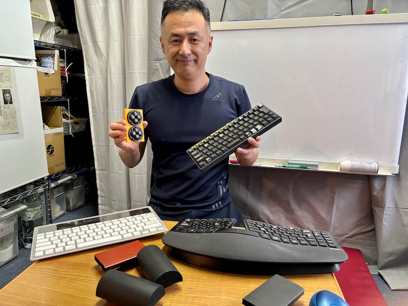

＜写真＞　「スイッチを選べるキーボードはあるのに、なぜキートップ間のピッチを選べないんだ」と、本題に入る前から全開で熱く語る篠田氏


### 圧を感じる唐揚げ屋さんの口上


アポの時間の少し前に到着し、店舗写真撮影をしたが、店に貼ってある唐揚げ屋の前口上的な文章にエスプリが効いていて店主が持つ斜め上の方向の才能とパトスを感じる。
私がレビュー記事を書くより、本人が書いた方が文章上手いんじゃないか？と冷静になってしまった。

その文章の一部を引用しよう

孤高のからあげ　本人真剣録　No.00003

```
”ときどき、曇天から一条の光が指すが如く、救世のアイデアを思いつく。
しかし、言う相手が居ない。いや、正確には、居るんだが、聞こうとしない。
そんなときは、「ああ、私は死後、評価されるほうなんだな。」と神が決めたシナリオにブスーっとなるのである。”
```


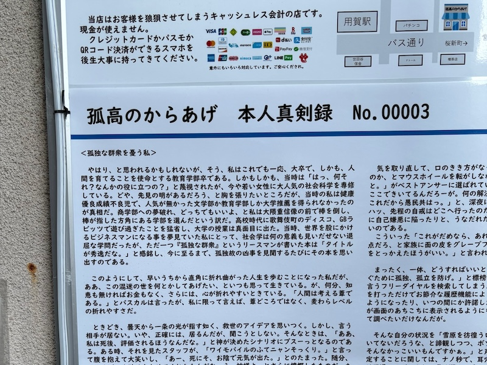


＜写真キャプション＞No.の固定長5桁から推測するに、このエッセイはあと9万9千件+まで執筆できるように桁数設計されてる奴だ。宇宙英雄ペリー・ローダンの長編シリーズも真っ青だ

この長文を最後まで読んだ筆者もどうかしていると思うが、この文章を見る限り、唐揚げ屋さんではなくハイパワー系の凄腕エッセイライターにしかみえない。本当にアームレストの取材になるのだろうか？

しかしここまで来てしまった以上、後には退けない。案の定、事務所に上がった瞬間にアキバの裏通りのレジ前のような光景を目にすることになった。

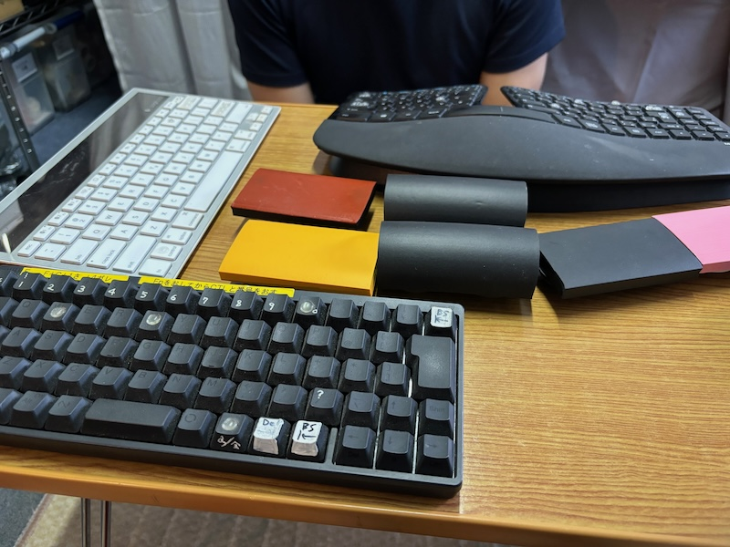


＜写真＞インタビューを始めた瞬間に使い込んだマニアックなキーボード（HHKを含む3台）が出てきた


「予想以上にやばいところに来てしまった」と気がついた筆者は再び戦意を喪失した。


### 可動式アームレストについての不満


店主の篠田氏は唐揚げ屋店主とは別の顔で、文筆の活動をされているということだった。このアームレストは店主が原稿執筆に向き合う中で、少しでも集中力を途切れさせないために自作した卓上可動式アームレストだった。キーボード作業を正確かつ素早く行うためにカスタムされた治具を、生業とする唐揚げ屋で頒布していると表現したほうが正確である。

ここで読者の皆様に注意したいのは、この手の治具は万人が求めるものではないということだ。キーボードの高さ、マウスの高さ、机の広さなどPC作業の最適化には考慮すべき無数の変数があり、作業者の肩幅や座面から肩の高さ腕の長さもすべての人で違う。

細かいポジションのズレに我慢が出来る・または気がつかない大多数の人と、我慢ができないごく少数の人がいて、このアームレストは後者のためのものである。自分に合わないと思ったら自ら加工改造して目的に合わせるのが基本だ。すなわち治具である。


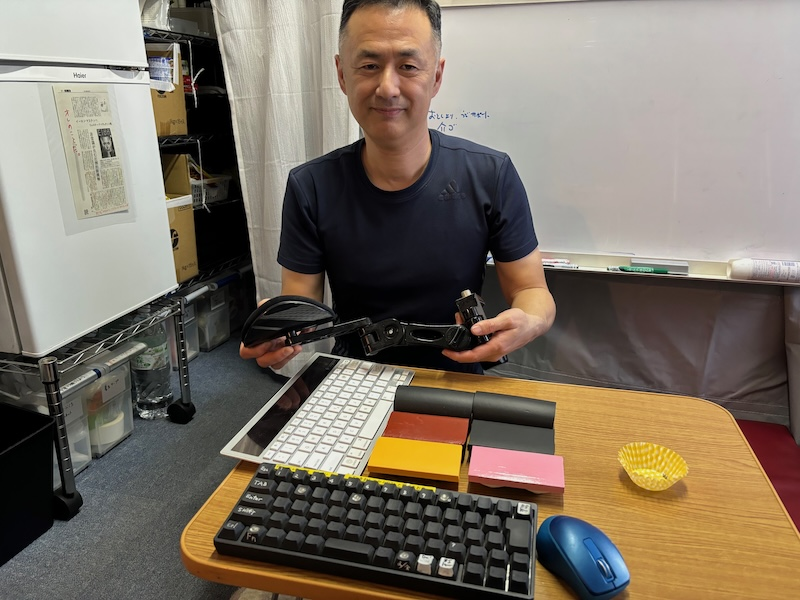

＜写真＞アーム可動式タイプのアームレストも試したが、卓上のレイアウトの関係で使いにくかったという


可動式アームレストは以前、「エルゴレスト」を筆者がレビューしている。

買い物山脈記事リンク　https://pc.watch.impress.co.jp/docs/column/kaimono/1260737.html

このときに紹介した製品は漫画家や精密作業の専門家に愛用されており、安全対策など非常に良く出来ていて病院のリハビリなどにも使われているそうだ。

人体の腕というパーツはかなり重く、成人で片腕4kg程度。
腕を前方にのばしてキーボードやマウスを操作するということは、腕の起点と先端の荷重バランスの視点において、「てこの原理」で更に大きな負荷が肩にかかることになる。デスクワークで肩がこる原因はこれだ。

かりに腕を前に出し続ける姿勢をキープしたら、どのくらい耐えられるだろうか？数時間続けるのはかなり辛いはずだ。しかし我々は勤務時間中、ずっとこの姿勢をとっている。ちょっとした拷問である。


キーボードの高さわずか数センチ、されど数センチをぷるぷるしながら腕に力を込めるか、重さをアームレストに預け脱力して横スライド操作するか。四十肩に悩む人であればいろいろ試してみるのも良いだろう。
椅子の横のアームレストはキーボードからちょっと遠い。筆者は前述のエルゴレストなしでは長時間働けない身体になっている。


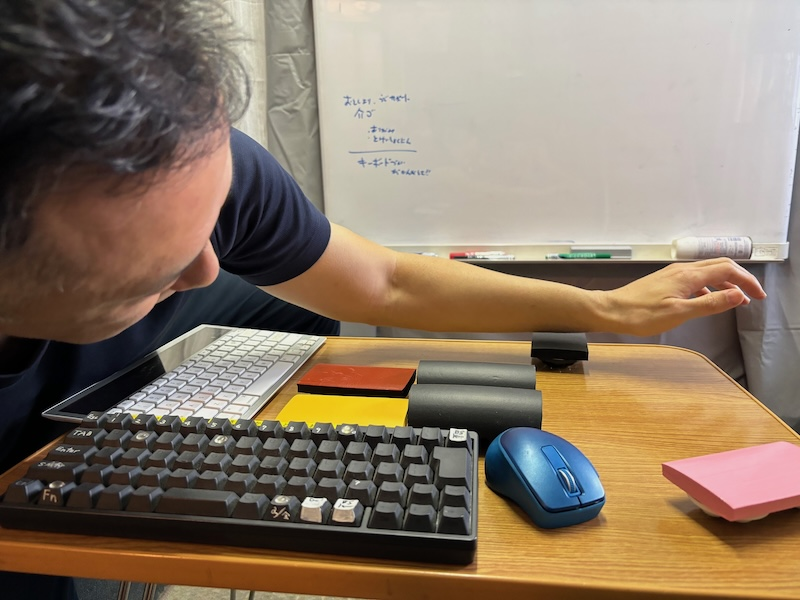

＜写真＞「この高さが、キーボードとマウスによって違う。マウスもキーボードもエルゴを謳っているのに、すきま空間はエルゴではない」とますます熱く語る篠田氏


マイコン少年だった筆者の年代はすでにインターネット老人という自虐時代を超えて本物のジジイになりつつある。スポーツジムで見かける、お年寄り向け講座でゆるくゆっくり腕を前に浮かせる太極拳の動きも、中国まで行って本気の先生に習ってみると案外辛い。
そして年齢からの衰えて反射神経を問われるゲームも楽しくなくなり、手首など身体の故障が多くなってきた。今の我々が投資すべきは部屋を激しく暖めてくれるGPUではなく、優しく健康を守るエルゴノミックパーツだ。

ついでに言えばあのときGPUを買うよりGPUメーカーの株を買っておくべきだったとちょっぴり反省している。

この手作りアームレスト製品自体はそんなPCユーザーの「あったらいいな」を形にしたもので、国内メーカーも中華メーカーも微妙に作っていない隙間製品だ。荒削りではあるが、パーツの取り付け角度などに工夫の跡を感じる。だれでも考えつく物を安易に作って売ってみた、というものでも無いという印象を受けた。


### 既存の製品と篠田氏の考える解決すべき課題のギャップ


原稿執筆に集中したい篠田氏の解決したかった課題は以下の二点であった

**問題定義1：キーボードとマウスの空間を、腕を移動させることが微妙に苦痛**

キーボードとマウスを行き来するのに腕を持ち上げなければいけないのが微妙なストレス。思考が中断され集中力が途切れる。

集中力が途切れるとすぐにコーヒー休憩やら細々した別の作業をしたくなるため、意識を中断されるきっかけを最小化したいという事情があった。

**問題定義2：資料を参照しながら打鍵をする時、資料をキーボードの手前側に置くとエルゴレストタイプのアームレストではリーチが届かない問題があった**

紙の資料を見ながら執筆する場合、資料をキーボードの手前に置くかキーボードの奥に置くかで机の上面ポジションが変わってくる。

篠田氏の執筆スタイルで机の奥にキーボードを置く配置では、机の上で動くタイプのアームレストが有利だった。

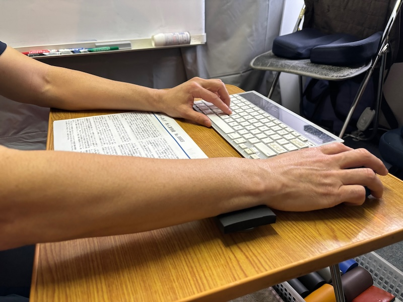


＜写真＞参照資料を手前に置いて執筆するスタイルの場合は、このアームレストのような方式が向いている

すでにいくらかの数を販売しており、現在の利用者の中にはマウス操作のストレスを低減したいゲーマーもいるそうだ。
筆者がゲームジャンキーから社会復帰して久しいため、速度の必要な反応に追従できるかどうかの検証はできなかった。

アームレストのクッション形状は平形とかまぼこ形があり、好みで選ぶ形になっている。没になった高さ可変型の試作品なども含め、まさに試行錯誤の治具だ。


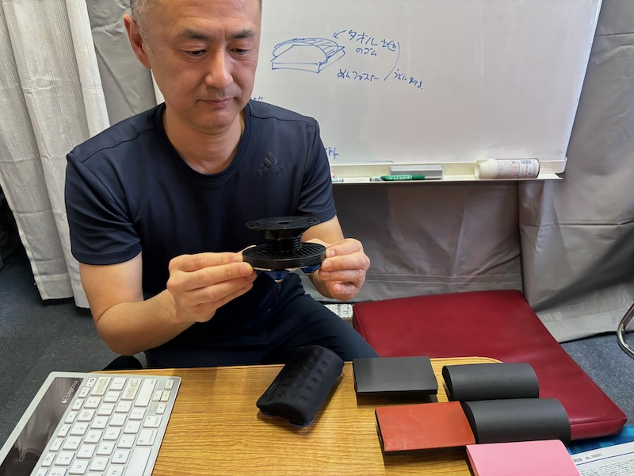

＜写真＞高さ可変式のアームレストは高さが高すぎてお蔵入りになった。


### 優れている点

接触面のクッションが折れることで安定する。接地するボールの個数も傾きで最小になるように取り付け角度が工夫されている。

軽量コンパクト　持ち運び可能なサイズであり、カフェや出張先のホテルで仕事するなどの場合にも気軽に持って行ける。

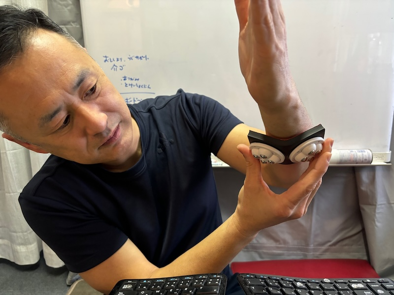

＜写真＞期せずして腕の安定性向上に寄与したクッションの柔軟性

また、怪我をするような部品の出っ張りがないことも安全が最優先という観点で中華ガジェットとは違う

### 気になる点


背面の金属ローラーはブッシュ構造ではなく、ボールベアリング構造で支えるようになっているため動作そのものはスムーズではあるが、机の細かい凹凸を振動と音として拾う

エルゴレストタイプのアームでは作動音がないが、このアームレストは硬い机の上ではそれなりに金属ボールの発する音がする。音に対して過敏な人は気になる可能性がある。

一般流通に乗るようなものではなく、あくまでもわかっている人向けのプロ仕様の手作り治具を頒布しているといった販売形態なので、購入する場合はよく理解した上でポチってほしい。

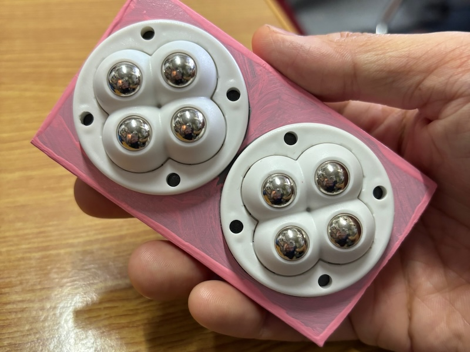

＜写真＞パチンコ玉サイズの金属ボールが背面に埋め込まれている。そういえば唐揚げ店の並びはなるほどパチンコ屋さんだ。


筆者が実際に使ってみたところ、二つ同時に使い、右腕の肘に近い部分と手首付近の二カ所を2個のアームレストで支えて、腕の重さを机にあずけてしまう使い方が個人的には良かった。
肩の力を脱力するという課題はしっかり解決できそうだ。ただ仕事机が木目のため引っかかりが気になった。


### そして、最も重要な要望だったっぽい、劉デスクのレビュー依頼項目を忘れていた


そういえば唐揚げのレビューがまだだった。肝心の唐揚げの味だが鶏の種類でブラジル産（安価）・宮崎県産（普通）・鳥取県産大山鶏（ブランド）が選べる。
味付けは主張の強いセールスコピーの「圧」とは裏腹に、薄味で鶏本来の味重視だ。

薄味のため一口目はそんなに印象が強くないが、よその店で食べたときに「あれ、今食べてるものより、あっちの方が良く出来ていているよな」と気がつくタイプだった。
これからの暑い季節、さっぱり目のビールや白ワインを飲みながら明るいうちから始める晩酌・アペリティーボにぴったりだ。


用賀駅そばのお店でアームレストに加え唐揚げを買って、そのまま散歩で砧公園や馬事公苑に行き、缶ビールを片手に夕涼みをしながら黄昏れるのも、悪くない。


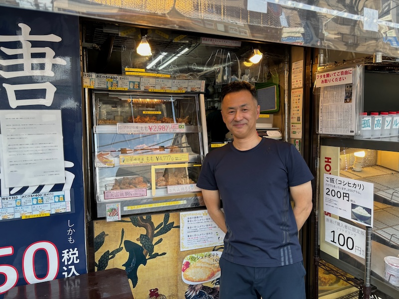

＜写真＞以前はITコンサルをしていたという篠田氏。唐揚げは美味しかったです。

孤高のからあげ　用賀本店　東京都世田谷区用賀４－２－１
店頭販売の他に通販サイトあり

https://kokou.shop-pro.jp/


### 最後にガチ実用レビュー　by 我が家の無職のアネサマ

ちょうど予算策定シーズンで忙しい筆者は、普段在宅勤務だが出社作業となった。

帰宅したところ、筆者の作業机で日がな一日、求職サイトを見ていた我が家の無職のアネサマが、「これ一体なに？」と聞いてきた。

「マウス操作用のアームレストだけど」と教えると、「これマッサージ器だと思った。すごくいい」と筆者が使う前から第二の人生を歩み始めたアームレストがそこにあった。我が家でレギュラーポジションとして活躍が決定した。

「とってもいい。中山式って知ってる？子供の頃から家にある」と横でごろごろしている。どうやら実家に数十年あるマッサージ器が生えてきたと考えていたようだった。

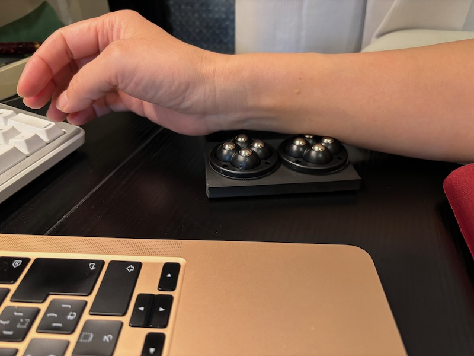

レビュー結論　これはいいものだ by 無職のアネサマ


