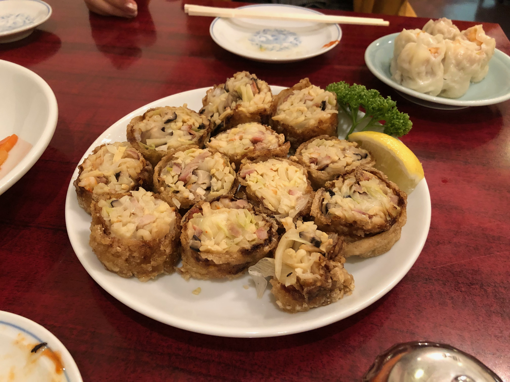

# 黄金色に輝く絶滅危惧メニュー「巻揚」。散歩の合間にいただくビールの最高の友人

中華街は人通りがすこし戻ったものの、大人数で宴会はどうしても無理な社会情勢。
そのかわり一人や二人で春の散歩の合間に何か食べたくなるようなタイミングで店に入りやすくなりました。

お店も忙しくないので、通好みの手間がかかるメニューをお願いするチャンスでもあります。

今回、少し冒険をする気持ちで試していただきたいメニューが「巻揚」。春巻のように小麦の皮ではなく、フランス料理のパテ・ド・カンパーニュなどに使われる網脂で巻いて揚げてあります。
具は豚肉や鶏肉・海老・シイタケ・タケノコ・ネギ・ショウガなど特別ではない材料ですが、これが実に美味しい。

かつては宴会の花形メニューだったものですが、もっと見た目華やかなメニューに取って代わられ、いまでは香港でも横浜でも出す店がガクンと減りました。


＜写真＞　黄金色に輝く「巻揚」（伊勢佐木町　龍鳳 宴会メニュー）

巻揚はたとえ香港に行ったとしても、伝統格式あるお店の事前注文料理でやっと出てくる手間がかかる料理。

ところが横浜ではレギュラーメニューで提供する店が少しだけのこっているのです。


ビールのお供の定番である春巻から、一文字だけ食通気取りに踏み出してみましょう。まずはとびきり美味しい巻揚をいただく春の散歩にいきませんか？


## 「お時間いただきますけれど良いですか？」　本牧　華香亭新館


＜写真＞　磨き上げられた店の風情もごちそうの一つ。こんな風情なら待ち時間も苦にならない

筆者が特に気に入っているのが、本牧にある華香亭本店。昼の涼しげな風情も、夜のしっとりとした雰囲気も文化遺産そのもの。

オーダーをお願いすると、そこから丁寧に巻いて作り始めるので少なくとも30分はみておきましょう。
周りを見渡せば、シウマイや黒酢唐揚げなど渋いメニューを頼んで、同じく巻揚げの登場まで静かにお酒を傾けて待つ紳士たち。

このお店は大正元年から続く100年の老舗。店の歴史と貫禄に比べたら、待ち時間なんてむしろ体験の一部だと思います。美しいファサードとシックな店内の雰囲気に博物館にいるような気分。

美しい切り口から見えるのは中華でおなじみの材料ばかり。タケノコ・シイタケ・ネギ・海老などと、彩りにインゲンがポイント。
何気ない材料を網油で包んで揚げることで味にこんなに迫力がでるのかと感心します。


## ふわっとざっくざくの食感がたまらない巻揚　楽園




＜写真＞　皮のパリッとした食感とざくっとしたタケノコのコントラストが、それはたまらない

中華街大通りでひときわ古風な雰囲気を漂わせるのが「楽園」。巻揚げを語る上では外せない名店なのですが、ここの巻揚は横浜でひときわ個性を放ちます。

大きく巻かれた巻揚げには、ネギ・シイタケなどとともにひらひらしたタケノコがどっさり、ふわっと巻き込まれています。
網油の皮のサクサクの食感と鼻に抜ける香り、タケノコの食感と、かみしめることで網油から出てくるコクがなんとも重層的。そして脂っこさをあまり感じないのが美点。

おなじような材料でも、店ごとの職人の手先の加減一つでまったく違った個性が現れるのが面白いのです。

## 腹ペコでも満足　肉押しの美しい巻揚　海南飯店


＜写真＞　ピシッと角が立った巻揚げには、この料理に対する作り手の気合いが出ている

中華街で主に食べられているのはタケノコと海老の、海鮮巻揚と言われるタイプが主。この店だけが肉肉しい巻揚げを出しています。

よく出来たシウマイの中身のような旨味の肉ががっつりと詰まった巻揚は、ハーフサイズでも一人だと腹パンになる満足感があります。

皮、肉、タケノコの3つの要素からなるザクふわザクの感覚と肉の甘みが口腔内に満たされる感じが心地よく、一幅の絵を見ているかのごとく味に立体的な景色があります。

そして揚がりの美しさが海南飯店の巻揚の最大の特徴でしょう。黄金色の皮に中央の海老の紅白。これならば宴会の料理で出てきても華やかで納得感があります。


## 日本でも香港でも消えつつある巻揚

巻揚は網脂と呼ばれる内臓のまわりの横隔膜を使って揚げる料理です。網脂の風味が料理に力を与え、そのサクサクの食感はこの料理を特別なものにしています。

そして食材流通が良くなかった時代の料理人は、ありものを美味しく仕上げることを美徳としていたそうです。


＜写真＞ 宴会メニューに出てきたら、その宴会に対する店の気合いを感じる一皿

香港で代表的な名前は「網油腰肝巻」（豚マメの巻揚）。豚モツなど決して高価でない材料を創意工夫とプロの技術で美味しく仕上げることに広東料理の料理人としての神髄があるそうです。

香港の美食家の友人に、巻揚はいまでも食べられるのかと聞いたら、「古い料理で、そんな料理はいまどきの香港人は食べない」と言う答え。
香港でも老舗のシェフが動画で作り方を公開していますが、それも料理消滅の危機感から技術を絶やしたくない、という思いを訴えるものでした。

失われつつある理由は3つあります。

1つめは、近年の健康志向。香港でも脂の多い料理を嫌うようになり、網油から湯葉に変更した上でも、さらに揚げ物を避けるようになりました。

2つ目は網油コストが高いこと。とあるシェフ曰く「中に巻いているものよりも、皮（網脂）のほうが高いんですよ」とぼやきます。そして揚げる油も新品でなければ良い色がでません。

3つめは処理の難しさ。網油は独特の魅力的な香りとともに生臭みもある部位のため、ハマナス酒でつけ込んでさらに水で洗って破らないように丁寧に掃除をしなければいけません。

いま厨房にいるベテラン世代が引退したら、香港だけでなく横浜でも消える可能性が高い料理。いまのうちに是非食べておきたいメニューです。


## 最後に、幸運な人だけが食べられる限定メニューのお店もご紹介

この連載では、常に仕込みの用意があり、料理としての特徴を良く表している3店舗の料理をご紹介するスタイル。

ただ、少し幸運が重なると食べられる美味しい巻き揚げの店は他にもあります。文頭写真でご紹介した宴会注文メニューの龍鳳の他、メニューにあがっているものの不定期で仕込みをするお店などです。

運良く巻揚げの用意があるタイミングに巡り会えたら必ず食べたい、幻のレギュラーメニュー？の名店たちを含め筆者の取材メモをご紹介します。ただし訪れる前に必ず電話確認をしましょう。


#### 中華街「廣新楼」

飲み屋として使いやすい、一人でゆっくりお酒を楽しめるお店。お店の自慢のセラーにあるワインと合わせられるのもうれしい。

外見は揚げが綺麗です。網脂を あげているとは思えない味の軽さ。
肉の味は少し控えめで、海老と調和がとれています。自己主張強くなくバランス取れた味で丁寧に味わいながらいただくタイプ。衣の軽さが光ります。

添えられた山椒塩を、途中から少しだけ振りかけていただくと、また違った印象になりますね。巻揚は事前に電話確認必須。


＜写真＞　記事中で紹介している名店のマダムが、頻繁に食べにくるという銘品


#### 中華街「龍鳳酒家」

具のキャベツの甘みがしっかり出ていて、気がつかない程度にカレーなのか五香粉なのかわからない香りを効かせているのが心憎い。

巻揚は事前に電話確認必須。塩卵いりなどバリエーションもあり。龍鳳酒家は通好みの季節メニューが多く本当に奥が深いお店。


＜写真＞　高齢のお父さんが、ごくたまにしか作らないので、食べられたら本当に幸運。

#### 野毛「新雅」

少し胡椒を振るスタイルが特徴。
仕上がりがサクサクで美味い。皿に残る油も少なく腕が良いと感じる。

接客してくれるお姉さんが、「一人だったらハーフにしましょうね」と気を利かせてくれるのが飲み文化あふれる野毛らしいお店。

中華街とはまた違った横浜中華の魅力があります。


＜写真＞　野毛の昭和な飲み屋街の一角に、素晴らしく美味しい中華があるのが横浜らしい

#### 中華街「一楽」

ぎゅっと固く巻かれた密度の高い巻揚げに、ケチャップをつけて食べるスタイルが80年代。実に懐かしい味。
同行の家人は「子供の頃に神戸の南京町で食べた味と同じ」と大喜び。


＜写真＞　今風の料理も昔の味も同時に味わえるありがたいお店。一人で入るのはもったいないので是非親しい数名で

#### 廣東飯店

店構えは重厚で入りにくいものの、中はカフェ的にカジュアルなセパレートテーブル席で一人でも入りやすいのがおすすめポイント。


＜写真＞　皮のサクサク感を特筆したい。餡もまとまりが良く五香粉の香りも食欲とビールを呼ぶ


#### 順海閣（現在営業中断）

もう一店舗、シウマイの元祖として以前ご紹介した順海閣も素晴らしい巻揚を提供していたのですが、現在お店自体が営業していません。インターネット情報によると閉店と言われていますが、筆者は店内工事を確認しているのみです。

もう一店、忘れられない巻揚は「雲龍」という閉店したお店のもの。 10年後には、今回ご紹介した店舗でも提供しているとは限りませんので、後回しにせずおはやめに。


＜写真＞　再開をひたすら願いたい「順海閣」の巻揚。ホールの広東語の御姐さんたちがハキハキしていて気持ちよい店でした

筆者のおすすめの巻揚げたちは、いずれも色合いが美しく黄金色にしあがっているのが共通点。ぜひ自分にとって居心地の良い店をみつけだしてください。


## 今回紹介したお店

※　緊急事態宣言の期間は営業時間短縮している場合があるのでお店にお問い合わせください。

```
華香亭本店
住所：神奈川県横浜市中区本郷町3-64
TEL：045-621-8250
営業時間：(通常)11:30-14:00, 17:30-21:00
木曜定休　不定期で長期休業あり
```

```
楽園
住所：横浜市中区山下町154
TEL：045-641-9308
営業時間：11:00～21:00　平日は中休みあり
火曜定休
```


```
海南飯店
住所：横浜市中区山下町146
TEL：045-681-6515
営業時間：11:00～22:00
不定休
```


## ※　参考　サトタカさん確認用

「消失中的味道（增訂版）」　という本の最初の最初にとりあげられています。電子版あり。

食材庫：豬網油
https://guide.michelin.com/hk/zh_HK/hong-kong-region/hong-kong/article/dining-in/ingredients-caul-fat

動画
https://hk.appledaily.com/ETW/20190701/WGFFKXL6FVUSNT6635SOQZ4TAA/


＝＝＝今回リスト除外分（あとで写真とポジティブコメントつけて、コスギさんに流してもらいましょう。

- 順海閣はおそらく閉業（コスギさんも気づいてました）
- 同發と玉泉亭は冷凍で風味わるし
- 菜香新館は悪くないけれど印象薄い
- 翠香園は厨房リニューアルで作業スペースが狭くなり提供中止
- 安記はお粥の回で紹介済み
- 翠鳳本店は未食（ペットOKなのであしが向かず、巡り合わせ悪いです）
- 福龍酒家は同發スタイル。同發よりうまいけれど新品の油を使わないのでキレがよくありません


