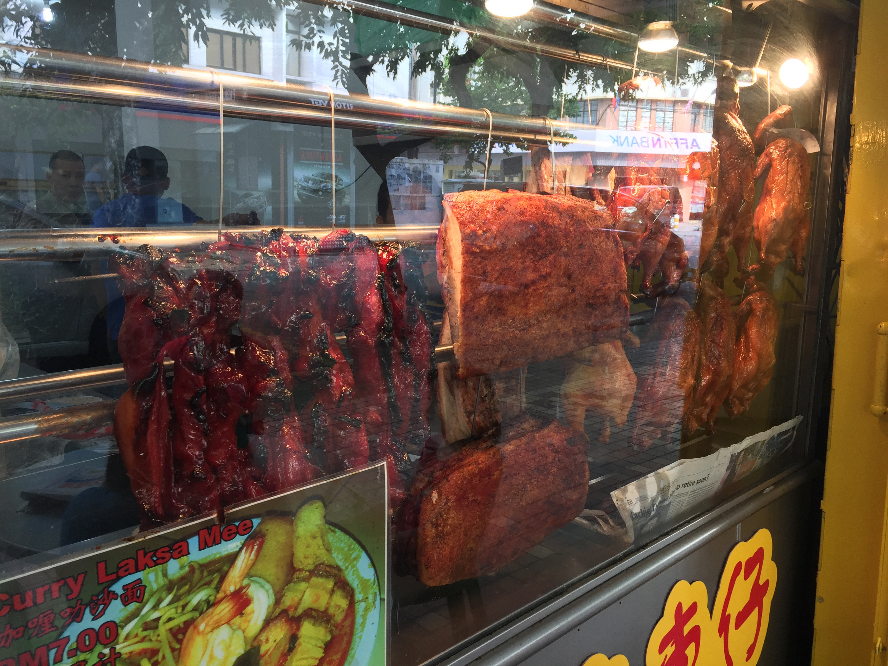

少し客足が戻ってきた中華街。

土日の昼間は結構人通りがあって賑わってはいますが、宴会や食べ放題で潤っていた大型店はいまだに苦戦中。
こんな飲食店が密集しているほうがバブルで特殊な町だったので、閉業する店が発生することは免れられず、勢力図が大きく変わると予想しています。

目につく変化といえば、タピオカ屋が減って台湾鶏排の店が増えています。バスツアーバブルだったいままでの中華街よりも、さらにチープな町に変わりつつある気がしています。

一見客の閑古鳥の鳴く不景気なときに、逆に常連に支えられて目立ってくるのが昔から変わらず高品質な料理を出すお店たち。
人通りも減って訪れやすくなった中華街で、本当に料理が好きな人がおいしい思いをして楽しんでほしいのです。

今回注目するのは、テイクアウトのチャーシューなど焼いた「焼味」です。特にチャーシューにフォーカスしたいと思います。


＜写真＞脇役的なチャーシューだが、これほど夢のあるテイクアウトは少ない。写真は石川町「廣東厨房　鴻」のネギチャーシュー麺。痩叉焼を使用


持ち帰りのチャーシュー、何が良いかって、家の料理の味が数段上がるのです。例えばチャーハン一つとっても、ちょい足しするだけで抜群に違いが出ます。
野菜炒めにいれても、釜飯に入れても無限の可能性を感じるのです。


＜写真＞うまみが凝縮したチャーシューは、野菜炒めにいれてもよし、


筆者のチャーハンのレシピは、中学時代に読んだ「椎名誠のあやしい探検隊」中華シェフだった林さんの作り方がベース。きっと当時に中学生くらいでアウトドアに憧れた男子であれば思い出すひともいるはず。

アウトドアで作れるようにシンプルな材料で特殊なことは一切していないレシピなのですが、そんな男のチャーハンも中華街のチャーシューを入れるとその香りに印象は激変。

野菜はネギかレタスが合います。本格的に作られたチャーシューは、とても使いやすいうまみ調味料なのです。

林さんチャーハンの秘密：https://www.kadokawa.co.jp/product/199999182701/


赤いチャーシューは煮豚よりも塩分が少ないためラーメンに乗せると、その味自体は目立たなくなるのですが、例えば黄金の組み合わせであるネギと合わせてしまえば格段に存在感を増して、主役に躍り出るのです。

家人からは「わたしの青春の味に対する冒涜」と呼ばれますが、ありもののインスタントラーメンですらもちょっとしたご馳走に大変化。


＜写真＞中華街のチャーシューがあれば、在宅ワークのランチで作るインスタント麺だって本格的なネギチャーシュー麺に早変わり

☆写真レタッチ時に、縦横回転をお願いします

中華街で宴会はしにくいかもしれませんが、若い家族だけで出かけて、お土産を家族全員で楽しむ、そんな方法もあるのです。


## 老舗なのに現代的な味。意外すぎて度肝を抜かれた「翠香園」の蜜汁チャーシュー

前回の月餅特集でも、金華ハム入り月餅「金銀肉月」で80cライターたちの圧倒的支持を集めた「翠香園」。

1980年代　ぴーたん一家の横浜南京町（中華街）行きは、野毛の山の中腹に住む伯母のおすすめに従い、毎回海南飯店でご飯を食べた後に翠香園で月餅を買うのが決まり。
この記事の連載を担当して、中華街がこんなに奥の深い町だと当時はこれっぽっちも思っていなかったけれども、まわるほどに横浜の伯母のおすすめは的確であったと理解しました。


＜写真＞ 以前紹介した肉まんやシウマイも美味ですが、チャーシューは初めてのチャレンジ

家人のお使い物で月餅を買うことになり、指定のお店売り切れだったココナッツ月餅が自分でも食べたくなって訪れたのは「翠香園」

まさか、そのお菓子屋と思っていた店でこんなチャーシューが売ってるとは。そして見るからにできが良いオーラを漂わせている。
この記事のために筆者の知る全店のチャーシューを買って食べ直していましたが、その中でも見るからに仕上がりがよさそう。


＜写真＞　包み紙が昭和の中頃を感じるテイスト。

翌日に試食して更にびっくりしました。

一切れを口にいれた瞬間にわかる、うまみの乗った肉。そしてうまみに負けない水飴の甘み。この二つが渾然一体となって口の中に広がります。

見た目の色こそ全然ちがいますが、脳裏の記憶で方向性が一致したのは香港の高級店「福臨門魚翅海鮮酒家」や、同じく福臨門の銀座店を経て独立した千代田区九段下「錦福」のチャーシュー。
この材料の肉すごくない？えっ日本でこのレベルのうまみの豚肉？と思うほど。このままだと試食が止まらないので、あわてて冷蔵庫にしまいこみました。


＜写真＞　立体感あふれるテクスチャー。現在の「翠香園」料理部門チーフは、広東料理好きなら誰もが知る都内高級ホテルご出身とのこと。なるほど同ホテル出身の焼き物師に共通する味付けだと思います。

このチャーシューは「蜜汁チャーシュー」と呼ばれる甘さ強めの香港スタイル。そして肉自体は肩ロースなどの脂多めの部位を使った「肥叉焼」というタイプで、そのまま食べるのに適しています。
香港の街角の焼き物屋さんの持ち帰りの定番、切ってご飯にのせてテイクアウトしてそのまま食べる系で、ぴーたん好みの中華街一押しおかずチャーシューは、ここで決まりです。持ち帰りはまず翠香園のチャーシューからスタートすることを個人的におすすめします。

チャーシュー以外にも、以前紹介した肉まん、シウマイ、中華菓子類が豊富。そしてすべて伝統製法でつくられた手作り品。
まず初回の中華街買い出しツアーでは、翠香園でお土産を買い求めるのが良いでしょう。料理部門も切れのある味が素晴らしいので、別記事で改めて紹介予定です。


＜写真＞高級和菓子屋のような風情を感じるショーウィンドウ。すべて古い伝統にのっとって保存料なしのため、お店の心意気を買って3日以内に食べきれる分だけ買いましょう


## 重慶飯店本館売店は広東焼き物パラダイス

しばらく前にリニューアルした「重慶飯店本店」　筆者のささやかな夢は重慶飯店の本店で大好きな辣子鶏をつまむ四川料理の宴会することだったのですが、まだ実現できていません。都内で現地系四川料理店が増える前から、本物の四川料理を出している、筆者の中ではそんな四川料理の名店というイメージがあったのですが、売店が拡充されて広東焼物が目立つお店になりました。

実はこちらの焼物類や滷味(主に豚耳・牛ハチノス・豚足などの煮込み)を試しに買ってみたら香港や東南アジアのローカル広東飯屋でたべる味とそっくりで、家人も高評価。
中華街に行くとほぼ毎回ひっかかってしまうようになりました。


＜写真＞　焼き物のぶら下がる、広東らしい景色

店番のお姐さんは、厨房の焼物師も広東語で会話しており、香港ロスの激しい筆者としては片道一時間のぷち香港気分スポットになっています。

広東語でオーダーを通していたので思い出すのは、今はオーナーが変わってしまった先代の「徳記」のお母さん。
いまとなっては中華街で広東語が聞けるのはこの重慶飯店本館売店と、南粤美食でパパママの二人の会話くらいではないでしょうか？
広東人がいてももう片方が別地方の人だと標準語での会話になってしまうため、貴重な空間です。


＜写真＞　広東語の掛け合いが聞けるのは中華街広しといえども、ここと南粤美食くらいか？

こちらの焼物や豚耳など、魅力はなんといってもその味の安定感。
筆者のように紹介できるものを探すためにお店を片っ端から食べていくと、やはり口に入れると初めてわかる細かい処理の技術の差が味に出るのです。

我が家の家族の食べるときの顔を見れば、どうしてもこちらのリピート回数が多くなります。


＜写真＞選びやすい詰め合わせもあれば、単品注文も可能。お姐さんから聞かれるのは「切る？切らない？」筆者は保存を考えて、切らずに買って自分で切る派です

重慶飯店の叉焼も、翠香園と同じ「肥叉焼」という脂多め部位です。目移りするような焼き物パラダイスで、家族の人数を考えると買える品物はそう多くありません。
ここで試して欲しいのは、3種類くらいずつ何度も試して全種類制覇。先にご紹介した翠香園で味の基準が決まったら、バリエーション豊かな重慶飯店の焼き物や滷味を試して自分の好みを知るきっかけとしてほしいです。

筆者の家庭で人気なのはチャーシュー・焼肉（パリパリポーク）・豚耳の三種類。

もしも香港や広州やシンガポールなどのエリアで食べたことがある方であれば、一番食べ慣れた味そのものだと思います。逆に重慶飯店の味を知って香港に行けば「ああ、あれは本物だったんだ」と納得できるでしょう。


## 「金陵」の焼物を、心の余裕をもって選ぶ楽しみ

関帝廟通りで数年前に移転した「金陵」小さいけれどピカピカの店舗。初心者からステップアップはこちらで。
店の裏の路地を通るとあまーい肉の焼けるいい匂いが充満していてたまらないものがあります。

ここは、重慶飯店よりもさらに近い場所から焼き物を見れるスポット。外観写真にするとガラスが反射してしまうのでいい写真がないのが残念。

噂によれば、腕利きの焼物師はネパールご出身とか。店内で何度かお見かけしています。この日も奥からでてこられました。


＜写真＞ランチで彼の手によるネパールカレーを食べてから焼き物を買って帰るのも贅沢です。ネパール現地で食べるカレーより美味しいですよ。


チャーシューをお願いすると「脂多めがいい？少なめがいい？」とお兄さんが聞いてくれます。このサービスの良さは、他のチャーシュー売りの店では経験がないですね。


＜写真＞　売り切れが早い店なので、食事の前にお土産は確保しよう。一杯ある時間なら手頃な好みに合うものが選べます


こちらのチャーシューも、甘さはしっかり目の蜜汁タイプ。脂身がじゅわっとして良いです。
スパイスの香りは、たしかに広東の香りですがすこし特徴があります。気のせいか、ネパールに行ったときの記憶を掘り起こされる香りが少し入っているような。


＜写真＞筆者の脳裏には記憶の景色、ポカラの屋根の上から眺める真っ赤に染まった10月のアンナプルナの山が広がります

ネパールご出身の焼物師に南方系のスパイスの使い方をばっちり決められるセンスがあるのでしょう。
そういえば、ポカラにいる義理の伯母の父上は香港でグルカ兵として勤務していました。そんなこともあり義理の叔母の家では香港風の料理が出てきました。ネパールと香港の関係は案外近いので、もしかしたら人材の交流も多いのかもしれませんね。
先入観を持たずに試して欲しい、関帝廟通りの名店です。


甘さしっかりのチャーシューに比べて対照的なのは豚耳。丁寧に毛を処理された豚耳には、繊細なニュアンスを感じます。

豚耳はさっぱりした味付けで、お店でもらったさっぱりタレもいいが、わさび醤油が合うのです。

おかず系のチャーシュー類を買うなら、金陵もはずせません。


## 大珍キッチンの叉焼焼き作業紹介

チャーシューの焼き方について、焼き物職人の大珍キッチンの陸　定全氏に焼き方をお伺いしました。
彼の技術は都内の高級ホテル仕込み、現代的な香港の蜜汁タイプ。

以前は店頭用のチャーシューも作っていた彼は、中華街に来られなくなった人向けに通販でチャーシューを届けようとと計画中。
彼の焼くチャーシュー、実は80c運営母体の中華高橋の社長さんもファンだとか。


＜写真＞ 一回に仕込んで焼く量、なんと300kg。仕込みは別に焼き上げだけで丸一日（提供：大珍キッチン）

下味に一晩以上つけ込んだ肉を、オーブンに入れて1時間程度調整しながら焼き上げ。最後に水飴をたっぷりまぶしてできあがり。


 ＜写真＞焼きたてはギリギリの火入れでロゼ色が肉の中央部にかすかに残るようにジューシーに作るのがコツで、一本ずつ大きさの違う肉を全部綺麗に焼き上げるのは1万回くらい経験が必要ということでした。


＜写真＞　都内の高級ホテルなどで供されているチャーシューまん、実は中華街大通りのど真ん中でつくられていました


焼き物に使うのは厨房写真の奥に見える「明炉」という中華オーブン。ガス式と炭式があり、主にガス式。こだわる個人店では備長炭で焼いています。
チャーシューではガス焼きでもそれほど違いは出ない気がします。料理により、たとえばローストダックなどでは大きな差がでるかもしれません。大珍楼の子豚は炭火焼きで
ガスと使い分けています。


＜写真＞　在日香港人からも「香港の味」と、支持を得ている大珍キッチンの「チャーシューまん」

チャーシューまんにすると、チャーシューの味自体は想像がつかないような複雑な味わいに変化しています。

大珍キッチンは時節柄、繁華街に出られないお年寄りが家族にいる方向けに本物の点心を通販でとどけています。
チャーシューに少しでも興味を持ったら試しに通販してみるのも手段です。

## 備長炭でチャーシューを焼く　伊勢佐木町　龍鳳

大珍楼のような蜜汁につけるタイプのチャーシューではガス釜での焼きが優れていると思いますが、表面がパリッとした古風な窯焼きを提供してい店も紹介します。

オールド中華の博物館のような伊勢佐木町　龍鳳では、香港油麻地の厨房器具店　蔡同盛で特注したという明炉を使い、備長炭で焼いたチャーシューを提供（テイクアウトは可能：事前予約相談）


＜写真＞　宴会時間にあわせて焼き上げているため、少しロゼ色の残ったジューシーな状態の肉とパリッとした表面の食感を味わえる


いずれにせよ、鰻の焼き方論争ではないですが、ガスと炭焼きどちらが優れているわけではないので、自分の好みのタイプを見つけてください。


## やはり老舗は飛ぶように売れていく　同發の焼物

ここからは中級者向けの内容となります。そして、美味しいの一言では片付けられない横浜オールド中華の世界に踏み込むことになるのです。

中華街大通りで一番かっこいいファサードの店、それは同發本店でしょう。中華街大通りの角に燦々と輝くディスプレイされ焼き物たち。


＜写真＞　一見観光客にはひときわ入りにくい雰囲気を醸し出す老舗「同發　本店」

常連たちに紛れて勇気を出してこの店に足を踏み入れてから、なにをもって筆者おすすめとするか迷いが生じてきました。

もちろん現代的なレシピは美味しいのですが、かじっただけでは断定できない、料理の伝来時代の背景により味を変えていくオールド中華の迷宮に足を踏み入れることになります。


＜写真＞ 密対策で店の外にならんでいたら、おじいさんたちにどんどん割り込まれていくので仕方なく店内へ。筆者もここでは若造です。


＜写真＞　フランス菓子のビッシュ・ド・ノエルをイメージさせるような、大きくてぎゅっと密度の濃いチャーシュー


＜写真＞　脂肪の入りも美しいが、身の脂は少なめ

こちらのチャーシューは「半肥痩」。脂と赤身のバランスが中くらい。

いままでご紹介した店が水飴をばっちり回すのに対し、同發のそれはさっぱりとしていてタレも甘み少なめ。
日本人に支持される理由は、煮豚にも近い味わいでしょうか？みなさん、どうやって食べておられるのか。。。日本人の慣れ親しんだ味に近いのに、香港スタイルのチャーシューを食べ続けていると逆に混乱するようになりました。

とても綺麗につくられたさっぱりチャーシュー。中華っぽい風味が抑えめで、日本酒にもよく合います。
そして、ネギチャーシュー麺などの料理に使うのであれば脂の主張の少ないこのタイプのほうが適しているかもしれません。


## 大通りの超老舗「一楽」のチャーシューは売り切れ早め。

このお店は「普通の人にはわかりにくい料理を出す」という点で筆者のとっておきでした。中華街全体を盛り上げようと、いつもがんばっている店主　呉さんが笑顔で迎えてくれます。お店のFacebookは見ていると食べに行きたくなる内容が毎日更新。


＜写真＞　そんなやる気の塊のような「一楽」は昭和2年創業。中華街に現存する中でも特に古いお店だとか。

わかりにくい理由、それはお料理が筆者が1980年代に食べた記憶そのままのものを今でも大事にメニューに載せているのです。
景気が良かった日本でしっかりとした仕事とコストをかけていた時代の雰囲気を色濃く残す昭和の中華博物館的な存在。

高齢の両親や親戚を連れて行くなら、一楽は期待を絶対に裏切りません。きっと「ずっと食べたかった料理があった、なつかしい」と年配者が喜ぶでしょう。


＜写真＞　店内でもパリパリポークと一緒にいらだけます。これは蜜汁チャーシュー

店内で販売しているチャーシューは大小サイズがあり、小さいものはだいたい300g弱で1本1,500円強のから価格なので、二人家庭などで買い求めやすいのも美点。


＜写真＞こちらのチャーシューは筆者が食べたものは「半肥痩」のタイプ。

下味の染みが少なめの色合いですが、表面は豊かな広東の麹を感じる発酵調味料の味わい、肉は逆にすっきりとした味わいなのです。

そのまま食するよりも、料理に使った方がさらに実力発揮しそうです。

## そうだ、保冷剤代わりのビール買うなら安田屋に行こう

持ち帰りの際は、どうしても保冷剤が必要になります。いくら本場の広州や香港でも常温販売とはいえ、何かあっては店に迷惑もかかるので、家から保冷剤をもってくるかコンビニで1kgの氷パックを買うのがオススメ。

あと、もう一個「いい方法」があります。

関帝廟通りの酒屋さん「安田屋」には、中華街のレストランを支える業務用のお酒が揃っています。
なんとしっかり冷えた青島ビール全種類や、ハルピンビールまで入手可能になりました。

ハルビンビールは中国に住んでいた人なら必ず記憶にある有名ブランド。雪花・青島・ハルピンが全国で買えますが


＜写真＞中国在住経験があれば、夏の旧友ハルビンビールが買えるなんて夢のよう。青島も全種そろってるのがさすが中華街

参考：

青島ビール全種を飲み比べ！IPA＆ウィートが日本初上陸、中国料理との相性は？【PR】
https://80c.jp/story/20190628-1.html

安田屋で保冷剤代わり、という言い訳をしながら、普段めったに手に入らない青島IPAやハルピンビールをクーラーバッグに放り込めば今日の買い物は完了。

あとは家に帰って風呂に入ってテイクアウトの焼き物を楽しみましょう。


## 中華街から東南アジアの広東系の食文化を焼き物から覗く

ここからは仮説を含めた考察をします。中華街と都内、香港、東南アジアの各地でチャーシューを食べてきましたが、気がついたことが1点ありました。

味については2種類あります。

ひとつは現代の香港広東あたりで食べられている「蜜汁チャーシュー」水飴をまわした甘みの強い系の味。ご飯にそのままのせて食べるのに向いています。

この甘いタイプのチャーシューをそのまま食べると、チャーシューは不動の主役的な存在感。飲茶でおなじみ、甘いチャーシュー包も炭水化物と甘いチャーシューのマッチング抜群。

ただ、料理に入れると甘みの強さが災いして皿の上の味のバランスがくずれるかもしれません。たとえばネギチャーシュー麺にいれたら、甘みがスープの味をぼかす可能性があります。

もうひとつは、横浜で多く見られる甘み控えめ系の味。こちらはネギチャーシュー麺にしたり、チャーハンにいれたりとうまみ調味料的な使い方が多くあります。


＜写真＞　東林のネギチャーシュー麺。半肥叉焼を使用していた。


 
 
 ＜写真＞　安記のネギそば。肥叉焼を使用。クリアなスープが素晴らしい


甘くない方をそのまま食べても、そんなに美味しいと思いません。やはり料理にいれると目立たなくてもぐっと味を良くしてくれる名脇役の立ち位置。

横浜に2タイプ存在する、この味の違いは何か？筆者は、伝来時期の味トレンドの違いによるものだと思います。

仮説ですが、甘み強めのタイプは比較的新しい世代の香港などの職人の持ってきた味で、裕福な時代を反映して肉をそのまま食べることを前提とした味付け。
ガツンとおいしいものを求めることができる時代だからできたもの。仮にこれを香港タイプとします。


＜写真＞　現代の広東の蜜汁チャーシューは甘みしっかり（広東省江門市新会陳皮村）



＜写真＞　マレーシア　コタキナバルの「広東仔」というお店。いまだに我が家で定期的に話題になるほど抜群に美味しかった。こちらも蜜汁チャーシュー


＜写真＞　ベトナム　ホーチミンの焼き物の店。こちらでもバインミーの具などに欠かせない。技術に少し古さを感じるが、味は現代広東スタイルに近い


対して、横浜に多く見られて、日本の町中華の煮豚の原型にもなっていると思われる甘み少なめの味は、さらに古い年代の味トレンドの伝来。
具体的には明治から戦前あたりの肉も砂糖もいまより遙かに高価だった時期のもの。
少ない肉をどうやっておいしく、節約しながら食べるかがコックの腕の見せ所。
また、昔の日本人の好みにあわせ、さっぱり系に順応して変わった可能性もあります。これは横浜タイプと仮に定義します。


＜写真＞　横浜センター南　「ウミガメ食堂」は本牧の奇珍楼三代目と息子さんの店。こちらは同發に近い横浜タイプのチャーシュー


店の歴史や、担当する料理人のバックグラウンドを並べていくと、このような仮説にたつわけです。
もちろん戦前のチャーシューと現代のものを直接食べて比較できるわけでもないので、あくまで仮説ですが、今も生き残っている古い味にはちゃんと理由がありそうです。

購入の際には、そのまま晩ご飯のおかずにするか、料理の材料として使うかで好みに応じて購入店を選ぶのがよさそうです。

また、なじみの店であれば在庫に余裕があればテイクアウトに応じてくれますので、通っている店のチャーシューが好みのタイプであったらぜひお店に予約でわけてもらうのをおすすめします。

# 今回紹介したお店

```
翠香園
住所：神奈川県横浜市中区山下町148（MAP）
TEL：045-661-1266
営業時間：11:30～21:00
月曜休
```


```
重慶飯店本館売店
Web: https://www.jukeihanten.com/wp-content/uploads/2019/04/2019.3.pdf
住所：神奈川県横浜市中区山下町164（MAP）
TEL：045-651-0820
営業時間：11:00～19:00
不定休
```


```
金陵
住所：神奈川県横浜市中区山下町131（MAP）
TEL：045-681-2967
営業時間：11:40～売り切れ仕舞
月曜休
```

```
大珍キッチン（だいちんきっちん）
URL：https://daichin.kitchen
TEL：045-681-2280
営業時間：オンライン販売
水曜定休　
```

```
同發本館
住所：神奈川県横浜市中区山下町148（MAP）
TEL：045-681-7273
営業時間：11:30-14:30 17:00-21:30(土日祝は通し営業）
火曜休
```

```
一楽
住所：神奈川県横浜市中区山下町150（MAP）
TEL：045-662-6396
営業時間：11:30-20:00
不定休
```


```
安田屋
住所：神奈川県横浜市中区山下町130（MAP）
TEL：045-641-9657
営業時間：9:00-20:00
水曜休
```

## 料理のみ紹介

```
廣東厨房　鴻
住所：神奈川県横浜市中区石川町1-13-12（MAP）
TEL：045-264-9861
営業時間：11:30-14:00，17:30-22:00
水曜定休
```

```
東林
住所：神奈川県横浜市中区山下町221（MAP）
TEL：045-201-8255
営業時間：11:30-14:00，17:00-21:00
火曜　水曜夜定休
```


```
安記
住所：神奈川県横浜市中区山下町147（MAP）
TEL：045-641-3150
営業時間：10:00-14:00，17:00-20:00
水曜定休
```


```
ウミガメ食堂
住所：神奈川県横浜市都筑区茅ケ崎中央24-12 ライオンズプラザ1F（MAP）
TEL：045-508-9204
営業時間：11:15～22:00（L.O.22:00）
水曜定休
```


