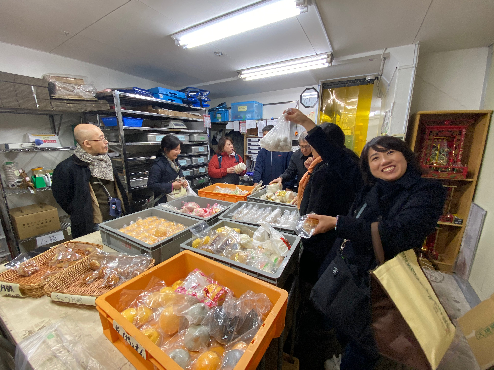

# クーラーバッグをもって秋の中華街お散歩！持ち帰りと通販を楽しもう（おかず編）


最近の横浜中華街は、団体宴会が激減したものの人通りは少しもどり、くわえてテイクアウトが熱くなってきています。例えば写真の「一楽」は巻揚や横浜野菜の料理が美味しい、ウーバーイーツにも登録しているので、近所の人が羨ましくなります。


中華街を歩いているとよく見かけるのが、かにチャーハンでご紹介した「龍鳳酒家」のお姉さん。ママチャリで近所に配達しまくってがんばっています。
持ち帰りは20分以内限定ということで大多数の80c読者はテイクアウトの恩恵にあずかれないのが残念。まだご紹介していない「牡丹園」もデリバリーをしていますが近隣区域のみです。

店で食べる中華料理は出来上がった瞬間がいちばんおいしいので、持ち帰りは難しいのです。

しかし、中華街にはもう少し長い時間の距離でも美味しさそのままで持ち帰ったり、通販で取り寄せたりできるものがあります。

地方への旅行や帰省が難しい今、首都圏の中だけで動くことしかできません。ちょっと横浜方面に行った帰りにお土産を買いにひっかけるのも良いでしょう。

たまにしか行けない中華街なので、何軒もまわりたい！という方にもオススメです。中華街お買い物ツアーにでかけましょう。




＜写真＞2020年2月「ツール・ド・横浜」最終ステージの「大珍キッチン」　肉まんからホテル用アウトレットが選び放題。現在は通販と毎週土曜日13時から10分間だけ開催とのこと

## 南粤美食のテイクアウトは待ち時間無し！今がチャンスだ

個人的には教えたくないのが行列の絶えない「南粤美食」の持ち帰り。このコロナの中でも、有楽町の劇場の入待ち出待ちのような開店前行列ができるのはまさに中華街のトップスター。

こんな炎天下でがんばって並ぶよりも、今日のおまかせをさっと買って家で食べるのがスマート。持ち帰りは入り口でお願いすると店員さんが渡してくれます。


お正月などだけに豚足やらチャーシュー等を販売していましたが、店内入店人数を制限している最近は普段から持ち帰りメニュー可能メニューが増えています。

その中でもぜひ試していただきたいのは、一個400gオーバーの巨大ちまき。本来は端午節限定の予約品でしたが、今年に限り販売延長中。


＜写真＞奥さんとふたりでせっせと仕込み。夜遅くなるまでがんばる広東人は働き者です。


「北海道の小豆・北海道の干し貝柱・塩卵・とびきりいい肉つかってる。俺のところのが一番ウマイ（広東なまり北京語）」
筆者はどこのチマキが一番美味しいとは立場上おおっぴらに言えないのですが、原価率の高さと高コスパは他店のそれを圧倒。2020年のナンバーワンちまきは南粤美食で確定です。


＜写真＞チマキを真っ二つに割ればわかる、材料の正確な配置。シェフの几帳面な性格を表す構造

テレビ番組で紹介されたのは「塩蒸し鶏」ですが、さらにオススメなのはどう考えても「アヒル」です。やはり広東料理の焼物はアヒル、日本で食べられない贅沢をいえばガチョウでしょう。


＜写真＞鳥の手羽先かとおもったら異常にウマイ、よくみたらアヒルの手羽先でした

少し甘い味付けに、アヒルの甘〜い皮目の脂がじゅわっと口の中にひろがります。この甘いソースは広東人じゃないと上品に再現できないんですよね。

鶏もうまいけれど、アヒルは役者が違うと感じる一皿です。南粤美食の料理をお家でお気に入りのワインに合わせていただくなんて、贅沢でしょう。


＜写真＞アヒルの焼物は香港の高級店の味わい。これがお家で食べられる。ガチョウを焼いてもらったらさぞかし美味しいだろうと思います

もう一つの楽しみは、残ったソース。これをとっておいて、翌日に目玉焼きを乗っけた白いご飯にソースをかけてみてください。店のまかないでしか食べられないような禁断の一皿になります。

そして、ちょっと待つ可能性はありますが、ワンタン麺に使われる生雲呑がテイクアウト可能なのです。


＜写真＞鍋の中で天使のような半透明の羽を広げる海老ワンタンは、中華街のトップスターの風格だ。これが家で食べられるとは

口に含むと、まずぷりっと逃げ回る食感、エビの旨味、肉の旨味、独特な大地魚（カレイ）の魚粉の風味が鼻に抜け、最後に皮の炭水化物の甘みが口の中に広がって消えていく感覚。

ほんのちょっとあるだけで、この満足感。実は黄シェフから、香港の名店「麥奀」と自分のものの味を比べてきてほしいと出張ついでの調査を頼まれたことがあり実食してきたことがあるのですが、スープに塩分の違いがあるだけで雲呑は目隠ししたら違いがわからない気がしました。


＜写真＞食べるときは、あのお店の鮮度抜群炊きたてスープが無いのが残念だが、旨味は充分。そのままシンプルに行こう


独立前から人柄が良く腰が低いと有名だったという黄シェフ、独立して有名店になっても人気に驕らず中華街全体が逆風の中でもしっかりとした料理を提供しているので客足は途絶えず。


行列が途切れているタイミングにうまく入れたら食べていくのがベストですが、行列していたら店の人に声をかけてテイクアウトできるものを聞いてみましょう。


＜写真＞「やろうっていってた鳩ローストの宴会はどうなったんだよ」「コロナ怖くてみんなこないよ、20人も集められないよ！5人が限界だよ！」ストレスの多いこんなときだから彼の頭の中は宴会料理でいつもいっぱい。いつか再び全力を発揮してもらいたいと願う


## 中華街の手作り冷凍餃子１　山東の水餃子は通販可能

筆者は良く「中華街で餃子おいしいところ無いか？」とよく聞かれるのですが、都内のあちこちに本物の手作り餃子を出す東北系の店が増えている中で、中華街まで来て餃子はねぇ、と思います。
さらに北京に住んでた時代に本場の餃子作りを仕込まれた筆者は、茴香を買ってきて自分で皮から作って肉を叩いたものが最高なのです。家族も長く中国に住んでいたため、なまじの餃子ではたいてい厳しい意見が飛んできます。

そんなぴーたん家において、家族からご指名買いが入るのは、「山東」の持ち帰り水餃子。
中華街まで行って買う価値がたしかにある逸品です。ネット通販もしているので横浜に行けない人にもありがたい。


＜写真＞　水餃子は小分けされた状態でわたしてもらえる


＜写真＞ゆでるとピンポン玉のようにぷっくり膨れ上げる水餃子。


ここの特徴はココナッツの隠し味を醤油につけること。他にない食べ方


ニラの風味が良い水餃子そのものが美味しいので黒酢もいいですが、ココナッツの隠し味は醤油との相性が良いようです。黒酢と醤油、お好みでどうぞ。


## 中華街の手作り冷凍餃子２　鳳林の焼餃子は北京の味がする

もう一店舗、家族からテイクアウトのご指名がはいるのは鳳林の焼餃子とシウマイ。とくに焼餃子にはびっくり。
ふだん焼餃子は横浜では食べない筆者が初めてお店で初めて餃子を食べたとき

「あっ、北京の学食で食べた”鍋貼”の味だ！」


＜写真＞　鳳林の焼き餃子は「北京の匂い」がします


聞けば鳳林の李さん一族は、河北省の天津出身の家系。
修行したのは広東料理の名店「菜香新館」なので広東料理を作っているものの、焼餃子の味はしっかりと北京の鍋貼の味がするのです。

広東系のコックの作る焼餃子と、北京系のコックが作る焼餃子はどこが違うかって？それはちょっとパンチの効いたニラの香りとごま油の強めの味。


この輪郭のはっきりした鍋貼的な餃子を口に放り込むと「やっぱりこれにはさっぱり系の中国のビールだよ、青島でもハルピンでもどんとこい！」と思うのです。


＜写真＞　テイクアウト用焼き餃子のパッケージ、ぴーたん家の常備品となった


忘れちゃいけないのが鳳林の持ち帰りシウマイ。中華街の中では特にオススメな一品。これをワンパック買って冷凍庫に常備しておけば安心。
我が家は弁当のおかずにこまったらシウマイを２つと茹でブロッコリーを入れれば


＜写真＞　去年の台風で看板が破壊されてしまい、「看板のない名店」という寒いギャグからも半年がかりでやっと復活


## 大珍楼の「Made in 中華街のおかずセット」は80c編集部コラボ商品入り

最後に、中華街に来られない人向けに通販に本腰をいれているのは「大珍楼」。
もともと都内高級ホテルの点心生産などを一手に引き受けていて、中華街のロプノール湖的な幻の店頭アウトレット販売をしていました。

こちらの点心類は、高級ホテルや一部中華カフェで使われる最高級のものをそのまま販売しているので、味は中華マニアのお墨付き。80c編集部メンバーも冷凍庫にストックしているとか。


＜写真＞高級ホテル広東料理店向けの点心がそのまま頂けるのが魅力

関帝廟の裏手にある点心工房で点心類の生産を担当する陸さん（通称りっきーさん）は業務用の注文が完全ストップしたコロナ禍の中で「中華街を通販で全国に発送する」という発想に切り替えて、D2Cビジネスのネット通販に全力投球。

ホテル向けの香港点心や、大珍楼の厨房で作っているエビチリなどが通販で購入できるようになりました。


＜写真＞チャーシューまんの仕込みをするりっきーさん　先日は80c運営母体　中華高橋の気仙沼工場までバイクで往復しフカヒレを仕入れに。新商品開発に余念がない


コロナのゴタゴタで、原価をあまり良く考えずに箱に肉まんを気前よく放り込みすぎたため、「#冷凍庫パンパン」として大手ポータルサイトで紹介され大ブレイク。
一時は２ヶ月以上待ちの大人気になってしまいましたが、業務を見直し８月より通販システムをリニューアルして「大珍キッチン」としてオープンしました。

一時のピークもおちつき、現在では一週間から半月程度の待ち時間で買えるようになりました。


＜写真＞大珍楼のチャーシューは、彼の修行先の都内高級ホテルと同じ味つけ。「１万回くらい焼くと上手になるんですよ」と語る（写真提供　大珍キッチン）


＜写真＞ちょっぴり赤いスパイシー餃子は80c編集部とのコラボ商品第一弾。ぜひ試して（写真提供　大珍キッチン）


中華街大通りの店舗でのテイクアウトは事前に電話で確認を。11時半ごろの開店時間に合わせて焼き上がりのチャーシューやパリパリポーク、アヒルの焼物などを狙うのがオススメ。


### まとめ・店舗情報

噂によると数十件が民事再生手続きをはじめているという中華街ですが、80cでご紹介しているオーナーシェフの店は低空飛行ながら営業続行中。

美味しい店を守るのは、お客のほうです。こんなときこそ中華街をはじめ、お気に入りの店にお金をおとしてほしいのです。

それでもまだまだ暑い時期ですから、熱中症に気をつけて。持ち帰りの際はクーラーバッグを二重にして保冷剤を入れるなど、厳重に食中毒対策を行ってください。

次回は、チャーシュー・パリパリポークやハチノス豚足などの焼物テイクアウト編。ご期待ください。


文中でご紹介した店

```
南粤美食（なんえつびしょく）
住所：神奈川県横浜市中区山下町165-2 INビル（MAP）
TEL：045-681-6228
営業時間：11:30～14:00　17:00～20:00 (L.O.19:30ごろ)
水曜定休　
```


```
山東　二号店（さんとう　にごうてん）
URL：http://www.santon.co.jp/
住所：神奈川県横浜市中区山下町150-3（MAP）
TEL：045-212-1198
営業時間：11:00～0:00
年中無休
※　隣の本店は休業中
```

```
鳳林（ほうりん）
住所：神奈川県横浜市中区山下町187（MAP）
TEL：045-662-2225
営業時間：11:00～15:00　17:00～21:00 (L.O.20:30ごろ)
水曜定休　
```

```
大珍キッチン（だいちんきっちん）
URL：https://daichin.kitchen
TEL：045-681-2280
営業時間：オンライン販売
水曜定休　
```