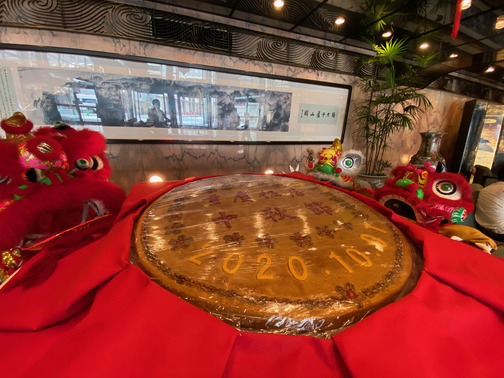
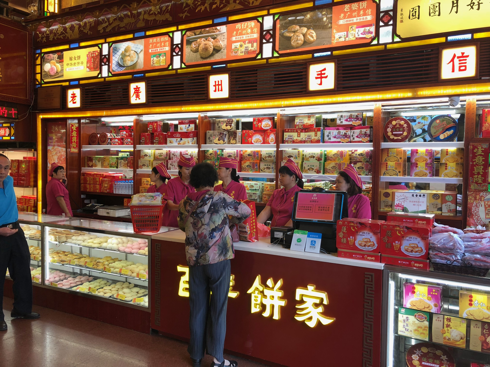
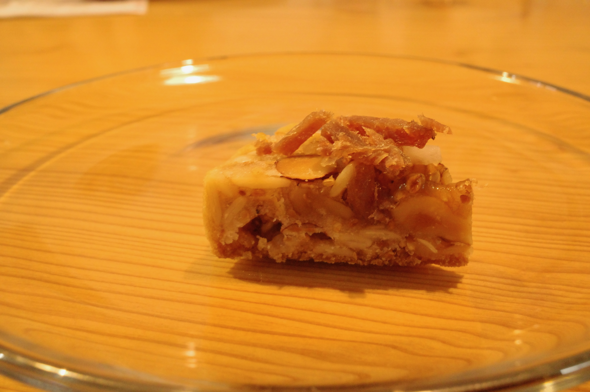
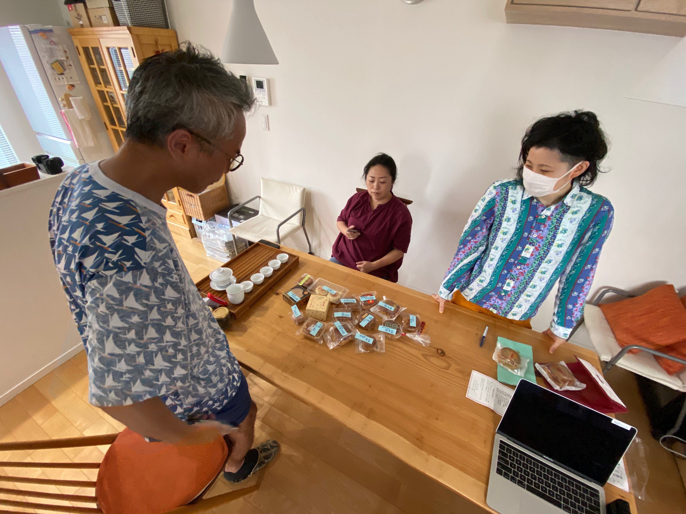

# クーラーバッグをもって中華街お散歩！持ち帰りと通販を楽しもう（月餅編）


2020年の中秋節は10月1日。旧暦でいうと秋の7,8,9月の真ん中、8月15日。

日本ではまだ河原のススキもまだ穂をだしておらず、月見団子という気分ではないのですが、香港のニュースでは、9月頭から月餅商戦本格スタート。


さて今回の記事、いつもであれば月餅の起源からスタートするのですが、中国語の文献を見ても諸説ありすぎて起源自体が曖昧になっている模様。

しかし一つ言えることは、中華系の暦の行事としては新年の次くらいに重要な日で、ハードワーカーの香港人たちもこの日は残業など一切せずに家族のもとに帰るのです。
丸い月餅は人々の団円を表し、丸い月を見ながら故郷を想ったり親しい人たちの幸福を願うのです。これだけ知っておいてもらえればアジアのビジネス常識は大丈夫。



＜写真＞　日本でも重慶飯店が毎年　巨大月餅を用意していますが、今年に限っては切り分け配布イベントは残念ながらキャンセルになっています。


## アジアの月餅事情

中華圏では中秋節は一大ビジネスイベント。
この月餅の一ヶ月だけで一年分稼ぎきる（11ヶ月は製造に専念し冷凍保存）業者もあるとかで、かつての日本のお中元お歳暮を数十倍したようなキャンペーンになっています。

この時期に香港や中国に出張で行こうものなら、行く先々で大量に月餅を押しつけられることになります。
もちろん彼らも食べたくないもらい物を、ちょうどやってきた日本人にこれ幸いとばかりに押しつけるのです。
駐在経験者などは、食べなければいけない状況の下つらい思い出しかないはず。

さて問題は、中国の古いスタイルの月餅は縁起物でこそあれ、あまりおいしくなかったという現実。そして主な用途は別のところにありました。
以前は月餅に高級酒・家電・自動車ついにはマンションがついてくるなど賄賂の手段になっていましたが、2013年で公費での購入が禁止されました。

2014年以降は、実際に食べるための中価格帯のものが売れ筋となっているようで、砂糖と油少なめのものが増えていると聞きます。



＜写真＞ 1889年創業の広州　蓮香楼の菓子売り場。広州式月餅のスタンダード　蓮の実餡の月餅の元祖として名高い。店舗は「広州市文物保護単位」に指定されている

この月餅、古くは豚のラードや鶏の脂を用いていました。最近といっても1980年代以降ですが、植物油を使うようになりました。

以前に比べれば甘さも控えめで食味も相当改善されましたが、最近では伝統的な月餅の概念を離れた洋菓子スタイルでチョコレートやカスタードなどのものも増えています。

例えば、香港ペニンシュラの「嘉麟樓」（Spring Moon）は中身がとろっとしたカスタードタイプ。大きな伝統サイズは食べきれないという理由もあり、ミニサイズも用意。
これが予約困難で飛ぶように売れるそうです。

https://www.peninsula.com/zh/hong-kong/special-offers/dining/spring-moon-mooncake-2020

同じく月餅文化のベトナムでは、もちろん美味しくないと言われていた月餅に風穴を開ける
フランス人と日本人が始めたチョコレート店「マルゥ」のチョコレート餡月餅が話題に。


崎陽軒は、食味の利点を生かして横浜月餅を中国に逆輸出するチャレンジまで始めました。
https://kiyoken.com/wp/wp-content/uploads/2020/09/20c_geppei.pdf

月餅自体は確実においしくなってきつつあります。

## 横浜の月餅事情

さて、日本の月餅は一体どうなのかというと、筆者の記憶によれば30年以上前からかなり美味しいものだったと記憶しています。

中華圏で流行の洋菓子スタイルは少なく、現在でも一部の店でひっそり用意されているのみ。
月餅自体が異国のエキゾチックなお菓子というイメージがあるせいでしょうか。
そして食味のほうも、80年代以降に香港で改良されたスタイルがメインのためかなり良いものになっています。


 

＜写真＞　今回のトップ人気になった翠香園「金銀肉月（金貨ハム・ナッツ類）」



＜写真＞　今回の月餅大集合 一店舗一個で集めたはずが、予想外に集まってしまった個数は15個！審査員一同が途方に暮れている

そして日本、とくに横浜で食べられるのは主に豪華で皮が薄い広東式となっています。

他に北京式（皮が厚くて素朴）、上海などの蘇式（肉入りなどがある）、潮州式（芋のうずまき型）など各地のローカルスタイルが存在しますが、残念ながら今年の中華街では入手困難。
美味しいかどうかは別として、素朴で味わい深いものがあるのです。

記事でもご紹介する翠香園や聚楽などの菓子専門店が古くから日本人の口に合う研究を重ねてレベルを上げたため、香港の一般的なものより一枚上手のものが手に入ると思っています。


もうひとつ、月餅で忘れてはいけないことは、少し時間が経ったもののほうが美味しいこと。
出来上がってから三日くらいたって皮に味が馴染んだところからがベストの状態になります。


今回の中華街持ち帰り企画、筆者は買い出しに専念することにしました。
大量の月餅を時間差で食べても空腹の状態で味覚に有利不利が出てしまい、公平なジャッジが困難となっています。

そこで80cのライター陣の救援をお願いしました。
筆者ぴーたんは遠巻きに観戦を決め込むつもりだったのですが、予想外にたくさん集まってしまった月餅　推定総カロリー12,000kCalの月餅たちをおいしいうちに食べるため食べる方にも参戦することに。

先に大枠の結論から言うと、購入した月餅はすべて水準以上で美味しいものでした。
その中でも月餅の作り手が、どんな人に食べて欲しいのか考えていることが味からわかるなど、お店ごとの個性を強く感じる結果となりました。


### 投票

```
愛吃（アイチー）　１　華正樓　２　翠香園　３　菜香新館　４　聚楽
つぼいちゃん　１　翠香園　２　華正樓　３　頂好食品　４　菜香　５　横浜大飯店
向井さん　１　翠香園　２　馬さん　３　菜香新館　４　頂好食品
サトタカ　１　翠香園　２　馬さんの店　３　華正樓　４　聚楽
ぴーたん　１　翠香園　２　馬さんの店　３　華正樓　４　大珍キッチン　４　聚楽
```

審査終了後、もう10年は月餅食べなくていいかな、とほぼ全員が思っていたようです。
ところがその日の深夜には、「来年またやりましょう」みたいな話になっていたことからも、食味も悪くなかったと

# 個別紹介

## 店名　翠香園


ほぼ全員一致してびっくりしたのが翠香園の金華ハム入り月餅「金銀肉月」。
この金華ハム入り月餅、筆者の知る限り以前でも親戚関係にある大珍キッチンと翠香園のみが作っていたスペシャルだったのですが、いまでは翠香園のみ販売となってしまいました。

それも、中秋節の2週間前から当日までの販売という超レアな限定品。そのお味はいかに？

包丁担当の坪井さんは「袋を持った瞬間に、絶対これ美味しい！と思った」とコメント。そして袋を開けた途端に「すごい良い香り」甘い香りと金華ハムから出る食欲をそそる香りが飛んできて、胃袋が刺激されます。

そして、包丁の刃が通らず非常に苦労しています。その訳は、「ぎっちり詰まったナッツに全部飴がけしてある」

さらに「ココナッツのバランスも良くてむちゃくちゃ手間がかかってる」と、プロでなければ出てこないコメントに参加者納得。


```
つぼいちゃん　「自分で作らず、買いに行きますね」
サトタカ　「かうならこれ　これは中がきれい。うんうんうん、最初の塩気がいい。自分では絶対マネできない。久々に月餅で感動したかも」
```

ナッツの香りと金華ハムの香りと塩気が食欲を誘う、中華街の菓子屋の老舗の貫禄を圧倒的に見せつける超逸品でした


## 華正樓

翠香園の月餅は圧倒的でしたが、次に評価が高かったのは華正楼の五仁月餅。このナッツたっぷりの月餅に、オレンジピールのようなものが入っていて柑橘の香りが時間差で鼻に抜けます。

広東では陳皮という漢方ミカンの皮を干したものを料理やお菓子に使うので、柑橘の香りを効かせるのは組み立てとして広東らしさを存分に感じます。
そして現代の水準においても完成度の高いお菓子としてまとまっていました。

```
つぼいちゃん　「ナッツタルトみたい」
サトタカ　「ださいもっさり感がたまらない。ナッツでもこっちが好き。柑橘あると爽やかで良くない？洋菓子っぽくて食べやすい。もらって嬉しい」
```


＝＝＝＝


## 参考文献

https://zh.wikipedia.org/wiki/%E8%93%AE%E9%A6%99%E6%A8%93

https://www.hkichdb.gov.hk/zht/item.html?05d7c750-743a-4836-998d-42dd41408fb3

http://www.clair.or.jp/j/forum/c_mailmagazine/201412_2/5.pdf


茶

岩茶　肉桂

## 店名　華都飯店

北京料理の名店、「華都飯店」。見た目は中華街にありふれた月餅なのですが、切ってみると北京のDNAがしっかり入っているものでした。
素朴なビジュアルの餡、クッキー生地のような厚い皮。見た目はちょっと広東よりでしたが、口に含むと「ああ、北京のあたりだな」と伝わるものがあるのです。

つぼいちゃん「良い意味で北京でもらった従業員用そっくり。油はいってるが嫌な感じがない。岩茶が似合う」

### 味

蓮の実

### コメント
本多
向井
坪井　北京でもらった従業員用です。油はいってるが嫌な感じがない。岩茶似合う。
サトタカ
ぴーたん　皮が厚いのが北京の系統を感じる。クッキー生地


## 店名　菜香新館

菜香新館の月餅は、参加者全員がポジティブな意見。全体の完成度が高い。蓮餡がしっとりして、ほろっとした卵とのコントラストが生きる食感だった。
中秋月餅となると大きいサイズの伝統的な月餅が多い中で、小サイズでうまく餡と塩卵と皮のバランスがとれていた。

つぼいちゃん「はすあんがしっとり。ほろっとした卵にマッチ」

サトタカ「むちゃくちゃ軽い　卵とバランスいい」

全員から高評価でした。


### 味

蓮の実


### コメント
本多
向井
坪井　はすあんがしっとり。ほろっとした卵にマッチ
サトタカ　むちゃくちゃ軽い　卵とバランスいい
ぴーたん

全体　ポジティブ　小さいサイズが更にバランス良い


## 店名　台湾美食

以前は本店が中華街の外、伊勢佐木町に二号店があり、最近になって本店移転で中華街進出を果たした台湾美食（茂園）。

実はぴーたんの事前予想では、台湾それも台北のご出身の家族が経営されているので、大きな期待をしていなかったのです。
予想に反して、長年横浜で生産をされていたノウハウが蓄積されているのかばっちり広東風が決まっていました。

アイチー　「」
向井さん　「」
つぼいちゃん　「」
サトタカ　「」

### 味

ごま入りあん


### コメント
本多　卵の塩気が良かった
向井
坪井　黒ごま餡のオーソドックスな甘さ　生地のほうが甘めに感じる
サトタカ　生地が美味しい
ぴーたん　甘みが強い。ちょっと好み


## 店名　萬珍樓


アイチー　「」
向井さん　「」
つぼいちゃん　「」
サトタカ　「」


### 味

蓮の実

### コメント
本多
向井
坪井　卵が油に負けてない　切りにくかった。生地が餡と同じ
サトタカ　塩卵の風味がすごい
ぴーたん　卵の味がガツン。


大通りの名店　萬珍楼の中秋月餅の特徴は、ストロング系の味。しっかりと存在感のある脂分だが、それにまけない塩卵の香りを逆に際立たせていた。
塩卵自体は食べ慣れない人には好まれない可能性が高いのに、あえてこの味の組み立てをするあたりが、ホンモノがわかるお客様を多く抱える老舗らしい玄人向け月餅かなと思いました。

## 店名

横浜大飯店

アイチー　「」
向井さん　「」
つぼいちゃん　「」
サトタカ　「」


### 味

栗あん

### コメント
本多
向井
坪井　★六角形で、もらったら心がおどるデザイン。渋皮まで入ってる感じがプラス。生地が大きいほうが中華菓子っぽくなるのではないか？
サトタカ　黄まんじゅうの延長にあるような感じ。月餅感が少ない
ぴーたん　和菓子に近い。こころがほっとする感じ。

SNSやメディアで話題にあがった記憶がなく。ノーマークだった横浜大飯店の月餅。
しかしお店の二軒先に点心工場があり、Made in 中華街の一つとして今回ぜひとも試したかったのですが、これが予想を遙かに上回るものでした。

まず、その六角形の形がしゃれっ気があり、包丁担当だった坪井さんの心をわしづかみ。「人から頂いたら、わくわくする！」というのも納得。

そして餡は渋皮もはいった栗あん。これが和菓子の栗まんじゅうの延長にある感じで、年長者にきっと好まれる味だろうなと思うのです。
月餅は一般的に脂分も強くお茶を合わせるのが大変ですが、これならどの家庭にもある番茶で合うでしょう。

食べ放題では中華街評価No.1とも言われる横浜大飯店。食べ放題のお客様向けに、日本人の味覚をよくわかってる人が味を決めているのではないか？と思います。
メインストリームからは外れますが、選択肢に入れて欲しいと思います。


## 店名　大珍キッチン

かなり個性的だったのは「大珍キッチン」の中秋栗あん月餅。新たに香港の点心チーフを迎えて、全国向けに中華街の味を届けるとこちらは審査員の評価が分かれました。
味のコントラストと立体感を評価するメンバーがいる一方、個性が立った餡・栗・塩卵と皮の一体感がもっとあったほうがいいという指摘も。


アイチー　「」
向井さん　「」
つぼいちゃん　「油感がすごい。栗の甘露煮があたると栗感がある」
サトタカ　「黄身の色が鮮やか。見た目以上に甘くさが控えめで、脂・栗と塩卵が味の個性が立っている。自分は一体感があるほうが好み」

筆者の評価は、香港人らしい荒々しさを感じる味の組み立てで、香港の下町で美味しい店にであったような感覚があり、食べるカットで味がちがって飽きの来ないタイプ。


### 味

栗あん

### コメント
本多
向井
坪井　油感がすごい。栗の甘露煮があたると栗感がある
サトタカ　身が黄色い。見た目以上に甘くない　油　栗　塩卵が味の個性が立っている　一体感があるほうが良い
ぴーたん　味の立体感が楽しい。時間差で味が変わっていくのがおもしろい


## 店名　翠香園


ほぼ全員一致してびっくりしたのが翠香園の金華ハム入り月餅「金銀肉月」。
この金華ハム入り月餅、筆者の知る限り以前でも親戚関係にある大珍キッチンと翠香園のみが作っていたスペシャルだったのですが、いまでは翠香園のみ販売となってしまいました。

それも、中秋節の2週間前から当日までの販売という超レアな限定品。そのお味はいかに？

包丁担当の坪井さんは「袋を持った瞬間に、絶対これ美味しい！と思った」とコメント。そして袋を開けた途端に「すごい良い香り」甘い香りと金華ハムから出る食欲をそそる香りが飛んできて、胃袋が刺激されます。

そして、包丁の刃が通らず非常に苦労しています。その訳は、「ぎっちり詰まったナッツに全部飴がけしてある」

さらに「ココナッツのバランスも良くてむちゃくちゃ手間がかかってる」と、プロでなければ出てこないコメントに参加者納得。


```
つぼいちゃん　「自分で作らず、買いに行きますね」
サトタカ　「かうならこれ　これは中がきれい。うんうんうん、最初の塩気がいい。自分では絶対マネできない。久々に月餅で感動したかも」
```

ナッツの香りと金華ハムの香りと塩気が食欲を誘う、中華街の菓子屋の老舗の貫禄を圧倒的に見せつける超逸品でした


### 味

金腿　と　ナッツ

### コメント
本多
向井
坪井　香りが素晴らしいい　めちゃくちゃ手間がかかってる。ナッツが全部飴がけしてある。味のまとまりが出てる。これ、美味しいですね。ナッツとあわせたココナッツのバランスもいい


サトタカ　かうならこれ　これは中がきれい　うん＊8回　最初の塩気がいい。絶対マネできない。久々に月餅で感動したかも。

ぴーたん　ナッツの香りと肉の香りが食欲を誘う。

一番好き＊2名


＜写真＞


## 店名　聘珍樓

アイチー　「」
向井さん　「」
つぼいちゃん　「」
サトタカ　「」

### 味

あんこ

### コメント
本多
向井 かなり甘みを感じる。
坪井　塩卵があってる
サトタカ　カラメル感がある。日本のあんこっぽく小豆を感じる
ぴーたん　綿菓子を口に入れたときの感じ


## 店名　聚楽

アイチー　「」
向井さん　「」
つぼいちゃん　「」
サトタカ　「」

### 味

あんこ

### コメント
本多
向井
坪井　黒糖の香りのような、いい香りがする。 シンプルなのがいい
サトタカ　カラメル感がある　皮もいい。
ぴーたん　皮が薄い。きれいにできてる。

広東月餅のプロトコルに忠実に従って作られた完成度の高い


## 店名　重慶飯店


アイチー　「」
向井さん　「」
つぼいちゃん　「」
サトタカ　「」

### 味

あんこ

### コメント
本多
向井
坪井　塩卵があってる。ねっとりした餡にほくほくした塩卵をあわせてる。
サトタカ　卵のうまさを感じる。日本のお土産にできそうな生地。
ぴーたん　あんこ！


## 店名　台湾美食


アイチー　「」
向井さん　「」
つぼいちゃん　「」
サトタカ　「」

### 味

蘇州式　酥皮　芋求肥

### コメント
本多
向井　甘露でつくってるほうがもちっとしている。生地は同じ作り方。
坪井 求肥がはいっている。芋自体に甘みがあり、さらに甘くしているので
サトタカ　確かに甘い。
ぴーたん　皮がほろほろ


## 店名　馬さんの店

アイチー　「」
向井さん　「」
つぼいちゃん　「」
サトタカ　「」


### 味

### コメント
本多　ピーナッツのみじん切りみたいなものが入っている
向井　甘いものを食べ続けていたので助かる
坪井　広東式とは別物。
サトタカ　もらったら嬉しい。しょっぱいのが癒やしになる。なにかサクサクなものが入っている
ぴーたん　俺たちの国に帰ってきた感がある


## 店名　頂好食品

アイチー　「」
向井さん　「」
つぼいちゃん　「」
サトタカ　「」

### 味

なつめ

### コメント
本多　少し
向井
坪井　おいしいじゃないですか、ナツメ餡じゃないですか。
サトタカ　黒砂糖を感じる。甘酸っぱい黒砂糖感を感じる。
ぴーたん　少し酸味を感じるので、食べやすい。甘みは強め。


## 店名　同發

アイチー　「」
向井さん　「」
つぼいちゃん　「」
サトタカ　「」


### 味

### コメント
本多　卵の味がしない。
向井　しゃくしゃくは冬瓜ですか？
坪井　
サトタカ　いい匂いがする。冬瓜が好みでないのでつらい
ぴーたん　ナッツの味が前に出ていて、親しみやすい。


## 華正樓

翠香園の月餅は圧倒的でしたが、次に評価が高かったのは華正楼の五仁月餅。このナッツたっぷりの月餅に、オレンジピールのようなものが入っていて柑橘の香りが時間差で鼻に抜けます。

広東では陳皮という漢方ミカンの皮を干したものを料理やお菓子に使うので、柑橘の香りを効かせるのは組み立てとして広東らしさを存分に感じます。
そして現代の水準においても完成度の高いお菓子としてまとまっていました。

```
つぼいちゃん　「ナッツタルトみたい」
サトタカ　「ださいもっさり感がたまらない。ナッツでもこっちが好き。柑橘あると爽やかで良くない？洋菓子っぽくて食べやすい。もらって嬉しい」
```


### 味

### コメント
本多
向井
坪井　ナッツタルトみたい
サトタカ　ださいもっさり感がたまらない。ナッツでもこっちが好き。柑橘あると爽やかで良くない？洋菓子っぽくて食べやすい。もらって嬉しい。
ぴーたん　柑橘の香りがして軽く美味しい


