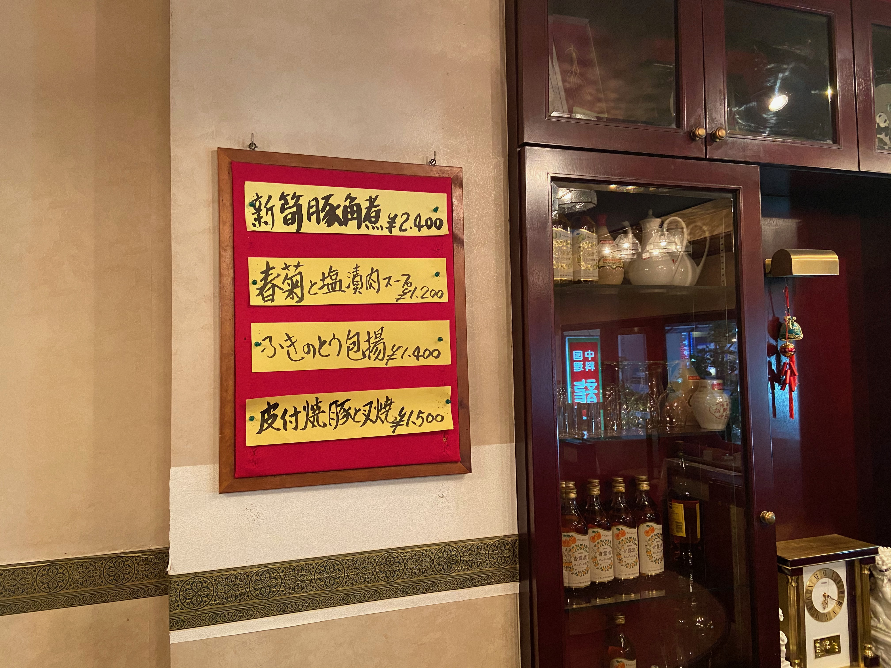
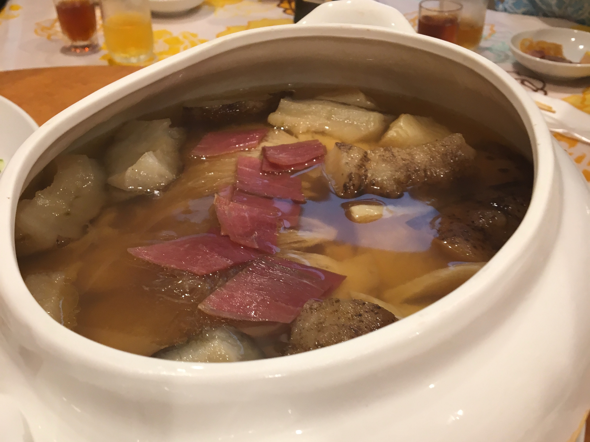
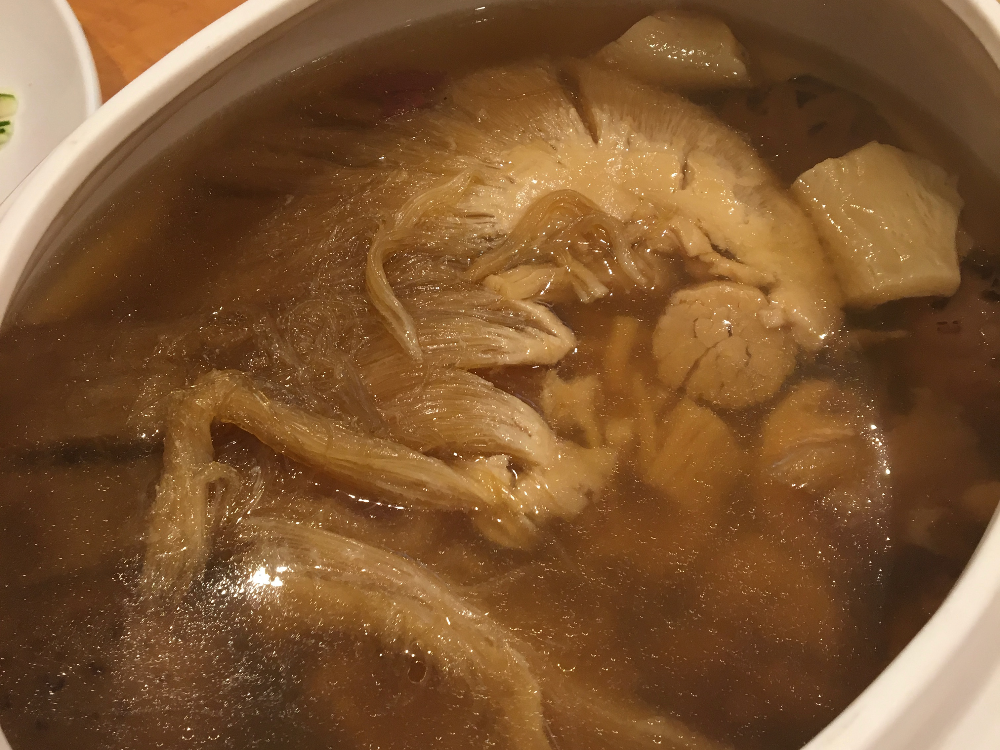
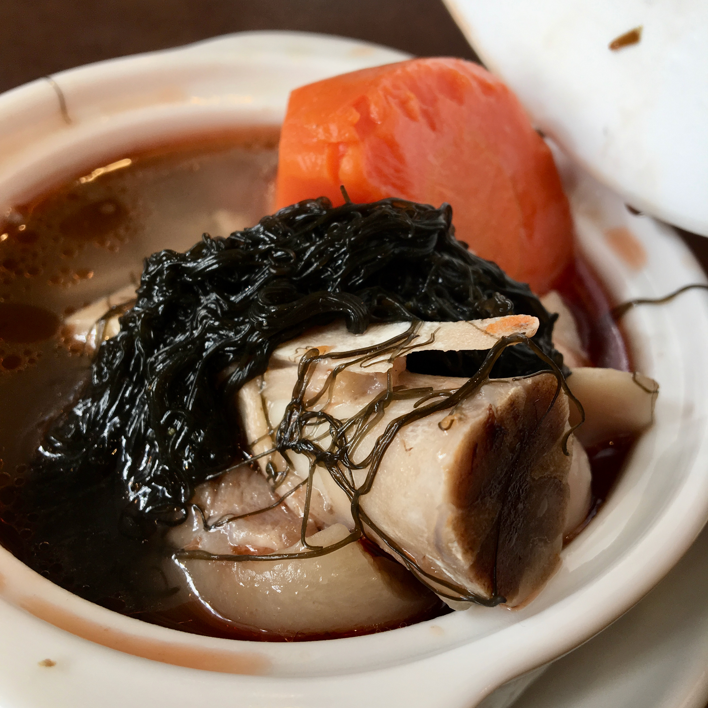
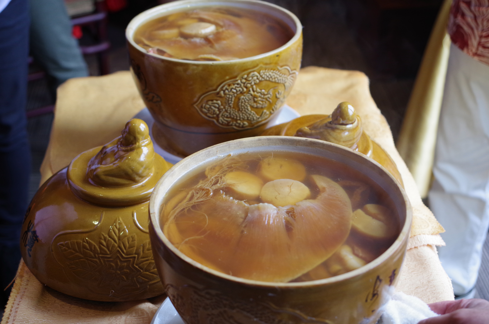
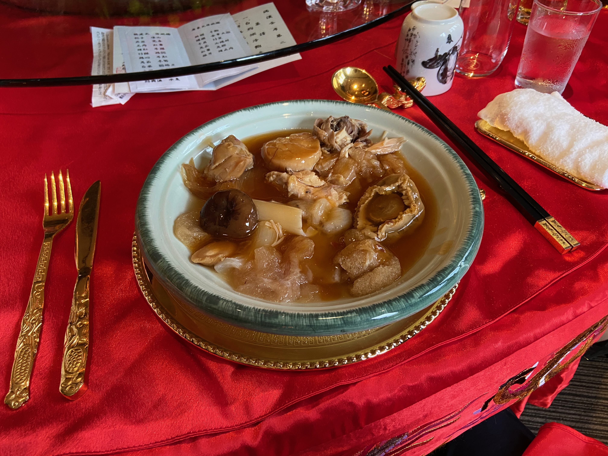
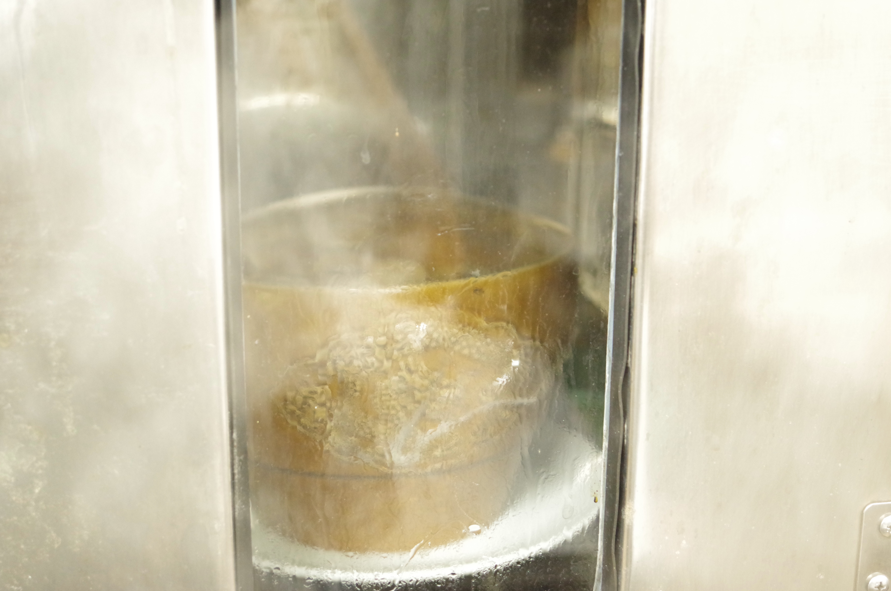
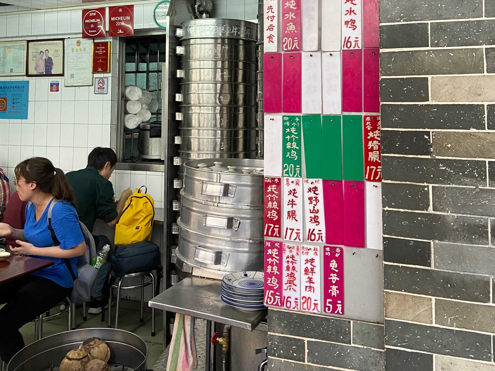

# 毎日の健康のための「例湯」特別な「佛跳牆」医食同源の神髄は薬膳スープにあり　

中華料理を食べに行って、スープの注文を考えたことのある方はどこのくらいおられるでしょうか？
普段見かける日本人向けメニューはコーンスープ、または西湖牛肉羹といわれる牛肉・卵白のあんかけスープくらいでしょう。

しかし、ランチサービスのラーメンスープなどで満足している限りは、決して決して中華の食通にはなれません。
なぜなら、スープは単なる味付きの湯ではなく、体調を整えるための薬膳を炊き出したもので不老長寿のメニューという位置づけ。

特に広東の豪華な宴会ではコースの最初と中盤以降で2品目の薬膳スープが組み込まれるのです。スープの内容と回数でその宴会の格式が決まります。

宴会で薬膳スープの相談をすれば、コックの目の色がかわります。結婚式や華僑ビジネスのメンツをかけた本気の宴会では一番予算が突っ込まれるのが薬膳スープだと考えて間違いありません。


＜写真＞中華宴会の花形は、不老長寿の薬膳であるフカヒレ。フカヒレといえば間違いなくスープ

また横浜では「例湯」メニューが残る店があります。 いわば「シェフのおすすめ本日の薬膳スープ」いったところでしょうか。

今回は、家庭的なスープ「例湯」から超高級スープ「佛跳牆」まで、横浜の薬膳スープをご紹介しましょう。

## 伊勢佐木町　龍鳳は薬膳スープのパラダイス

横浜で、ほぼ必ずスープを用意しているのは、伊勢佐木町の「龍鳳」。広東人好みの味は塩分控えめ旨味でぐいぐい押すタイプ。

スープは前日、少なくとも数時間前に一度炊き、いったん冷ましてなじませてから再加熱して仕上げるという時間のかかる料理。

使う肉はスペアリブ、豚の軟骨（パイカ）などをベースに、ハトムギや当帰などの毎回違った薬膳材料を使って炊き出します。

龍鳳では、最も季節感のある材料を使ってスープを作っています。
お正月はレンコン、春は春菊、夏はバナナの花やドラゴンフルーツの花、秋はイチジク、たけのこ宴会スペシャルでシェフ自ら摘んできた野セリなど。季節ごとに食べに行かなければいけないお店です。


＜写真＞初夏と秋の名物　いちじくのスープ　甘みと香りが肉の旨味とあわさると上品な味わいに

夏イチジクと秋イチジクのシーズンには、イチジクの甘みを煮出したスープが登場。
果物のイチジク？と思うかもしれませんが、スープにすると素晴らしい旨味を出すのです。


＜写真＞冬　「土ぼこりっぽいところで育ったものが旨いんですよ」と楊シェフが語るのは干菜白菜（広東白菜の乾物）のスープ　スキッとした野菜由来と力強い豚の脂身由来の2つの甘みがスープににじみ出す


年間通して通うべきスープのお店としてまず龍鳳を訪れるのが良いでしょう。
気楽かつ自然な味わいで、特にお子様がいる家族におすすめのお店です。
筆者は仕事で疲れ果てた時は、このスープだけわざわざ飲みにいくことも少なくありません。



＜写真＞薬膳スープは壁メニュー。このタイプの手書きメニューがある店では壁メニューを上から下まで頼めば間違いない

## 玄人向けの天龍菜館　蛇入りスタミナ漢方薬膳スープ

中華街でひときわ入りにくい、最上級者向けの店が「天龍菜館」。中華街で働くコックと家族のための店です。

こちらのお店にも、すばらしい薬膳スープがあります。漢方材料がごろごろ入った、強火で煮出したと思われる白濁した力強いスープ。
広東省のレストランで出てくる物と寸分の違いはなく、塩分は控えめで旨味を味わう系。店の外観ほどクセは強くないのでどんどんおなかに入るはずです。

スープには漢方の根っ子的なものをはじめとする様々な漢方材料が入っていますが、ときたま鱗がついた皮が入っていることがあります。材料は察してください。

注文から出てくるまでに2時間かかるので、前日か、当日食事開始前の早い時間に予約が必須です。二代目の店主が守る店は、以前よりもずっと入りやすくなりました。
ホールを担当する店主の娘さんが日本語達者のため、以前のように日本語が通じないこともなくなりました。


＜写真＞漢方の名人と謳われた先代は少し前に亡くなられてしまわれたと聞いています。先代の漢方スープは忘れられない味です。二代目のスープも味わいが深いのです

## 高級スープも薬膳たっぷり。南粤美食の「佛跳牆」は貸し切り限定メニュー

庶民的なスープを経験したら、高級薬膳料理としてのスープに是非ともチャレンジしていただきたいです。

昔のグルメ漫画などで「佛跳牆」（ぶっちょうしょう・ファッテューチョン）の名前を聞いたことがある人は少なくないでしょう。薬膳材料を炊き出したあまりの素晴らしい香りで、修行中のお坊さんがたまらず壁をのりこえて来るという名前のスープです。

一般的に広東では蒸しスープとして、6時間以上の蒸し時間で調理します。直火炊きスープは濁りが出ますが、蒸したスープは透き通ったスープに仕上がります。

壺の目張りを切って蓋をあければ、部屋中が複雑玄妙な香りで充満し参加者から歓声があがること請け合い。




＜写真＞上に見える紅い肉は中華ハム。古い資料で良く言及される金華火腿ではなく、雲南雲腿（雲南ハム）を選択。広東はプーアール茶の交易が多いためか、江蘇省の金華ハムだけでなく雲南省の雲南雲腿の利用も多い。

仕込みは一週間前に開始、蒸しは夜の宴会のために昼営業も閉店しての作業となります。 どんこ、魚の浮き袋、干しアワビ、干しなまこなどの高級干貨が蒸し出されています。

それらのパワフルなスター級の材料たちが喧嘩をせずに壺のスープの中に調和するのがこの料理です。




＜写真＞　写真からも迫力が伝わってくる巨大な材料のみで構成されたスープ

巨大な干しフカヒレはラーメンの麺のような太さ。他に滋味深い「干し貝柱」（干瑤柱：ゴンイーチー）が見えます。最下層には烏骨鶏の肉がほろほろになって沈んでいます。

すべての食材は旨味を出し切っているわけではなく、噛むごとに旨味がほとばしります。そして琥珀色のスープは、参加者が呆然としながら無口にすする味でした。


佛跳牆は当日の仕込みのために小さなお店ならば一日貸し切る必要があり、人数集めで非常にハードルの高い料理ではあります。

お値段は入れる材料で青天井ですが、スープに釣り合う格式の料理も考えて10名、一人あたり5万円程度からを見ておくとよいでしょう。ちょっとびっくりする値段ですが、都心の高級店と比べてみれば半額に近い格安と感じると信じています。


南粤美食では、もちろんリーズナブルな値段で楽しめる例湯（本日のシェフオススメ薬膳スープ）も宴会でオーダー可能。「宴会でスープをお願いしたい」と言った瞬間に気合いで顔色が変わる黄シェフとのやりとりも楽しいのです。



＜写真＞　縁起物の髪菜が入ったスペアリブ・レンコン・ニンジン入りお正月スペシャル薬膳スープ。底からは冬虫夏草が

## 大珍楼の「佛跳牆」は広東式と福建式の二種類

佛跳牆のような高級料理は、設備の整った大きい店のほうが頼みやすいでしょう。いずれにせよ個室での宴会となるので、収容人数の多い大きな店であっても安心して食べることができます。

「佛跳牆」を出す場合、店のメンツをかけた特別な宴会になりますので、スープ以外のどの料理もすべて間違いなく美味しいという次元の違う料理たちが出てきます。



＜写真＞「蒸し」スープとして作られた広東式佛跳牆

広東式（廣式）材料は　フカヒレ　干しアワビ　ホラ貝　金華ハム　干し貝柱　キヌガサタケ　干しシイタケ　鹿のアキレス腱　ナツメ　魚の浮き袋　白キクラゲ　豚肉。

その猛烈な香りと美しいスープ、食後にみなぎる身体の熱さは一度だけでいいから体験しておきたいところ。強烈な記憶は、一生心に残る財産となるはずです。




＜写真＞　琥珀色のスープを頂いたあとに中の材料を別皿でいただきます

スープだけでなく材料そのものも料理として供されます。噛めば噛むほど味わいが出てくる干貨たちは、まだ大きな力をその食材の中に残してくれています。


＜写真＞「直火炊き」スープで作られた福建式佛跳牆。

福建式（閩式）の材料は　クコ　長いも　ヨモギ　朝鮮人参　ナツメ　烏骨鶏　豚レバー　牛スジ　鶏砂肝　鶏ハツ　牛モツ　干しシイタケ　タケノコ　白果　ウズラの卵　キクラゲ　百合の花　紹興酒　すっぽん。

薬膳のパワーがものすごく、参加者の中には漢方酔いを起こす方もいたほどです。


## 中国沿海部の食文化の神髄はスープにあり

薬膳スープは華僑の日常のもののためか、レストランで積極的にはメニュー化されていません。しかしオーナーシェフの店で予約時に事前注文すれば、あっさりとOKしてくれるでしょう。

薬膳材料もパッケージ化されたものが中華街の中華食材店で簡単に入手可能です。味の組み立てさえ覚えれば家庭の台所で料理するのは難しくありません。


＜写真＞スープ用の漢方セット。横浜中華街「萬勝商事」で入手可能

薬膳材料をふんだんに入れて、直火で炊き出した少し濁ったスープをいただけば、仕事で疲労した体調もすきっと重さが抜けて身体のバランスを取り戻す感覚を実感できるはず。


また佛跳牆を代表とする「蒸しスープ」という調理法は時間が必要ですが、材料を破壊せずに素材の旨味のみをスープに引き出す強力な調理方法です。これも大きな中敷き付きパスタ鍋などで容器ごと1〜2時間蒸せば家庭で簡単に再現できます。




＜写真＞巨大な蒸し器の中で専用の食器で仕込まれる佛跳牆




＜写真＞　広州の街角スープスタンド？蒸し器が積み上がる

簡単に作れる最も身近な家庭料理から、最高級の料理までカバーするのが中華料理の薬膳スープの奥深さ。広東人の家庭では健康のために母親やおばあちゃんが毎日かならず作ると言います。
親しい友人の家に日本から訪れれば、日本でお茶がでてくるようにその家自慢のスープが出てきます。
調理時間は短い物で30分、長いものでは3時間から6時間、これが出てきたら最大のおもてなしですのでありがたく頂きましょう。

福建系のオーナーシェフの店でも、定番の海苔のスープ、冬は牡蠣、夏はマテ貝のスープ、もちろん福建式佛跳牆が注文可能ですので、店と相談することをおすすめします。厨房はきっと大喜びで出してくれます。

数ある料理の中でもスープこそが「母の愛情あふれる味」、中国沿海部の食文化の神髄を表していると言えるでしょう。


## 店舗情報

※　営業時間　定休日は自治体の要請により変更の可能性があります。

```
龍鳳
住所：神奈川県横浜市中区長者町7-112（MAP）
TEL：045-261-0308
営業時間：11:00～14:00　17:00-21:00
水曜休
```

```
天龍菜館
住所：神奈川県横浜市中区山下町232（MAP）
TEL：045-664-0179
営業時間：11:00～深夜
不定休
```

```
南粤美食
住所：神奈川県横浜市中区山下町165-2 INビル（MAP）
TEL：045-681-6228
営業時間：11:30〜14:00 17:00〜21:00
不定休
```

```
大珍楼
住所：神奈川県横浜市中区山下町143（MAP）
TEL：045-663-5477
営業時間：11:00〜21:30
不定休
```


## 参考文献

雲南ハム
https://kojuken.co.jp/item/3728/

閩式佛跳牆
https://www.youtube.com/watch?v=q1YvjALODhQ

