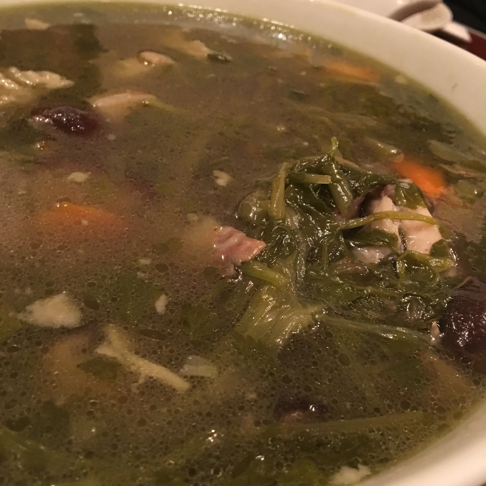

# 家族の健康のための「例湯」贅を尽くした「佛跳牆」　中華料理の醍醐味はスープにあり　

中華料理を食べに行って、スープを考えたことのある方はどこのくらいおられるでしょうか？
メニューから普段見かけるのはフカヒレスープやコーンスープ、良くて西湖牛肉羹といわれる牛肉・卵白のあんかけスープくらいでしょう。

しかし、サービスのラーメンスープなどで満足している限りは、決して決して中華の食通にはなれません。

日本人からするとスープは食事の脇役ポジションですが、中華料理においては主役の中の主役で、特に広東の豪華な宴会では2品組み込まれるものです。
宴会でスープの相談をすれば、コックの目の色がかわります。一番予算が突っ込まれるのがスープだと考えて間違いありません。

＜写真＞中華宴会の花形は、フカヒレ。フカヒレといえば間違いなくスープ

横浜では「例湯」メニューが残る店があります。 いわば「シェフのおすすめ本日の薬膳スープ」いったところでしょうか。

日本人から注文が入らないので、毎日例湯を仕込む店は中華街でも珍しくなりました。手間も時間もかかるスローフードですので、よほどこだわりのある店でしかレギュラーメニューではおいていません。

今回は、家庭的なスープ「例湯」から超高級スープ「佛跳牆」まで、横浜のスープをご紹介しましょう。

## 龍鳳の季節の直炊き薬膳スープ

横浜で、ほぼ必ずスープを用意しているのは、伊勢佐木町の「龍鳳」。広東人好みの味は塩分控えめ旨味でぐいぐい押すタイプ。

スープは前日、少なくとも数時間前に一度炊き、いったん冷ましてなじませてから再加熱して仕上げるという時間のかかる料理。

使う肉はスペアリブ、豚の軟骨（パイカ）などをベースに、ハトムギや当帰などの薬膳材料を使って炊き出します。筆者は仕事で疲れ果てた時は、このスープだけわざわざ飲みにいくことも少なくありません。

龍鳳では、最も季節感のある材料を使ってスープを作っています。お正月はレンコン、春は春菊、夏はバナナの花やドラゴンフルーツの花、秋はイチジク、たけのこ宴会スペシャルでシェフ自ら摘んできた野セリなど。季節ごとに食べに行かなければいけないお店です。

＜写真＞シェフの積んできた秦野たけのこ山の野セリスープ

＜写真＞初夏と秋の名物　いちじくのスープ

夏イチジクと秋イチジクのシーズンには、イチジクの甘みを煮出したスープが登場。イチジク？と思うかもしれませんが、スープにすると素晴らしい旨味を出すのです。

＜写真＞冬　干菜白菜（広東白菜の乾物）のスープ

「ほこりっぽいところでとれたものが旨いんですよ」広東省北部の河源の名物　干菜白菜を戻して煮込まれたスープは野菜の旨味がどっさり。

## 天龍菜館　蛇入り漢方薬膳スープ

中華街でひときわ入りにくい、最上級者向けの店が「天龍菜館」。二代目の店主が守る店は、以前よりもずっと入りやすくなりました。店主の娘さんが日本語達者のため、日本語が通じないこともなくなりました。

こちらのお店にも、すばらしい薬膳スープがあります。漢方材料がごろごろ入った、白濁した力強いスープ。

注文から2時間かかるので、前日までに予約が必須です。スープには様々な漢方材料が入っていますが、ときたま鱗がついた皮が入っていることがあります。材料は察してください。

漢方の名人と謳われた先代は少し前に亡くなられてしまわれたと聞いています。先代の漢方スープは忘れられない味です。二代目のスープも味わいが深いのです。

## 高級スープも薬膳たっぷり。南粤美食の「佛跳牆」は貸し切り限定メニュー

「佛跳牆」（ぶっちょうしょう・ファッテューチョン）の名前を聞いたことがある人は少なくないでしょう。あまりの素晴らしい香りで、修行中のお坊さんがたまらず壁をのりこえて来るという名前のスープです。

一般的に広東では蒸しスープとして、6時間以上の蒸し時間で調理します。直火炊きスープは濁りが出ますが、蒸したスープは透き通ったスープに仕上がります。

蓋の封を切って蓋をあければ、部屋中が複雑玄妙な香りで充満し参加者から歓声があがること請け合い。

＜写真＞　仕込みは一週間前に開始、蒸しは夜の宴会のために昼営業も閉店しての作業

どんこ、魚の浮き袋、干しアワビ、干しなまこなどの高級干貨が蒸し出されています。

上に見える紅い肉は中華ハム。古い資料で良く言及される金華火腿ではなく、雲南雲腿（雲南ハム）を選択。広東はプーアール茶の交易が多いためか、江蘇省の金華ハムだけでなく雲南省の雲南雲腿の利用も多い。

＜写真＞　写真からも迫力が伝わってくる巨大な材料のみで構成された

巨大な干しフカヒレはラーメンの麺のような太さ。他に滋味深い「干し貝柱」（干瑤柱：ゴンイーチー）が見えます。最下層には烏骨鶏の肉がほろほろになって沈んでいます。

すべての食材は旨味を出し切っているわけではなく、噛むごとに旨味がほとばしります。そして琥珀色のスープは、参加者が呆然としながら無口にすする味でした。

佛跳牆は当日の仕込みのためにお店を一日貸し切る必要があり、人数集めで非常にハードルの高い料理ではあります。

オーナーシェフの黄さんはテレビで紹介された雲呑麺などではなく、こういうコックの本懐のような料理を作りたいといつも話していますので、80C読者の方は同志を10名あつめて是非ともチャレンジしていただきたいです。

お値段は入れる材料で青天井ですが、スープに釣り合う料理を考えて一人5万円程度を見ておくとよいでしょう。ちょっとびっくりする値段ですが、都心の高級店と比べてみれば格安と感じると信じています。

南粤美食では、もちろんリーズナブルな値段で楽しめる例湯（本日のシェフオススメ薬膳スープ）も宴会でオーダー可能。「宴会でスープをお願い」と言った瞬間に気合いで顔色が変わる黄シェフの表情も楽しい。

＜写真＞　縁起物の髪菜が入ったスペアリブ・レンコン・ニンジン入りお正月スペシャル薬膳スープ。

## 大珍楼の「佛跳牆」は広東式と福建式の二種類

佛跳牆のような高級料理は、設備の整った大きい店のほうが頼みやすいでしょう。いずれにせよ個室での宴会となるので、収容人数の多い大きな店であっても安心して食べることができます。

「佛跳牆」を出す場合、店のメンツをかけた特別な宴会になりますので、スープ以外のどの料理もすべて間違いなく美味しいという次元の違う料理たちが出てきます。

＜写真＞「蒸し」スープとして作られた広東式佛跳牆

材料は　フカヒレ　干しアワビ　ホラ貝　金華ハム　干し貝柱　キヌガサタケ　干しシイタケ　鹿のアキレス腱　ナツメ　魚の浮き袋　白キクラゲ　豚肉。

その猛烈な香りと美しいスープは一度だけでいいから体験しておくべきでしょう。

＜写真＞　琥珀色のスープを頂いたあとに中の材料を別皿でいただきます

スープだけでなく材料そのものも料理として供されます。噛めば噛むほど味わいが出てくる干貨たちは、まだ大きな力をその食材の中に残してくれています。

＜写真＞「直火炊き」スープで作られた福建式佛跳牆。

材料は　クコ　長いも　ヨモギ　朝鮮人人　ナツメ　烏骨鶏　豚レバー　牛スジ　鶏砂肝　鶏ハツ　牛モツ　干しシイタケ　タケノコ　白果　ウズラの卵　キクラゲ　百合の花　紹興酒　すっぽん。

福建式はすっぽんをはじめ薬膳のパワーがものすごく、参加者の中には漢方酔いを起こす方もいたほどでした。

## 中国沿海部の食文化の神髄はスープにあり

日本では地味なスープは評価も知名度も低いのですが、筆者の師匠様は「広東料理の真髄は例湯（本日のスープ）にあり」とおっしゃっています。

＜写真＞　広州の街角スープスタンド？蒸し器が積み上がる

薬膳材料をふんだんに入れて、直火で炊き出した少し濁ったスープをいただけば、仕事で疲労した体調もすきっと重さが抜けて身体のバランスを取り戻す感覚を実感できるはず。

その中でも「蒸す」という調理法は特に手間と時間ががかかりますが、材料を破壊せずに素材の旨味のみをスープに引き出す強力な調理方法です。

＜写真＞巨大な蒸し器の中で専用の食器で仕込まれる佛跳牆

最も身近な料理から、最高級の料理までカバーするのが中華料理のスープ。広東人の家庭では健康のために母親やおばあちゃんが毎日かならず作ると言います。
親しい友人や親戚の家を訪ねれば、日本でお茶がでてくるようにその家自慢のスープが出てきます。

福建系の料理店でも、定番の海苔のスープ、冬は牡蠣、夏はマテ貝のスープ、もちろん佛跳牆が注文可能ですので、店と相談することをおすすめします。きっと大喜びで出してくれます。

数ある料理の中でもスープこそが「おふくろの味」の根底、中国沿海部の食文化の神髄を表していると言えるでしょう。

#

## 参考文献

雲南ハム
https://kojuken.co.jp/item/3728/