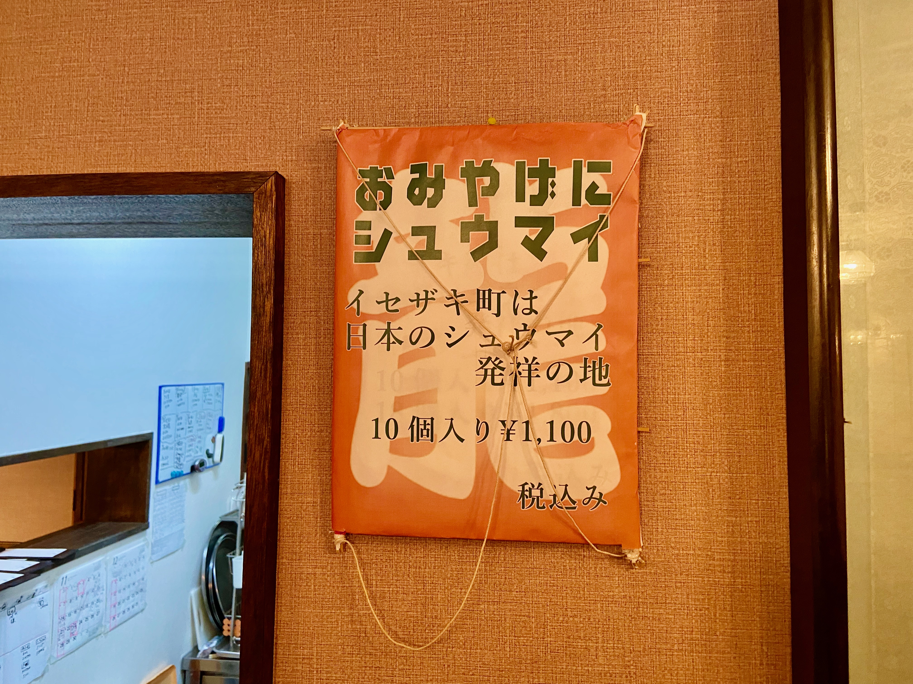
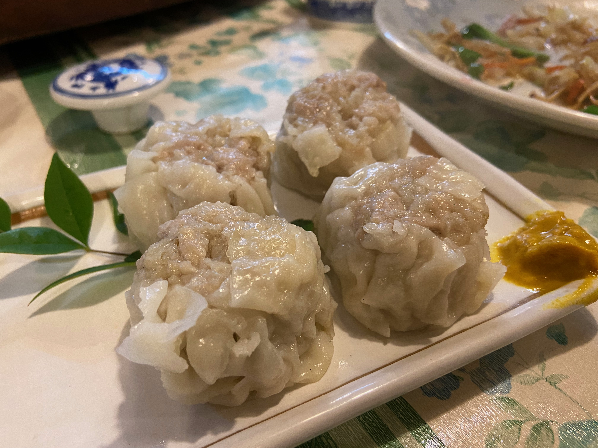
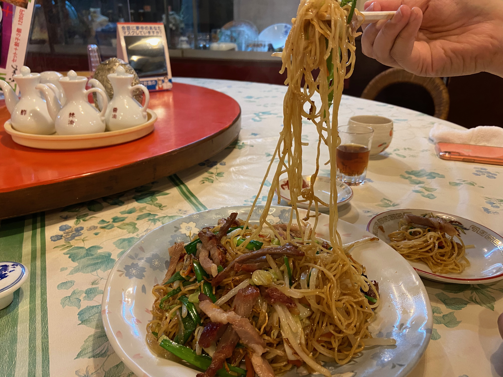

## 横浜オールド中華探訪　エピローグ　失われた博雅のシウマイを探して

横浜のシウマイの記事を書いてからも、伊勢佐木町発祥 失われたハマッ子のソウルフード「博雅のシウマイ」を足で探す旅を筆者は続けていました。

＜写真＞　伊勢佐木町　龍鳳の店内に飾られた看板。筆者が初めて訪れた時からあったもの

博雅の名前を持つ店は関東に数件ありますが、実際に伺うと横浜とは無関係だったり、肝心の横浜にのれん分け店が残っていません。
一旦記事としてまとめた後も、横浜中華最大のミステリーとしてずっと心の隅にひっかかっていました。
昔働いていた職人さんの技術ががどこかに伝わっていると信じて、出会う華僑の皆さんに片っ端から聞いていました。

その結論が見つかるイベントが、ある日突然やってきました。2021年の秋　蒔田の「廣東楼」で食べたシウマイが、以前同店で食べたものと違うのです。
それはちょうどコロナの落ち着いたタイミングで、今まで厨房に入っていたコックさんは活況の戻った中華街に助っ人に行ってしまい、老齢オーナー夫妻が細々と手作りしたものでした。

「ああ、これね、亡くなった親父が一時期、伊勢佐木町の博雅でコックをやってたんだよ。だからうちのは美味しいよ。今日はちょっと水の加減がうまくいかず柔らかすぎたけどね」

灯台もと暗しとはまさにこのこと。まさかの旧知の店で、ついに博雅の直系レシピを受け継ぐ人の作るシウマイを食べることができました。
それも博雅で働いていたという廣東楼先代は、「伊勢佐木町　龍鳳」のご親戚。龍鳳は筆者が「おそらく昔の博雅の味に近いシウマイを提供しているのではないか？」と紹介したお店ですので、推測の糸がつながりました。

シウマイが汗をかくように肉汁が染み出し、肉肉しい味わいが口内いっぱいに広がります。
職人の手のひらの形がそのまま写し取られたような飾り気のないシウマイは、伊勢佐木町のマダムの証言どおり大きく柔らかく、たしかに龍鳳のシウマイよりもソウルフード的力強さを持つ味わいでした。

＜写真＞これが、筆者が足かけ15年探し続けた「博雅」のシウマイの味

「博雅のオーナーはたいした人でね、シウマイを仕込んでるときは調理場に入ってこなかったんだってさ。貧しい時代でみんなおなかすかせてるだろ？オーナーがいたらつまみ食いできないからね、そういう人柄だったんだよ。」

この話は戦後すぐの日本が豊かになる前の時期、進駐軍の配給物資の割り当てなどがある華僑の店でないと肉類は食べられないものだったと思います。
もしも腹をすかせた筆者の父母世代が子供時代にこれを食べたら、それは天にも昇る気分だったことでしょう。

博雅のシウマイの味に関しては、一次情報を手に入れたことで筆者の中で心の整理がつきました。では未解決の、シウマイの形についてはどうでしょうか？

伊勢佐木町の生き字引、田中屋林蔵商店の大旦那の証言によれば、記憶の中の博雅のシウマイは、形は普通のシウマイの形になっていたということでした。
他の方の証言では「拳骨みたいに大きかった」とされていて、横浜松坂屋で販売されていた側面が垂直で樽形のものだったと推測します。

＜写真＞蒸籠が窮屈に見えるほど立派な拳骨に見えるシウマイ。こちらは筆者が取材野中で特に感銘をうけた根岸　聘華楼のもの。横浜松坂屋で販売されていた博雅ブランドものと形はほぼ同一の外観

今回の廣東楼のものは、柿のような丸いもの。中華街の古い店、牡丹園などと似ています。
あくまで推測ではありますが、廣東楼の先代が博雅で働いておられた古い時代は、気取らないこの形での提供だった可能性があります。
当時の写真が残っていない今となっては、ここまで追いかけるのが限界。ご容赦ください。

##シウマイさがしの旅の終わりに

コロナに翻弄された横浜の中華料理店で偶然が重なり、一瞬だけ霧の晴れた瞬間に空の向こうに山の頂が見えたかのように、横浜に博雅のシウマイが復活しました。

店も料理人も客も高齢となった廣東楼は一日に10人にも満たない常連が訪れるのみ。
古い味が現代の人の嗜好に合わない部分も含めて、オーナー夫妻がなじみ客のために静かに出来る範囲の手作りを守り続けています。

もしも博雅のシウマイにもう一度出会いたかったら、蒔田の廣東楼に訪れるとよいでしょう。
博雅のシウマイが深い霧に再び閉ざされる前お早めに。次の霧は、もう晴れる見込みはありません。

＜写真＞　いまも旧式の製麺機で作られる廣東楼の手作り麺。横浜に数多くある中華料理店の中でも、明らかに麺そのものが美味しいと感じる

