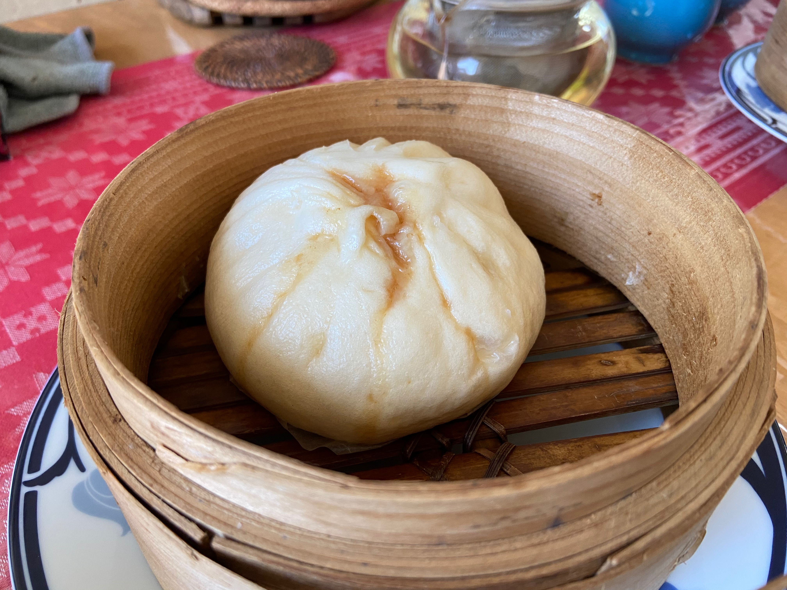
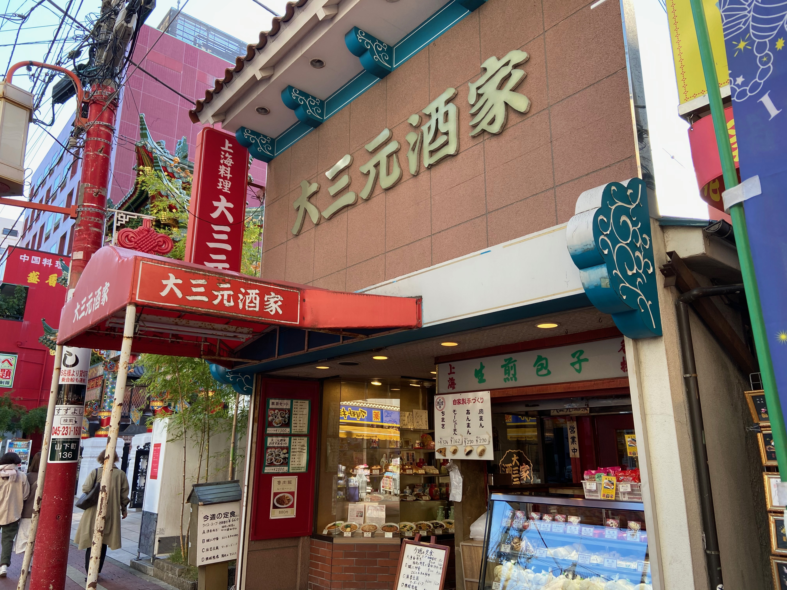
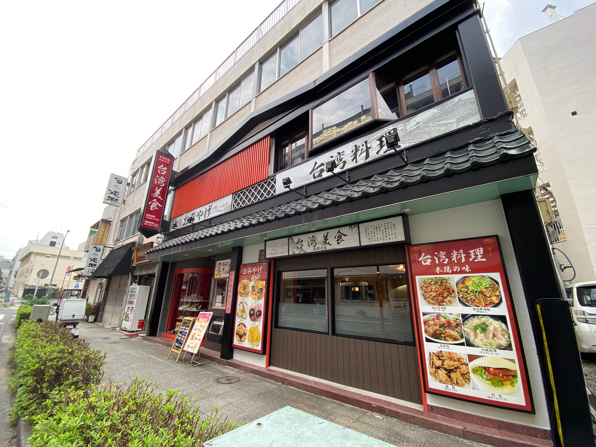
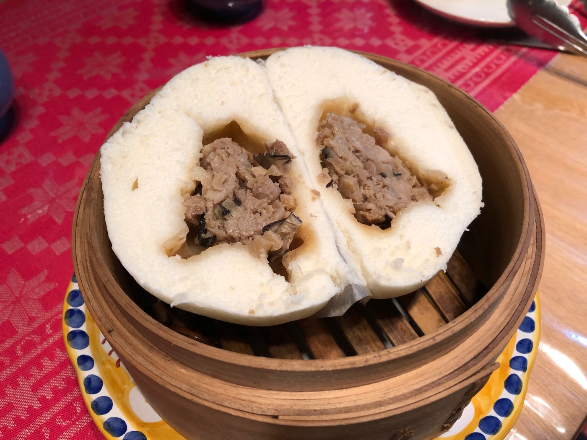

# 幸せな昼食は肉まんから。中華街に来たら手作り肉まんをお土産に

肉まんの恋しい時期になりました。一昨年公開で好評だった前編でご紹介できなかった地方色のある肉まんたちを改めてご紹介したいと思います。

テレワークのご時世に、肉まんほど便利な中華食材は無いかもしれません。ふかすだけで主食もおかずも食べられる完全食。
蒸し器で暖めている間は、仕事をしていても大丈夫。電話会議で前後がブロックされてても、短い昼休みに素早く満足できます。


＜写真＞台湾好きならおなじみの大同電鍋に放り込んでおけば、電話会議の合間に蒸かし立ての肉まんが食べられる

コンビニでもスーパー・デパ地下でも買えるほど日本人にこんなに愛されている肉まんですが、中華街の専門店の肉まんは値段の差を納得するほどの違いがあります。

手作り肉まんは冷凍ストックがあるととても便利。肉まんを買ってきたら冷凍庫に放り込んでしまえば、一ヶ月程度は保存することができます。
食べるときは中華風味を損なわないように、かならず「蒸し器で強火15分以上」、冷凍の場合は更にプラス5分蒸かして、ふわふわにして戴いてください。

蒸し器は100円ショップで買えます。電子レンジだけで加熱すると生地が硬くなってしまいます。蒸し器で調理するのがおいしさのコツです。
蒸し時間は大きさによりますが、勢いよく蒸気が上がってから15分から18分くらいでしょうか。冷凍からの場合は更に10分追加してください。

電子レンジにかけると皮がカチカチになります。

前編からの再掲ですが、手作り肉まんはこんな特徴があります。

**手作り肉まんの特徴**
- 自然発酵のためカッコがちょっとブサカワで個性的
- そもそも中の味付けは店ごとに全然ちがう
- そして、麺（皮）のコシと自然発酵による小麦の香りと豊かな味わい


＜写真＞手作りのブサカワな部分は、キューピーちゃんの頭の先っぽような部分でわかる


では、後編おまたせしました。後編では、中華圏各地方のエッセンスをもった肉まんたちを紹介。北から順番に行きましょう。


## 北京代表「華都飯店」

まずは、中華街でもひときわ陰の薄い北京から。筆者が「北京の包子（肉まん）が懐かしい。どこかに無いか」と言われたら、ここを薦めます。


＜写真＞旨味の肉汁が外側まで染み出した、少し不格好で質実剛健なビジュアル

多すぎて滲み出た醤油と肉汁が、生地を茶色くしているあたりが手作り感満載です。
これが大当たりを見分ける肉汁たっぷりのおいしさの証。北京で食べてたものも茶色くなっていて、このようなビジュアルでした。

てっぺんのねじれも、皮のひだも一個一個違って、手でひねった感が満載。
日本人だったらこうしないよね、と妙に納得してしまう、とっても中国らしいおおらかで質実剛健な作りです。


＜写真＞そのビジュアルに肉汁を感じる肉まん


肉汁が飛び出すので方向に気をつけてがぶっといっきましょう。
香味野菜がピシッと強めに立っている気がします。食べてわかる範囲で中身は肉としいたけ、葱の強めの香味も入っています。

ふわっと上がる力強い香りが特徴です。


筆者が食べ比べた限りでは、中華街の肉まんの中では頭一つ飛び抜けた個性的な風味。 北京の最高気温零下の日の朝に道路でかぶりついた肉まんの記憶がよみがえります。
でも、こちらの肉まんは筆者が北京で食べていたものより材料も作りも味わいも100倍上等です。気に入ってもらえるとうれしいです。


- 味の系統: 醤油　香味野菜の香り系
- 特徴: 休日の朝食向け　ただし強めの匂いにはご注意
- 合わせたい飲み物　個人的には薄いしぼりたて豆乳　日本のラガービールも合うはず


## 上海代表　上海料理の名店「大三元酒家」



＜写真＞大三元とは縁起の良い名前。昔どこかで読んだ本の記憶では、初代が麻雀で勝ち取ったお店とか(真偽不明）

筆者の家人が上海に長く住んでいたので、ときたま上海料理を所望されます。媽祖廟横の上海料理屋　大三元酒家はたまに行く店の一つ。
料理は上海風でありながら横浜らしく広東の影響を感じる横浜中華です。そしてレギュラーメニューに田鶏（カエル）があるあたりに、観光客に媚びない店の本気を感じます。

こちらはなつかしく穏やかな上海料理が美味しい。池袋や新橋の現代の上海ではなく、実に古くさい味。
逆にそれが郷愁を誘い食べて良し居心地は良し。そして店先に並ぶ手作りまんじゅうやちまきが、食後のお土産に手頃で良いのです。


この肉まん、表面の部分が景色があっていいですね。無理にひだをつくらずになんとも優しい表情をしています。


＜写真＞ぎゅっとしていてどさっと固まった餡

中は醤油味の餡がどっさりはいっています。タケノコとひき肉が実にいい味をだしていて、餡が舌の上でころころと転がるのです。
味は家人に言わせれば、この焦点のぼやけた感じが上海だということ。筆者にも塩分控えめな感じが好印象です。


上海系らしく少し甘く醤油味が効いた色濃い目の味。
朝に食べる肉まんとしては、なぜこれと一緒にビールが飲めないか、画竜点睛を欠くのではないかと、いささか駄目人間らしい不満を筆者は感じます。
買っておいたら休日用にまわしたい肉まんです。


＜写真＞綺麗に記事が割れたチャーシューまん

もう一個、チャーシューまんを買ってきたので、こちらも試してみました。広東は食紅をつかったチャーシューですが、上海は醤油の茶色です。

甘みは肉まん以上にかなり強く、それ以上に思い出すのは、たしか上海の福州路にある「老正興菜館」で食べた「草頭圏子」の味です。

上海料理といえば、醤油味で甘いのがごちそう。上海料理で有名所だと豚スネの醤油煮やアヒルの醤油煮などがありますが、この肉まんも同様のニュアンスを持っています。

こんな古めかしいごちそう系の肉まんは、休日の昼ごはんにビールと一緒に、濃い味を洗い流しながら戴くのが正しいのではないかと思います。ぜひとも金曜か土曜に中華街に行き、週末のランチビールのお供にしていただきたいと思います。


- 味の系統: 醤油ひき肉　一昔前のごちそう系
- 特徴: すこしダサめの餡が上海の旅の思い出を誘う、ごろごろ肉系
- 合わせたい飲み物: アルコール度の薄いさっぱり中国ビール！もしくは緑茶


## 台湾代表　懐かしのあの肉まんの味　「台湾美食」（茂園食品）の肉まん

横浜中華街は広東・福建・上海の人たちが多いのですが、台湾系の人も多く住んでいます。 コロナの中で新規開店した台湾美食（茂園食品）は街の話題になりました。

その茂園食品の肉まんは、かなり筆者の好みなのです。


＜写真＞　頭の部分がちょっと乱れてるのが手作りの証。ここをみればわかります。それにしても美しいひだの造形にうっとり

懐かしさを感じるしっかりとした醤油味。クワイのシャキシャキ食感、しいたけの旨味ががつんと来るのが特徴。

オーナーが独立前に務めていたという店の味と似たニュアンスがあります。
干し椎茸の味が強めに出ていて、少しだけ良い意味での古めかしさを感じます。そして塩分も控えめ。

筆者が台湾人の友人と食事をして観察していると、日本人と比べて甘み強めの塩分控えめが好みのようです。




＜写真＞逆風の中で開店した「台湾美食」　いついっても必ずお客さんがいて根強い人気

この店の肉まんを初めて手に入れたのは、おととしのこと。中華街のはずれ、萬来亭の小さな製麺所のガラスケースで見つけたのです。いかにも手作りでオーラを感じる肉まん。
ところが、製麺所には肉まんを作っている気配は無し。

レジを打ってくれた気さくなお兄ちゃんが「ここでは作ってなくて親戚にお願いしている」と教えてくれました。


ならばとラベルの表記を頼りに中華街にほど近い工房、当時の本店で製造されているご家族の方々に伺ったところ、ご出身は台北だそうです。この肉まんは台湾北部の味ということになります。

- 味の系統: 醤油肉椎茸　一昔前のごちそう系
- 特徴: これぞ日本人が連想する肉まんらしい肉まん。垢抜けない味だけれど、それが時代を超えた魅力。
- 合わせたい飲み物: ビール！


## 広東代表　「楽園」の大型肉まん

最後にご紹介したいのは、一等地にあるのに見落としがちなお店の肉まんです。

中華街の門をくぐれば、いつもそこにある「楽園」。でもお店のスタッフの方々の高齢化で、他の名店たち同様にいつまで続くかもわからない。
いまのうちに食べておくべき、中華街の本物の楽園だとお伝えしたいのです。


＜写真＞楽園の肉まん　表面の輝きが美しい

楽園の肉まんは大サイズで、一個で朝食大満足のボリュームです。 我が家のセイロでは積み重ねするとてっぺんがぶつかってしまい、すこし工夫が必要なほど。


＜写真＞がつっと分厚い皮、少し偏った餡の景色が手作り感を感じます。

基本的に塩味で、少し醤油が使われているビジュアル、中華街の中でも立派な部類の大きさの予想に反して上品な味付けです。


食べているとたまに歯にあたるしいたけから、じゅわっと深い味わいと香りが立ち上ります。中のしいたけは荒く刻んであり、この一口ごとの印象の違いが味に立体感をあたえています。


味が濃いのに慣れている人には少し物足りなさを感じるかもしれません。食べるときはぜひ「自分は広東人」と思ってください。
優しく食べ飽きない家庭の味なのです。筆者の感想では、とくに仕事で疲れて胃腸が重たいときに好印象でした。

この肉まんには、不思議とアルコール飲料を飲みたいと思わせないがあります。
食べた後に口に濃い味が残ることもなく、食べ終わったら仕事を始めるのにぴったりの朝の肉まんです。


＜写真＞　この店にさらりと入れるようになったらかっこいい、そんな古いお店

こんな素敵な店のドアを開けたのですから、せっかくなのでランチメニューでも、夜なら一品料理をなに食べてから肉まんを買いましょう。
素敵な店のお母さんとの会話、貫禄を感じるメニュー構成にきっと何か素晴らしい体験がまってるはずです。


- 味の系統: しいたけの旨味が光るタケノコ醤油系
- 特徴: 朝食向け　薄味でしいたけをかみ当てた瞬間に幸せな風味が爆発
- 合わせたい飲み物: 台湾の上品な高山烏龍茶・ダージリン・香り高い焙じ茶など軽め


味の好みは人それぞれ、年齢や運動量・体調によっても美味しいと感じるものは変わるので、中華街に行ったら違った店で二・三種類買い込んで、自分の好みをさがしてみましょう。

そしてぜひ、マイベスト肉まんを探し出してみてください。


## 今回紹介したお店


```
華都飯店
住所：横浜市中区山下町166
TEL：045-641-0335
営業時間：10:30～21:00
水曜定休
```

```
大三元酒家
住所：横浜市中区山下町136（MAP）
TEL：045-641-4402
営業時間：11:00～22:00
不定休
```

```
茂園 台湾美食
住所：横浜市中区山下町220（MAP）
TEL：045-663-0901
営業時間：11:00〜21:00
不定休

工場直売　茂園(モエン)2号店
住所：横浜市中区伊勢佐木町3-106（MAP）イセザキモール
TEL：045-242-6525
営業時間：10:00～19:00
https://www.moensyokuhin.com/
```

```
楽園
住所：横浜市中区山下町154
TEL：045-641-9308
営業時間：11:00～21:00　平日は中休みあり
火曜定休
```


