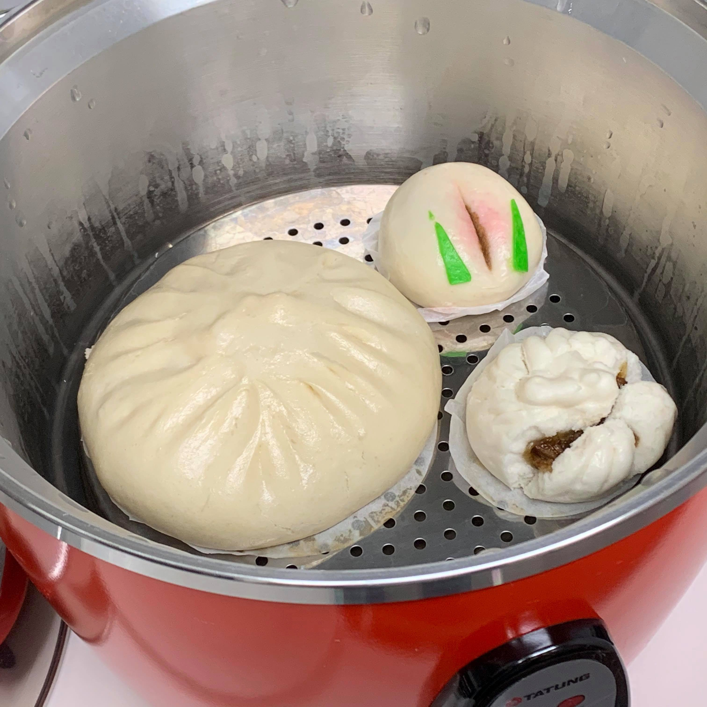
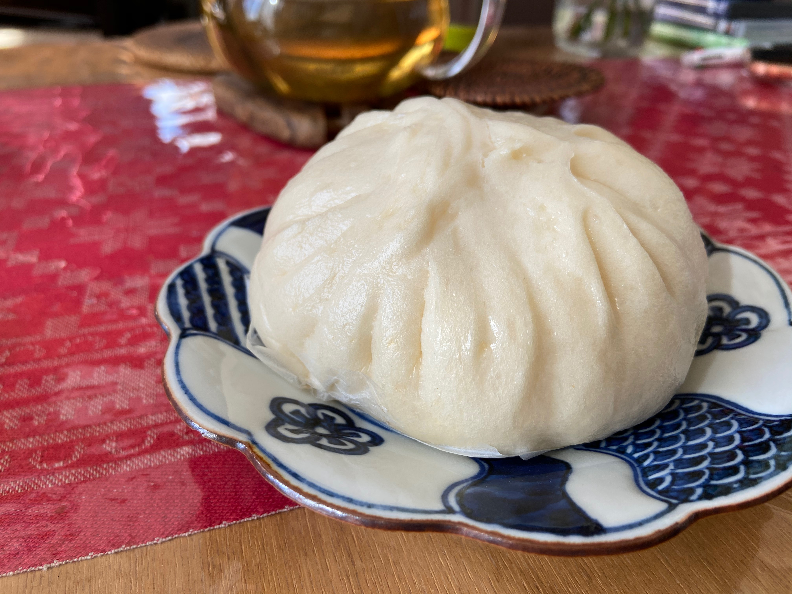
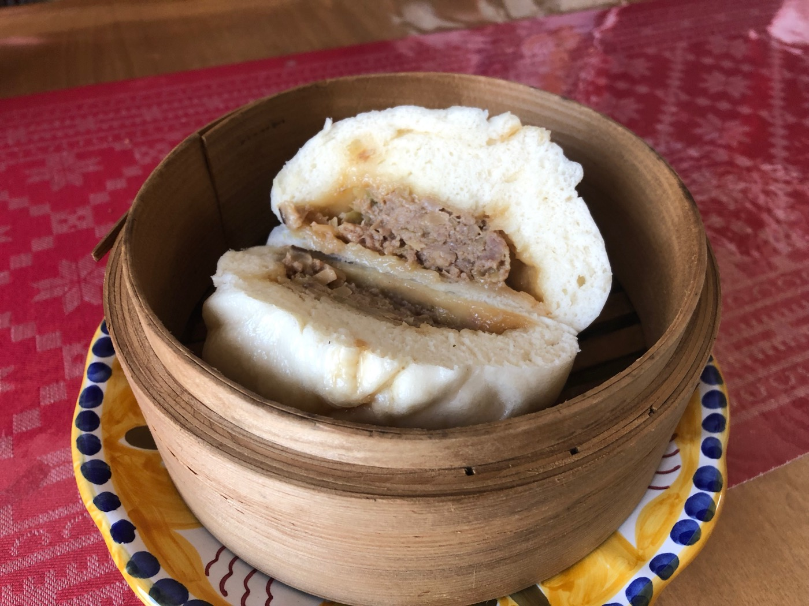
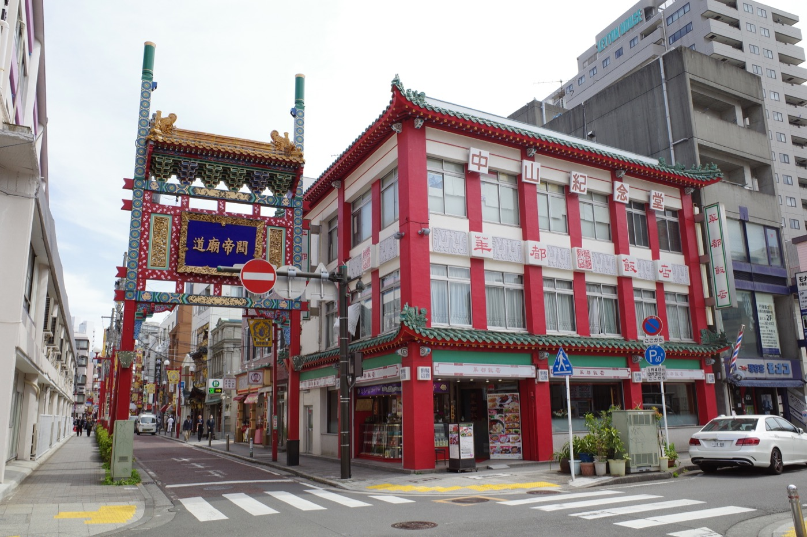
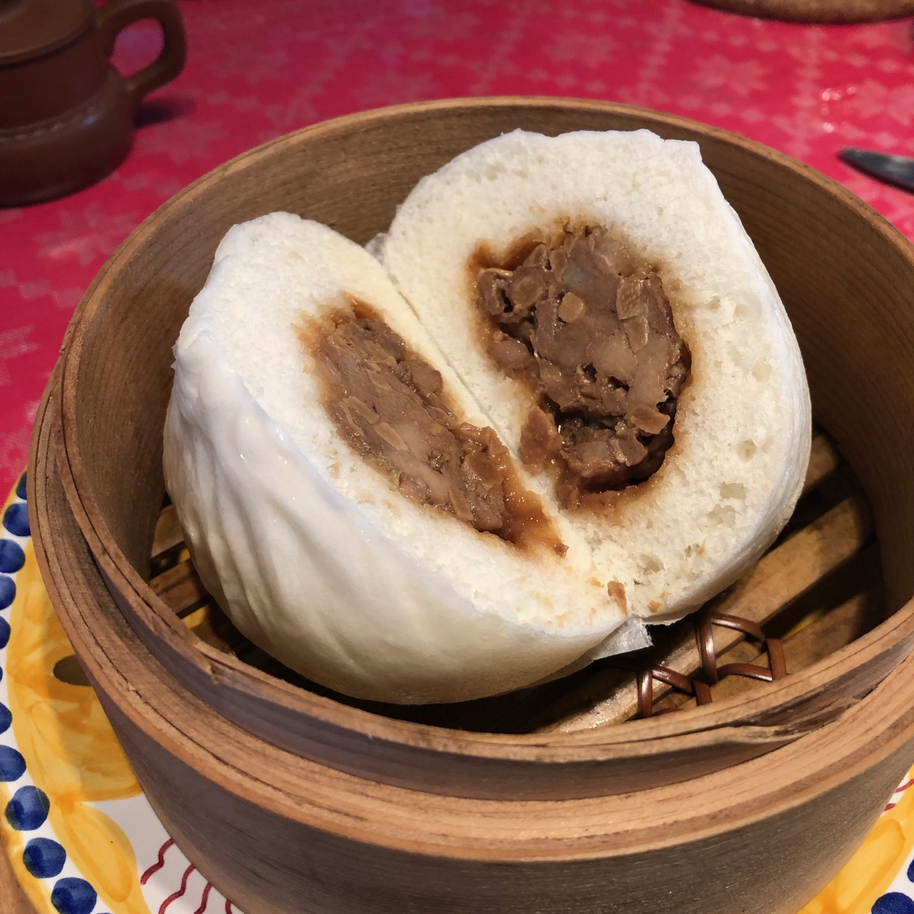
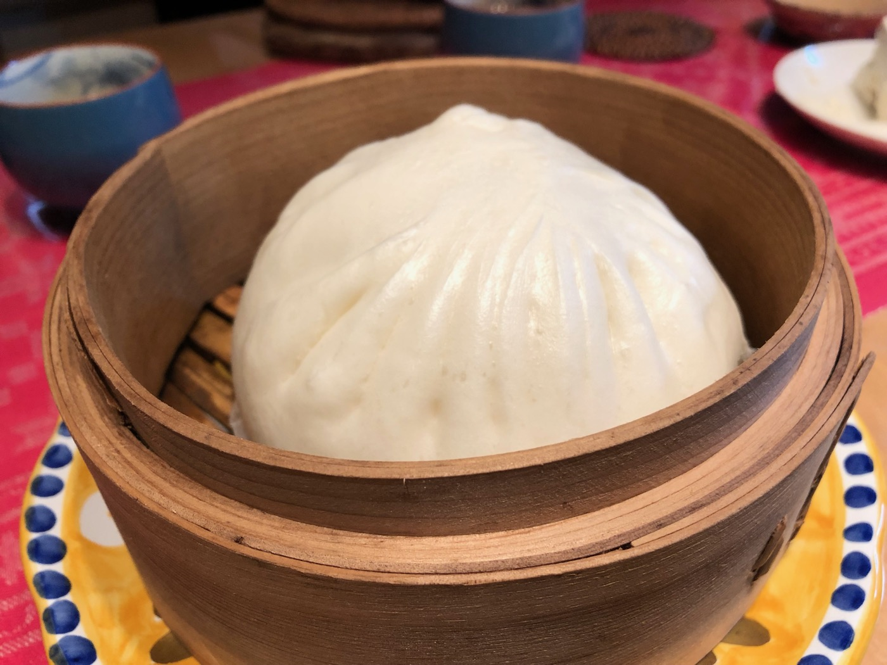
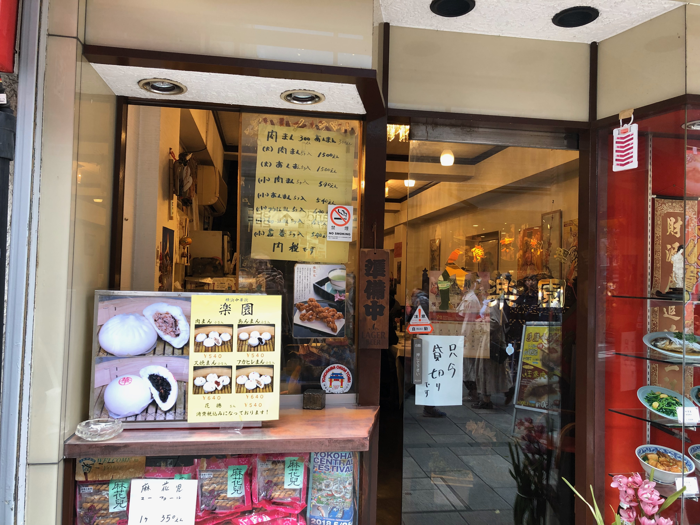

# 好みの味を見つけよう！横浜中華街のおいしい"手作り肉まん"(後編)

風が冷たく肉まんの恋しい時期になりました。一昨年公開で好評だった前編でご紹介できなかった、中国の地方色のある肉まんたちを改めてご紹介したいと思います。

なぜ地方色の区切りかというと、海外旅行に出られない中華好きの方が中華街でほんの少しでも中国旅行気分を味わって欲しいからです。

またテレワークが多くなるご時世に、肉まんほど便利な中華食材は無いかもしれません。蒸し器で蒸かすだけで主食もおかずも一度に食べられる完全食。

蒸し器で暖めている間は、仕事をしていても大丈夫。電話会議で前後がブロックされていても、短い昼休みに素早く満足できます。



＜写真＞台湾好きならおなじみの大同電鍋に放り込んでおけば、電話会議の合間に蒸かし立てのアツアツ肉まんが食べられる

前編からの再掲ですが、手作り肉まんはこんな特徴があります。

**手作り肉まんの特徴**
- 自然発酵のためカッコがちょっとブサカワで個性的
- そもそも中の味付けは店ごとに全然ちがう
- そして、麺（皮）のコシと自然発酵による小麦の香りと豊かな味わい


＜写真＞手作りのブサカワな部分は、キューピーちゃんの頭の先っぽのような部分でわかる。これは寝癖付き

では、後編おまたせしました。本編では、中華圏各地方のエッセンスをもった肉まんたちをご紹介。


## 北京代表　孫文ゆかりの「華都飯店」

まずは、広東勢優勢の中華街でもひときわ陰の薄い北京方面から。筆者が「北京の包子（肉まん）が懐かしい。どこかに無いか？」と問われたら、ここを薦めます。


＜写真＞旨味の肉汁が外側まで染み出した、少し不格好で質実剛健なビジュアル

滲み出た醤油と肉汁が、生地を茶色くしているあたりが手作り感満載です。
この生地の茶色い滲みこそが、肉汁たっぷり大当たりを見分ける鍵。筆者が北京で食べていたものも盛大に茶色くなっていて、特に美味しい物はこのようなビジュアルでした。

てっぺんのねじれも、皮のひだも一個一個違って、手でひねった感が満載。
「日本人だったら見た目でこんなに思い切れないよね」と妙に納得してしまう、とっても中国らしいおおらかで質実剛健な作りです。


＜写真＞生地のなかまで茶色いマーブル模様。肉汁を感じる肉まん

肉汁が飛び出すのでかぶりつく方向に気をつけてがぶっといきましょう。
香味野菜がピシッと強めに立っている気がします。食べてわかる範囲で中身は肉としいたけ、葱の強めの香味も入っています。

ふわっと立ち上る力強い香りが中国の北側に多い特徴、筆者はこう考えています。

筆者が食べ比べた限りでは、中華街の肉まんの中では頭一つ飛び抜けたパンチの効いた風味。 北京の最高気温零下の日の朝に道路でかぶりついた肉まんの記憶がよみがえります。

でも、こちらの肉まんは筆者が北京で食べていたものより材料も作りも味わいも100倍上等です。気に入ってもらえるとうれしいです。



華都飯店には中華街に居住した孫文(日本滞在時代に中山樵と名乗り、のちに孫中山と号したと言われる）の記念堂の看板がかかげられています。
中国の近代化の中で横浜中華街にも重要なストーリーがあったことを感じる散歩も良いでしょう。

- 味の系統: 醤油　香味野菜の香り系
- 特徴: 休日の朝食向け　ただし強めの匂いにはご注意
- 合わせたい飲み物　個人的には薄いしぼりたて豆乳　日本のラガービールも合うはず


## 上海代表　横浜媽祖廟横の名店「大三元酒家」

上海風の肉まんであれば、我が家のお気に入りは「大三元酒家」です。

この肉まん、表面部分の景色穏やかで良いですね。目立つようなひだをつくらずに、なんとも優しい表情をしています。
餡は上海系らしく少し甘く醤油味が効いた色濃い目。




＜写真＞ぎゅっとしていてどさっと固まった餡

中は醤油味の餡がどっさりはいっています。タケノコとひき肉が実にいい味をだしていて、餡が舌の上でころころと転がるのです。
特徴はどの素材の味が目立つと言うことの無い、上海料理好きが俗に言う「ぼやけた味」。好みと違う人がいるかもしれません。

でも上海料理を愛する家人に言わせれば、この焦点のぼやけた感じが上海風味の愛すべきポイントだということ。筆者にも塩分控えめな感じが好印象です。

朝に食べる肉まんとしては、なぜこれと一緒にビールが飲めないか、画竜点睛を欠くのではないかと、いささか駄目人間らしい不満を筆者は感じます。
買っておいたら休日用にまわしたい肉まんです。


＜写真＞綺麗に記事が割れたチャーシューまん

もう一個、チャーシューまんを買ってきたので、こちらも試してみました。中華街に多い広東風では食紅をつかった紅色のチャーシューですが、上海では醤油の茶色です。

甘みは肉まん以上にかなり強く、筆者の脳裏に浮かぶのは、たしか上海の福州路にある「老正興菜館」で食べた「草頭圏子」（豚ホルモンの濃厚醤油ソース）の味です。

上海料理といえば、醤油味でぐっと甘いのがごちそう。上海料理で有名所だと先にあげたホルモンの他、豚スネの醤油煮やアヒルの醤油煮などがありますが、この肉まんも同様の甘さのパンチ力を持っています。

これは絶対ビールやお茶がお供に要る味です。こんな古めかしいごちそう系の肉まんは、正座してビールと一緒に、濃い味を洗い流しながら戴くのが正しいのではないかと思います。ぜひとも金曜か土曜に中華街に行き、週末のランチビールのお供にしていただきたいと思います。


＜写真＞大三元とは縁起の良い名前。昔どこかで読んだ本の記憶では、初代が麻雀で勝ち取ったお店とか(真偽不明）

肉まんをご紹介した媽祖廟横の上海料理の大三元酒家は筆者がたまに行く店の一つ。

料理は上海風でありながら横浜らしく広東の影響を感じる横浜中華です。そしてレギュラーメニューに田鶏（カエル）があるあたりに、観光客に媚びない店の本気を感じます。

こちらはなつかしく穏やかな上海料理が特徴。人によっては古すぎると思うかもしれませんが、筆者には子供時代の郷愁のようなものを誘い食べて良し居心地は良し。そして店先に並ぶ上海風手作りまんじゅうやちまきが、食後のお土産に手頃で良いのです。


- 味の系統: 醤油ひき肉　一昔前のごちそう系
- 特徴: すこしダサめの餡が上海の旅の思い出を誘う、ごろごろ肉系
- 合わせたい飲み物: アルコール度の薄いさっぱり中国ビール！もしくは緑茶


## 台湾代表　懐かしのあの肉まんの味　「台湾美食」（茂園食品）の肉まん

横浜中華街は広東・福建・上海の人たちが多いのですが、台湾系の人も多く住んでいます。 コロナの中で新規開店した台湾美食（茂園食品）は街の話題になりました。

その茂園食品の肉まんは、かなり筆者の好みなのです。


＜写真＞　頭の先っぽ部分がちょっと乱れているのが手作りの証。ここをみればわかります。それにしても美しいひだの造形にうっとり

懐かしさを感じるしっかりとした醤油味。クワイのシャキシャキ食感、しいたけの旨味ががつんと来るのが特徴。

干し椎茸の味が強めに出ていて、少しだけ良い意味での古めかしさを感じます。そして塩分も控えめ。

筆者が台湾人の友人と食事をして観察していると、日本人と比べて甘み強めの塩分控えめが好みのようです。


＜写真＞餡の中身のサイズが不揃いになっている。これががぶっといったときの食感の秘密の気がします。


筆者がこの店の肉まんを初めて手に入れたのは、数年前のこと。中華街のはずれ、萬来亭の小さな製麺所のガラスケースで見つけたのです。いかにも手作りでオーラを感じる肉まん。
ところが、製麺所には肉まんを作っている気配は無し。

レジを打ってくれた気さくなお兄ちゃんが「ここでは作ってなくて親戚にお願いしている」と教えてくれました。


＜写真＞逆風の中で開店した「台湾美食」　いついっても必ずお客さんがいて根強い人気

ならばとラベルの表記を頼りに中華街にほど近い工房、当時の本店で製造されているご家族の方々に伺ったところ、彼らのご出身は台北だそうです。
その後、本店を中華街に移転し台湾美食をオープンされました。この肉まんは台湾北部の味ということになります。月餅をはじめ中華菓子の品揃えが良いお店です。

- 味の系統: 醤油肉椎茸　一昔前のごちそう系
- 特徴: これぞ日本人が連想する肉まんらしい肉まん。垢抜けない味だけれど、それが時代を超えた魅力。
- 合わせたい飲み物: ビール！


## 広東代表　「楽園」の大型肉まん

最後にご紹介したいのは、一等地にあるのに見落としがちなお店の肉まんです。

中華街の門をくぐれば、いつもそこにある「楽園」。でもお店のスタッフの方々の高齢化で、閉店していった他のかつての名店たち同様にいつまで続けてくれるかわからない。

筆者の主張が強すぎるかも知れませんが、いまの機会を逃さずに食べておくべき、中華街に残された「本物の楽園」だとお伝えしたいのです。



＜写真＞楽園の肉まん　表面の輝きが美しい

楽園の肉まんは大サイズで、一個で朝食大満足のボリュームです。我が家のセイロでは二人分を積み重ねすると肉まんのてっぺんがぶつかってしまい、すこし工夫が必要なほど。


＜写真＞がつっと分厚い皮、少し偏った餡の景色が手作り感を感じます。

基本的に塩味で、少し醤油が使われているビジュアル、中華街の中でも立派な部類の大きさの予想に反して上品な味付けです。


食べているとたまに歯にあたるしいたけから、じゅわっと深い味わいと香りが立ち上ります。中のしいたけは荒く刻んであり、この一口ごとの印象の違いが味に立体感をあたえています。


味が濃いものに慣れている人には少し物足りなさを感じるかもしれません。食べるときはぜひ「自分は広東人」と心の中で念じてください。
これが優しく食べ飽きない「清淡」と言われる広東の味なのでしょう。筆者の経験では、とくに仕事で疲れて胃腸が重たいときに好印象でした。

この肉まんには、不思議とアルコールを必要としない何かがあります。

食べた後に口に濃い味が残ることもなく、食べ終わったらぐっとお茶を飲んで仕事を始めるのにぴったりの朝の肉まんです。



＜写真＞　この店にさらりと入れるようになったらかっこいい、そんな貫禄のあるお店

入りにくいかもしれませんが、勇気をだしてドアをあけてみてください。せっかくなのでランチメニューでも、夜なら一品料理をなにか食べてから肉まんを買いましょう。

ホールを守る素敵なお母さんとの会話、貫禄を感じるメニュー構成。きっと何か素晴らしい体験がまっているはずです。


- 味の系統: しいたけの旨味が光るタケノコ醤油系
- 特徴: 朝食向け　薄味でしいたけをかみ当てた瞬間に幸せな風味が爆発
- 合わせたい飲み物: 台湾の上品な高山烏龍茶・ダージリン・香り高い焙じ茶など軽め


## 肉まんの美味しい食べ方

今回は筆者の好みでご紹介しましたが味の好みは人それぞれ。年齢や運動量・体調によっても美味しいと感じるものは変わるので、中華街に行ったら違った店で二・三種類買い込んで、自分の好みをさがしてみましょう。

コンビニで手軽な値段で買える肉まんですが、中華街の専門店の手作り肉まんは値段の差を納得するだけの違いがあります。

肉まんは冷凍ストックがあるととても便利。肉まんを買ってきたら冷凍庫に放り込んでしまえば、一ヶ月程度は保存することができます。
食べるときは中華風味を損なわないように、かならず「蒸し器で強火15分以上」、冷凍の場合は更にプラス5分蒸かして、ふわふわにして戴いてください。

蒸し器はクラシックなものがベストですが、フライパンと組み合わせる簡単なものであればスーパーでも買えるでしょう。

蒸し時間は大きさによりますが、勢いよく蒸気が上がってから15分から18分くらいでしょうか。冷凍からの場合は更に10分追加してください。

注意したいのは電子レンジだけで加熱すると生地が硬くなってしまうこと。蒸し器で加熱するのがおいしさのコツです。


## 今回紹介したお店

```
華都飯店
住所：横浜市中区山下町166
TEL：045-641-0335
営業時間：10:30～21:00
水曜定休
```

```
大三元酒家
住所：横浜市中区山下町136（MAP）
TEL：045-641-4402
営業時間：11:00～22:00
不定休
```

```
茂園 台湾美食
住所：横浜市中区山下町220（MAP）
TEL：045-663-0901
営業時間：11:00〜21:00
不定休

工場直売　茂園(モエン)2号店
住所：横浜市中区伊勢佐木町3-106（MAP）イセザキモール
TEL：045-242-6525
営業時間：10:00～19:00
https://www.moensyokuhin.com/
```

```
楽園
住所：横浜市中区山下町154
TEL：045-641-9308
営業時間：11:00～21:00　平日は中休みあり
火曜定休
```
