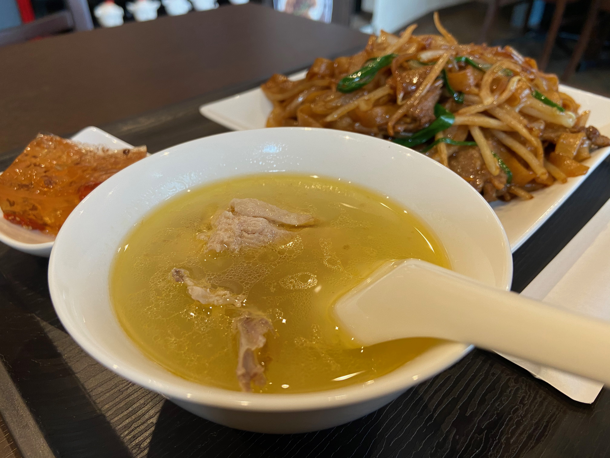
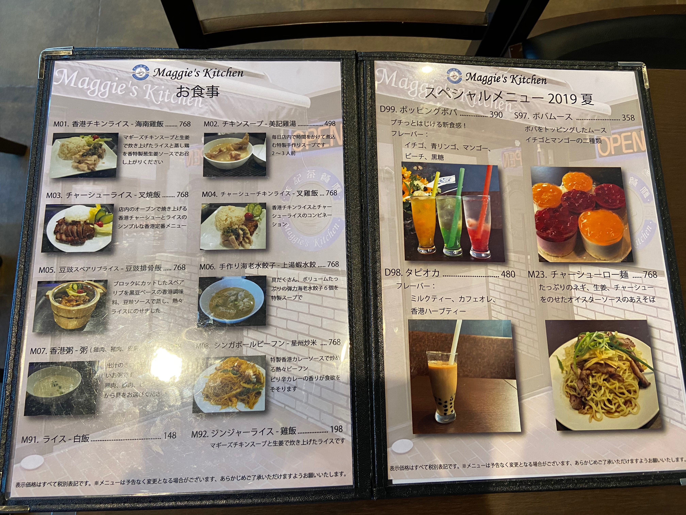

# 横浜の外れ、生麦の「Maggie's Kitchen」で香港のママ手作りの味を楽しむ

「雨宿りにふらりと入った店が、過去の記憶と交叉してやけに思い出深い」こんな経験がある方はおられないでしょうか？
この店に入ったときに、香港の田舎のカフェや友人宅で食事を頂いた思い出が走馬灯のように浮かんできました。

こんなに良い経験をした店があったので、筆者がテーマとして取り上げている純粋なオールド中華ではないものの、横浜の華僑文化の一角として紹介したいと思います。

広東料理の中でも歴史的に各地の文化の交差点に位置したため、ベースは広東全域だがイギリスや上海・福建などの影響の強い、かなり特徴がある香港料理。

そして中華に関しては一般の旅行者が食べる店の濃い味と、家庭の薄い味は大きく違ったものなのです。家庭料理を食べてみないと中国の料理を深く理解するのは難しい気がします。

そんな薄味の家庭料理を頂くチャンスは、日本の華僑や現地の友人がいる人に限られるのですが、横浜の外れにそんな貴重な料理を提供するお店がありました。


＜写真＞　店主のマギーさん。香港人は自分の住む場所に香港カフェを作る飲食文化があるらしい。アメリカ西海岸に住んでいた香港人の友人一家も、毎週のように現地の茶餐廳に通っていた。


＜写真＞　生麦の旧道沿いを横にちょっと入ったところにある目立たないお店

お店の名前は「Maggie's Kitchen」（以下　カタカナでマギーズキッチンと表記）といいます。場所は、「生麦」という歴史の教科書でしか聞いたことのない方ばかりだと思う駅のそば。
観光地もキリンのビール工場くらいしかなく、あえてここを途中下車する人はいないはず。ところがこの近辺はベトナム料理の優良店ができたりして、アジア料理店という視点から見て面白い場所になりつつあるのです。

都内方面から来るのであれば、昼に中華街を楽しんで帰りにハシゴで寄るのもよし。中華街の中華カフェは混んでいたりするので、気分を切り替えるには良い選択肢。
現に筆者自身が、中華街や横浜の用事の帰りに、中華街のカフェではなく生麦まで出てマギーズキッチンで一服しようと思うようになったのです。

そして料理やお菓子の内容も良質な香港らしさが出ていて非常に良い。カフェでも食事でも使いやすい中華の店というのはめったにありません。


## まずは食事の紹介から　広東人のソウルフード　干炒牛河と炊き出しスープ

ランチでお願いしたのは、干炒牛河というライスヌードルの炒めもの。広東エリアではどこにいってもある、清朝末期から民国初期に生まれたといわれるベタベタなオールド広東料理です。

きしめん的ビジュアルのライスヌードル河片（ホーファン）は広州の沙河鎮（現在は天河という広州中心地）にある義和居という店で生まれたと言われています。いまでは東南アジアに広く広がり、ベトナム料理で言うPho（フォー）といえば想像しやすいでしょう。

広東ではどこにでもあるのに、中華街でこれをレギュラーで出している店で思い出すのは、中華街大通りの楽園と菜香新館・ときたま南粤美食くらい、それも準備に30分以上たっぷり待たされます。
日本人がめったに注文しないので中華街では絶滅危惧種に近いのです。


味はしっかりした色合いとは裏腹に、ぎりぎり薄味の中国南方テイスト。それでもしっかりと食べさせるのは、塩味にたよらず旨味のボリュームが大きいからでしょう。
そのわけは次に紹介するスープにありそうです。


　
＜写真＞　干炒牛河　横浜オールド中華でも紹介したいメニューではあったのですが、3店舗紹介することが難しいレアメニュー。ようやく3店目が見つかった

特筆しておきたいのは、皿に残る油がほとんどないことです。炒め物に油をどっさり入れれば作るのは簡単ですが美味しくなくなります。

私の知る腕利き中華シェフたちの料理は、油の使用量をぎりぎりまで減らしています。
そのシェフたちが口を揃えて言う共通点は、お母様がとびきり料理上手なことが彼らの自慢だということ。
なるほどマギーさんの母親料理は油に頼らず家族の健康への思いやりと味が両立しています。そんな母親の料理で育った方々が名料理人になるのではないかと思います。




＜写真＞　スープ。出来合いのスープの素では出しようのない、広東料理の魂ともいうべき母の味


中華好きであれば一目見て「あっ」と思うのは、黄色い鶏の脂がキラキラ美しい鶏スープ。広東料理の神髄、主役はなんと言ってもスープ。
骨付き鶏肉がゴロっと入って、しっかりと鶏の風味が浸み出たスープを一口すすれば、横浜の外れのこちらで食事をする理由ができるはず。

失礼ながらこんな小さな店で出てくる内容ではないため、これは一体？とお伺いしたところ、「朝8時に店に来て、3時間かけて仕込んでいる」というではないですか。

小さな香港風カフェではなく、とんでもなく気合いの入った本気のオーナーシェフ店でした。


＜写真＞　一口デザートは色の濃すぎるキンモクセイゼリー

添えられたデザートは、広東に行けば見慣れたキンモクセイゼリー。でも、写真でわかるとおり、ちょっとどころではなく色が濃い。
入っているキンモクセイの花も、ごはんに載せるシソの実のように一杯はいっている。これは一体？と思って口に運べば、甘さは控えめでガツンとくるキンモクセイの香り。

甘いものはそんなに好きでは無いので、評価は厳しいと自認する筆者ですが、これは相当いいぞ、と思うのです。一般的な店の三倍くらいキンモクセイが入っているはず。


## カフェとしての実力も高い。香港人オーナー　マギーさんの手作りスイーツと香港料理

そもそも筆者がこの店を訪れようと思ったきっかけは、中華街の華僑三代目のチャーシュー職人の知人との話で出たから。
彼と一緒に来るはずが、第一回目の訪問は夏の通り雨のせいで中途半端な時間に雨宿りで偶然入ることになったのです。

初回訪問は中華街での取材直後でおなかいっぱいだったため、食事ではなく中華街では味わえない香港らしいドリンクを飲みたい気分。

香港らしい飲み物と言えばアレ「鴛鴦茶（コーヒーと紅茶のミックス）をいただけますか？」とお願いすると、残念ながらメニューには載せていないということで香港コーヒーを注文することに。

おなかのほうは中華街で2店舗の取材をこなした後だったので、料理はぐっとこらえて手作りスイーツを冷蔵ショーケースから選ぶ形です。
いろいろあってよく覚えていないものの「チョコレートと、イチゴと、マンゴープリンがありますよ」といわれ、頭の中が香港気分な筆者は迷わずマンゴープリンをお願いしたのです。


＜写真＞　様々な手作りスイーツの並ぶショーケース

これが大当たり。マンゴーの色が地味で、あきらかに商売っ気のないビジュアルだが、それが逆に手作りの証。


＜写真＞　たくさんあるマギーさんの手作りスイーツから一つ選ぶのは、ちょっと難しい選択だった

そして香港カフェは「よく混ぜて飲んでくださいね」と言われて、おやと思ったら練乳が下に沈んだ香港スタイル。


＜写真＞　スプーンで下の方をすくうと、練乳が。

そうそう、この肩の力が抜けた味が広東のほかの場所と違う、香港の風味なんだよなと思い出したのです。

## 話し好きのマギーさんが醸し出す、味だけではない香港空間

「お店が出来たのは去年の6月。ちょうど1年になったところ」


＜写真＞　店内は、ちょっとアメリカ風。あとでその理由がわかった

マギーさんの悩みは、香港人の口にあう中華料理の店が日本に全然無いこと。自分で店を出した理由もそんなところにあるらしいのです。

中華街で唯一のお気に入りは筆者もよくお世話になっていた店で、一緒に行こうと誘ってくれていた叉焼職人さんの働いていた、香港そのままと評判だった店（閉店）だったということ。

つまりマギーさん、味に関しては相当こだわりの強いお方のようです。中華街で、料理の良い店はなぜかすぐに無くなってしまうのですよね。


＜写真＞　「ちょっと味が濃いかもしれないけど」とメニューにない鴛鴦茶を作ってくれた。飲みかけになってしまって失礼。そうそうこの味この味

話が長くなると、無茶をお願いした鴛鴦茶を特別に作って出してくれました。こういうオーナーシェフ店ならではの自由なホスピタリティが心地よいのです。


＜写真＞　香港生まれのマギーさんは以前アメリカに住んでいたという。アメリカ風な看板。夜はお酒も提供


## 手作りパン・手作り月餅　もちかえりメニューも楽しい

マギーさん椅子から立ち上がり厨房に入ると、オーブンから焼き上がったパンを取り出しはじめました。このパンも、日本のものとはちょっぴり表情が違うゆるさを漂わせる香港スタイル。

「この時間くらいになるとパンを焼いて出してるの」と話して、パンの焼き上がりを知らせる幟を店の外に出すマギーさん。どうやら筆者を呼び込んだ雨はあがったようでした。。


＜写真＞　3時頃に焼き上がる手作りパン。

「日本で香港の味を出すのは、調味料も混ぜて混ぜて大変」


そういえば筆者は友人に連れられて、香港島の南側のスタンレーまでこんなパンを食べに行った覚えがあるのです。
そんな香港で食べるパンはマーガリンの風味が強く好みにあわないのですが、こちらのパンはマーガリンのネガティブな風味が無く、お世辞抜きに美味しいのです。


「材料費高いけど、マーガリンは美味しくないからバターを使っているの」

なるほど、都内に数件ある香港カフェは雰囲気を味わう店という認識ですが、こちらのお店は何を食べても大丈夫。美味しい香港の味がいただけます。


会計の際、レジの横に月餅が置いてあったのをめざとく見つけました。
香港でも上海系の家庭出身というマギーさんに、月餅は上海式でしょうか？と尋ねると「月餅も手作りしてるの。好みにあわせて甘さはすごく控えめ。上海式じゃなくて広東式。香港の月餅は甘すぎてちょっとね」


＜写真＞　ミニ月餅　味は中華街のお菓子屋さんと遜色ない出来だった


帰宅してからお茶にあわせて頂きましたが、甘いものはそんなに好きではない筆者もぱくっといただける味でした。来年のG-1（月餅）グランプリにはエントリー確定です。


## ストリートフードの王様「咖喱魚蛋」（カレーフィッシュボール）まで　

彼女の悩みは、日本人が香港の味を全然知らなくて商売が難しいこと。
食べて欲しかった開店当時のおすすめ料理をメニューからいくつも外しているという、例えば牛ハチノス。そういえば中華街でもハチノスが看板メニューの「安記」以外で頼む人をみかけることはまずありません。


「カレーフィッシュボール知ってる？これも日本で作るのが大変で、時間かかったけどようやくできるようになったの」

そういえば、メニューの中でひときわ存在感があり、気になっていたのでした。
その日の中華街の取材はポーション少ない店だったので、すでに少し胃袋に余裕ができている幸運。せっかくだから注文することに。


＜写真＞　メニューの一番下に控えめに表示されている「香港カレーフィッシュボール」　宝物はこっそり、本気の中華店によくあるメニュー配置

「メニューに載ってる大根は、味がぶれるから入れたり入れなかったり。今日は屋台スタイルで串にしてみたわ」とマギーさん

そのカレーフィッシュボールは、歯ごたえも風味もバッチリ、確かに記憶の中の香港の味がしたのです。


＜写真＞　屋台風に供される「香港カレーフィッシュボール」は、東洋・西洋・インドが混ざる香港のマルチエスニックを体現しているかのようなゆるさを持つ味わい


日本人や大陸人のコックがどうやっても再現できない「骨太なのに角の丸い」雰囲気が、日本の材料でさらりと再現されていて、これはちょっとした香港旅行。

中華の醍醐味というべき大人数の会食が難しいご時世、二人くらいで海外気分を味わえる秘密の場所を見つけた気分になりました。


### 店舗情報

文中でご紹介した店

```
Maggie's Kitchen(マギーズキッチン）
住所：神奈川県横浜市鶴見区岸谷1-22-16（MAP）
※京浜急行　生麦駅徒歩3分
TEL：045-710-0328
営業時間：月～土、祝前日: 12:00～19:30 （料理L.O. 19:00 ドリンクL.O. 19:15）
日祝休
```


## 未使用写真類





### 今回ご紹介した店

```
Maggie's Kitchen（マギーズ　キッチン）
住所：横浜市鶴見区岸谷1-22-16（MAP）　生麦駅徒歩2分
TEL：045-710-0328
営業時間：12:00-19:30 
日曜・祝日定休

ホームページ
https://maggieskitchen.owst.jp

ツイッター
https://twitter.com/mags_kitchen
```


