# 横浜にわずかに残る古典メニュー　バンメンを味わう

横浜で中華麺をいただくとしたら、真っ先に思いつくのがもやしあんかけそばの「サンマーメン」（生碼麺）ですが、少し知名度の低い横浜ならではのメニューがもう一つあります。

その名前は「バンメン」。古い歴史を継承する店でしか提供しなくなっている絶滅危惧種です。

食べてみるとなかなか味わいのあるメニューなのですが、古いメニューとあって現代人の舌には地味に感じる味のせいか、横浜でも消えつつあります。

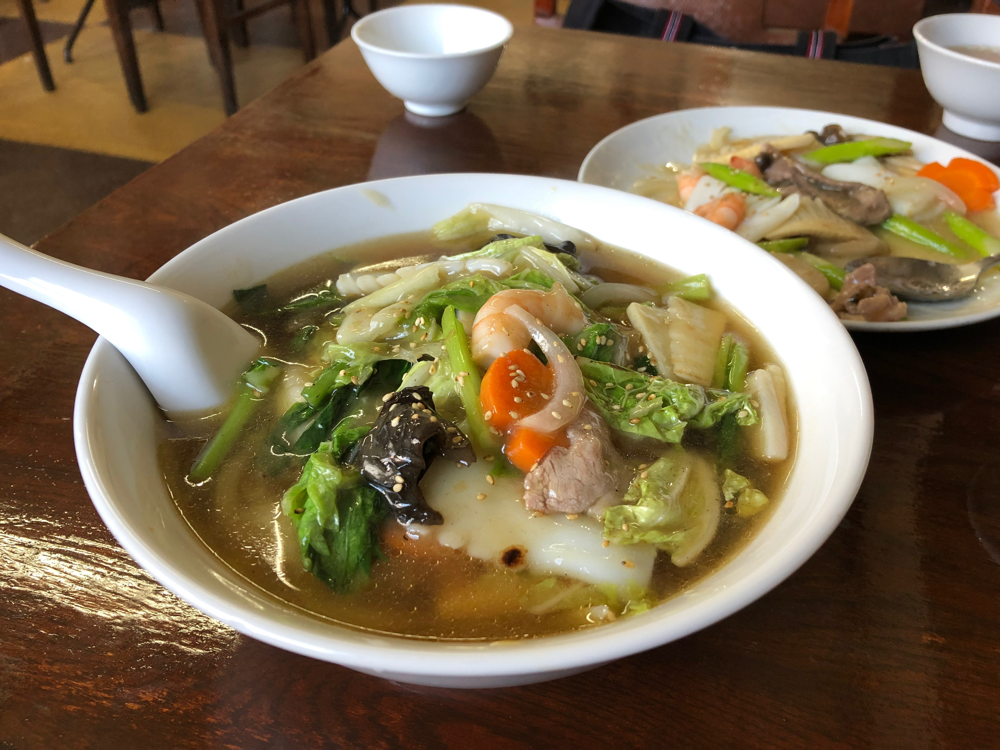

＜写真＞　古い店の風格に似つかわしい古典メニュー　バンメン（本牧　華香亭本店）


※　華香亭は前回巻揚で紹介していますので、料理写真のみご紹介。どの料理も丁寧な仕事で美味しいです。

香港でも人気は低いようで少しだけ残っているメニューですが、使う麺がちがうため姿はだいぶ横浜のものとは違って見えます。

横浜の中華の歴史を語る上で食べておきたいメニューのひとつ、バンメン。筆者のお気に入りの店を紹介しましょう。


## 広州の伝統を受け継ぎながら現代人の舌を唸らせる「ウミガメ食堂」の「バンメン」

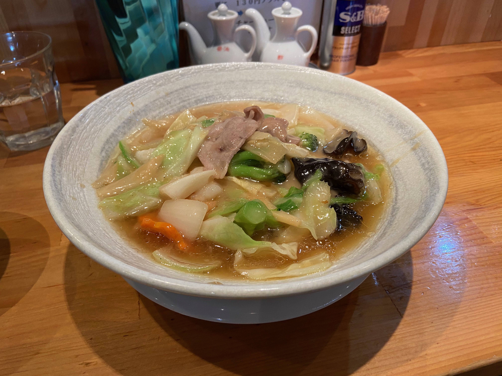

＜写真＞　現代的なすっきりさと、老舗の味が一皿に。ウミガメ食堂の「バンメン」

綺麗に整っていて活気のある店内に、ガンガンとスープを炊く大きな寸胴。鶏の香りが立ち上るスープ。一目でわかる特徴ある細い麺。具もかわいい細工が丁寧に作られていて、一口二口と食べ進めれば「来て良かった」と思う味です。


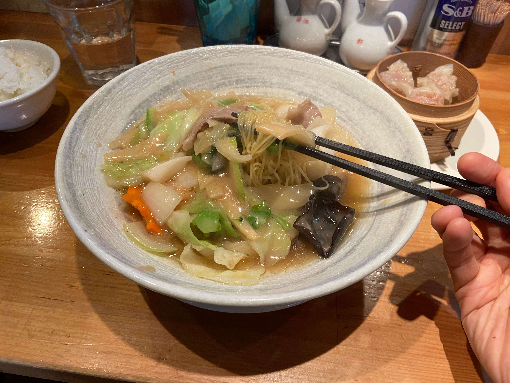

＜写真＞　かわいい細工の入ったニンジンに笑顔がこぼれそう。ぜひともお店で探して欲しい

特筆すべきは、その自家製麺の細麺。店内奥の製麺スペースで店主のお父様が手作りしているのが見えます。この手作り麺が他の店とはひと味もふた味も違うコシと香りがあり、細麺なのにスープで簡単に伸びないのが不思議です。熱い麺もゆっくりと味わっていただくことができます。

この麺については筆者と友人は、「広州の老舗店　呉財記で食べた麺を思い出すね」と話しています。横浜の標準的な中華麺よりかなり細めの麺は筆者に広州西関の路地裏を思い出させます。このお店はどのメニューもポーションサイズが大きいので運動をされている方にもおすすめです。


ウミガメ食堂があるのは横浜市内といってもニュータウンのセンター北。地下鉄で横浜・日吉・あざみ野などからアクセスするため少し遠いのですが、わざわざ行きたくなる魅力のあるお店です。

＜その他写真＞

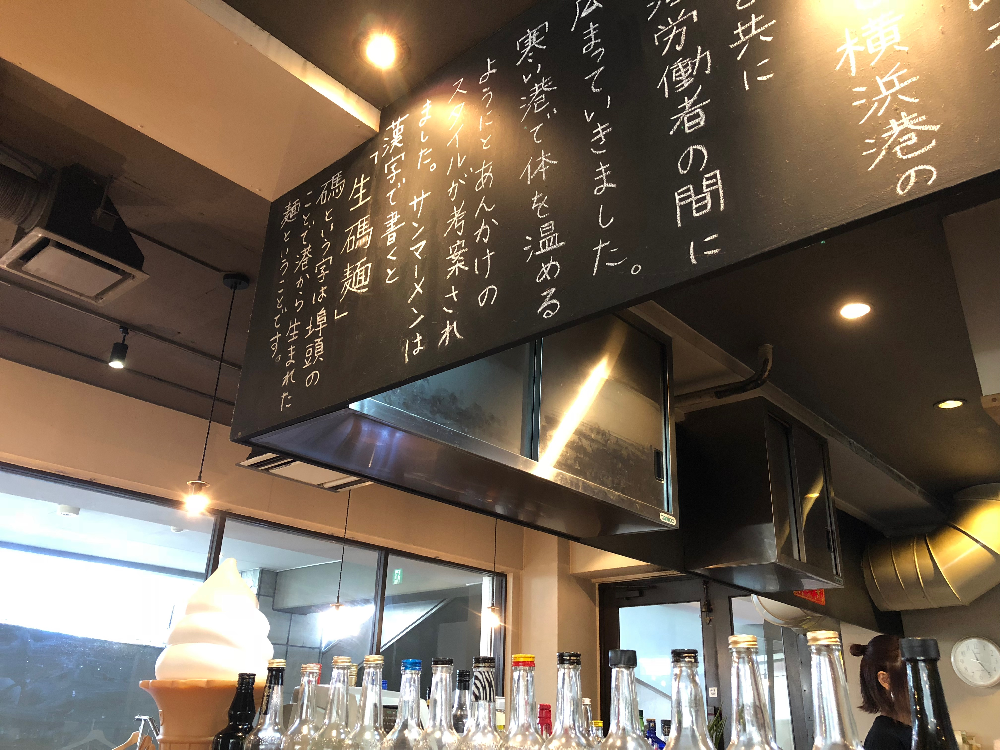


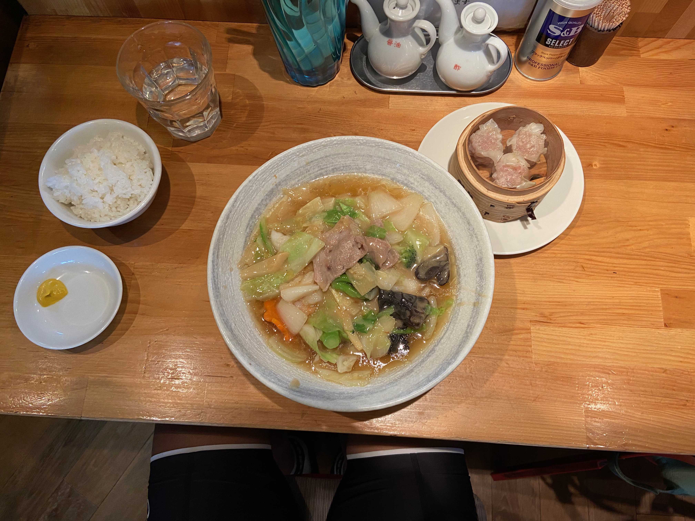


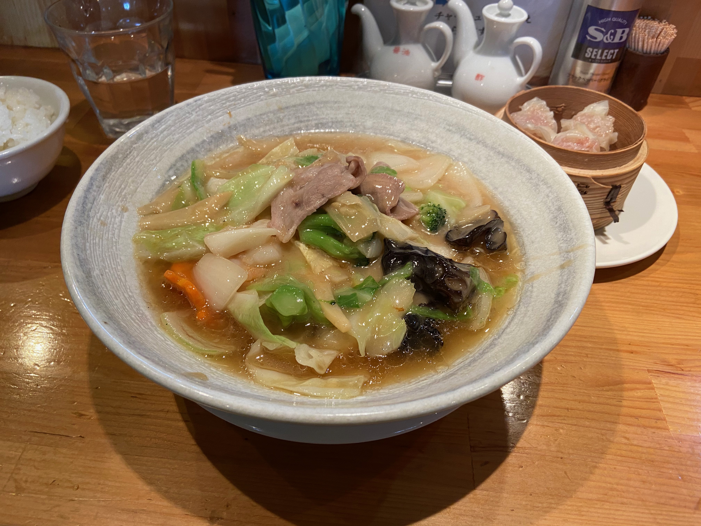


## やさしさと懐かしさを感じる街の名店「神奈川　翠香園」の「バンメン」

少し古いタイプのバンメンの銘品だと筆者が思うのは、東急東横線　反町にある「神奈川　翠香園」


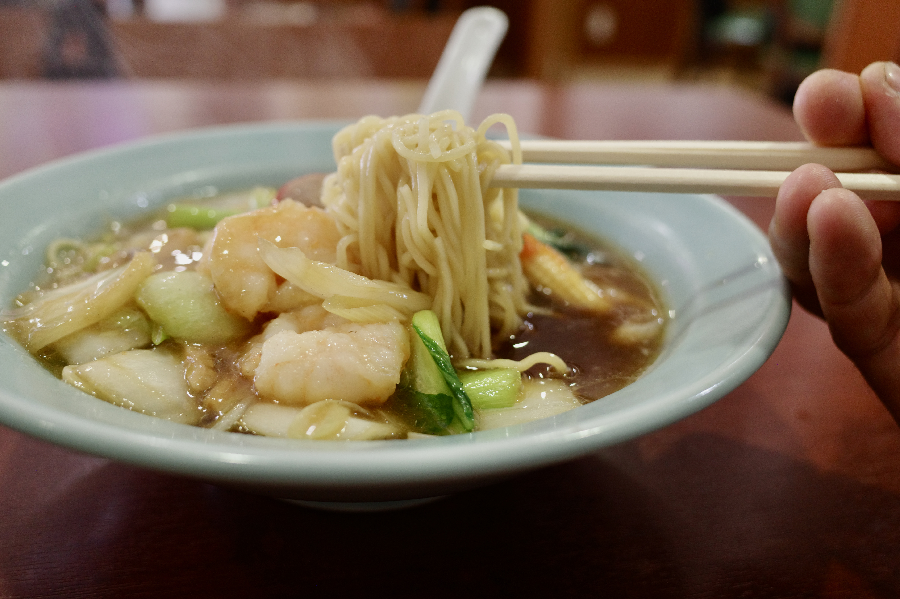

＜写真＞　クラシックなたたずまいと味わいの「バンメン」

浅いどんぶりにとろみのついた少なめのあんかけスープがかかっています。具も茶色主体で懐かしさを感じます。味は広東麺といわれる五目あんかけそばに近いのですが、スープがすくない分アタマのあんかけの味を強く感じます。
スープの塩分が気になる年齢になると、食後に残してしまうスープがおおい湯麺よりも、スープすくなめのバンメンに優しさを感じるのです。

名前は翠香園の名前からわかるとおり、中華街の翠香園の親戚筋です。店は近年移転したためとても綺麗。ホールは奥様が、厨房では旦那さまと若い息子さんが二人できびきびと調理をしています。

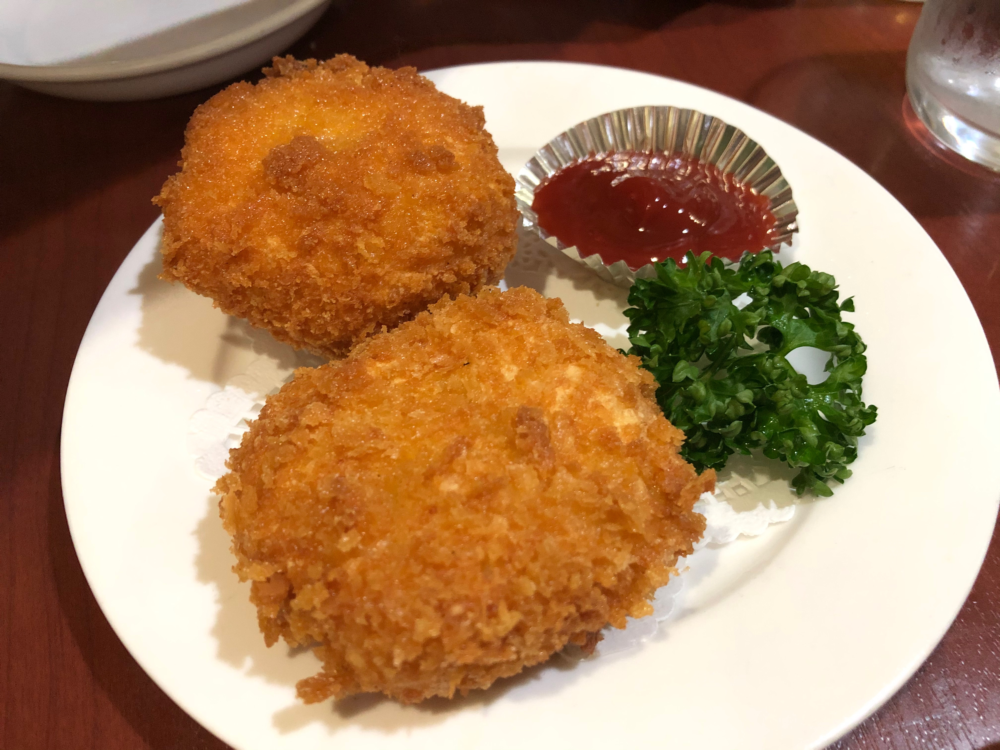

＜写真＞　このお店で他に頼みたいのは揚げ物系メニュー。ホタテの揚げ物は海老のすり身が上にのり、味付けも火の通しも絶妙。

瓶ビールで春巻きなどの揚げ物をつまんでから、バンメンでシメる的な一人で楽しむ用途にぴったりです。少人数でも気兼ねなく美食を楽しめる街の名店だと思います。

＜その他写真＞

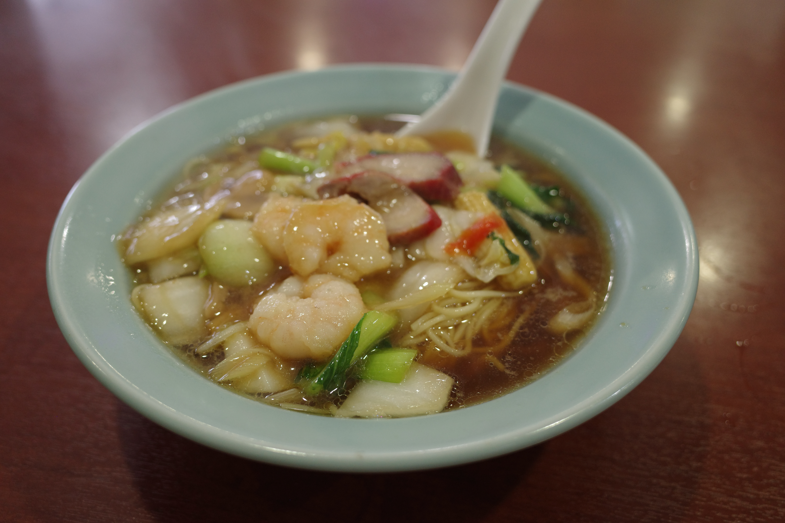


## 鶏香るスープに野菜の甘みが大満足の町中華。野毛「萬福」の「バンメン」

古い店が残る大人のワンダーランド、「野毛」のエリアにも、すばらしいバンメンを出すお店があります。それがこの「萬福」町中華と分類される店ではありますが、料理はさすが横浜と思わせる味わいです。


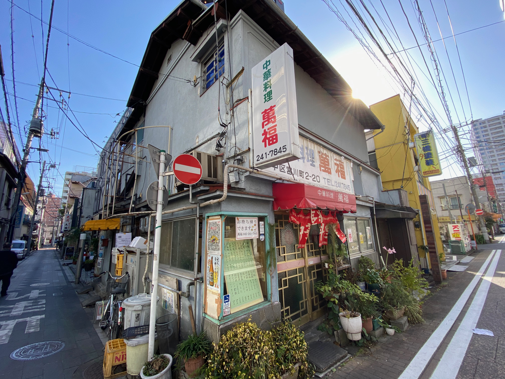

野毛の老舗の系統だという料理は仕事がしっかりしていて、鼻腔を抜ける鶏の香りとしっかりと煮出した野菜の旨味がすばらしいのです。スープ側が強力な個性を持つため、麺だけは控えめな印象となります。

紅いチャーシーも綺麗に仕上がったとろみ餡の野菜煮込みも、横浜の古い中華の見本のよう。その外観でありながら現代でもしっかり通用する水準の丁寧な仕事を感じます。

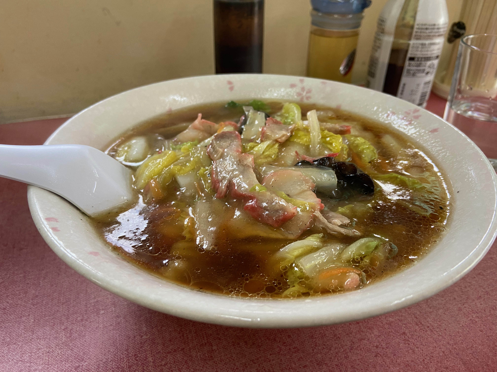

＜写真＞　写真では伝わらない料理の香り。配膳のお姐さんが来たときからふわっと身体を包む感覚をお伝えしたい


店内に置いてある勝馬投票券や静かに物思いに耽る老紳士たちと過ごす時間は、料理だけでなく小さな旅を感じることのできるお店だと思います。

先に紹介した2店は若い後継者がおられますが、この「萬福」は高齢のシェフとスタッフで運営されていますので、いまのうちに通っておくべき店かと考えています。

＜その他写真＞

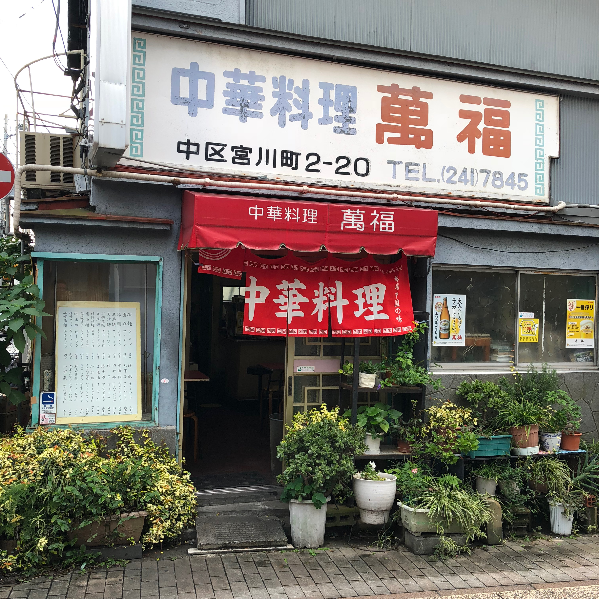


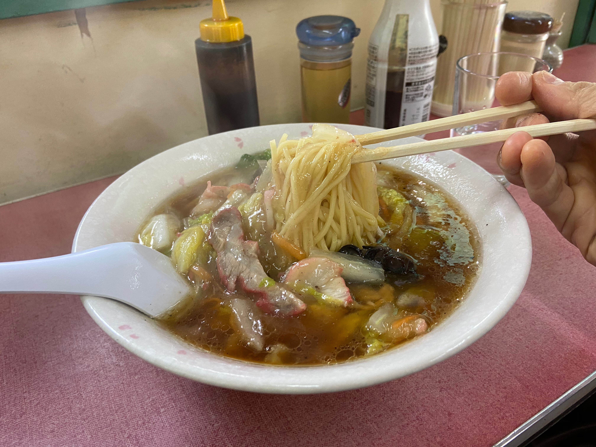

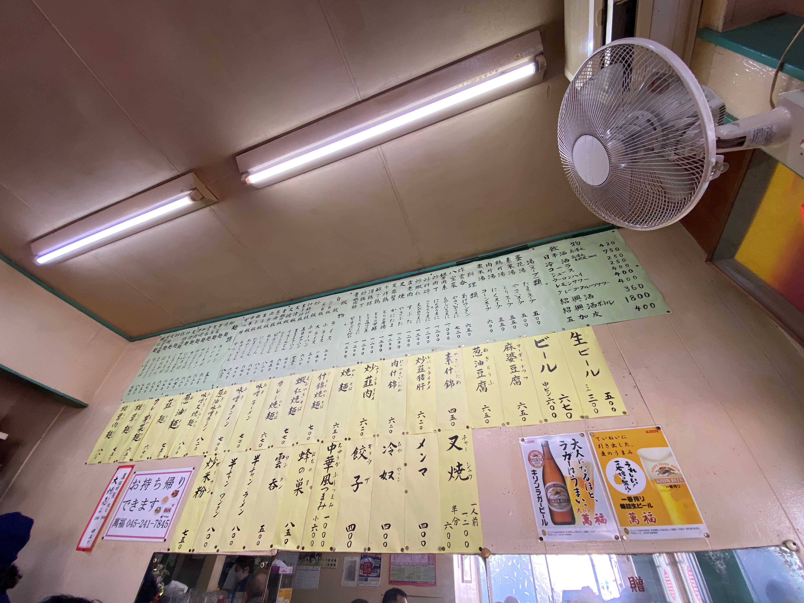


## バンメンとは一体、何なのか

バンメンとは一体何か？ネットやテレビでは謎の麺と紹介されていますが、横浜の老舗に尋ねると以下のように答えが返ってきました。

- 「私の理解ではバンメンは拌麺で汁なし和え麺です」（伊勢佐木町　龍鳳）
- 「昔はうちでも出していました。美味しいですよ」（蒔田　廣東楼）
- 「すごく昔のメニューにありましたし、いまでも作れます。宴会メニューを難しい字で書いたことがあります」（中華街　大珍楼）

古いメニューのため、中華街から離れた店で地元民に愛されて残り、観光地化した中華街には逆にすくなくなっていると思われるのです。

筆者も実際に食べて歩きながらヒアリング調査と、文献調査を行いました。例えばサンマーメンは横浜発祥と言われています。これに対しバンメンは横浜オリジナルのメニューというわけではないようです。
横浜で提供している店のメニューや海外の資料や実際の写真を調べる共通点を探す限りは、ゆであげ麺に少しとろみのついた餡をかけるか、濃いめ少なめのスープに浮かせるものが相当します。

バンメンに相当する漢字表記は「拌麺」もしくは「辦麺」となります。前者が一般的な「まぜる、和える」という意味。

後者は高級店メニューで良くある格調高く画数の多い漢字を当てているタイプと推測します。
「辦」を分解すると「辛力辛」になり、康熙字典によれば意味は「致力也」（ちからをいたすなり）で「拌」の意味と近く、昔の料理人が同音同意の漢字をあてたのでしょう。

筆者の写真を探すと、古典メニューで有名な香港の陸羽茶室のメニューにありました。料理の写真を見る限り、和えそばという理解と一致します。


＜写真＞中環　陸羽茶室のメニュー右下に「052 鮮菇蝦仁辦麵」の記載。お値段210HKD（約3,000円）となかなか高級メニュー

広東省や香港においては、汁の少ない麺メニュー「撈麺」（ローメン）ごく少量の汁をかけたまぜそば）とバンメンは区別されていて、汁の少ない順から多くなるにつれて「撈麺」「辦麺」「湯麺」と分類していると考えます。

中華街には閉店した店も含め、バンメンと銘打っていなくても「汁なしネギそば」（海南飯店　連載第一回でご紹介）など、湯麺に対しバンメン的なメニューが対で存在する店があります。わかりやすさを優先したメニュー翻訳がされていることもあるようです。

また横浜のバンメンは広東料理だけでなく、上海料理（萬来亭：連載22回でご紹介）にもあります。

九州の福建系華僑の店では「パンメン」と少し違った発音をする料理が提供されているようです。こちらは横浜の福建系華僑のお店では見つからなかったので今回ご紹介できませんが、濃いめのスープがかかったあんかけそばというものだそうですので、やはり同じ料理を指すのでしょう。


## 店舗情報

※　営業時間　定休日等は自治体の要請により変更の可能性があります。

```
ウミガメ食堂
住所：神奈川県横浜市都筑区茅ケ崎中央24-12 ライオンズプラザ1F（MAP）
TEL：045-508-9204
営業時間：11:15～15:00（現在は昼のみ、通常は夜営業あり）
水曜休
```

```
神奈川　翠香園
住所：神奈川県横浜市神奈川区松本町2-19-3（MAP）
TEL：045-594-6595
営業時間：11:30～14:00　18:00〜21:30
月曜休
```

```
萬福
住所：神奈川県横浜市中区宮川町2-20（MAP）
TEL：045-241-7845
営業時間：11:00〜20:00
水曜休
```


## 参考文献・メモ

野毛　萬福のお父さんの修業先は野毛の會星楼（ほんの数年前に閉店）という話。二次情報で未確認。會星楼ではバンメンという名前から「うまにそば」に変更した模様
https://blog.goo.ne.jp/chuka-champ/e/664909acc689edf05f67532d6dad96d2


https://www.mpweekly.com/culture/于逸堯-拌麵-辦麵-68564


バンメン研究家のブログ
http://g.kyoto-art.ac.jp/reports/1455/


https://banmen.hatenadiary.jp


https://www.royalchinagroup.co.uk/propeller/uploads/2018/09/RC-Kitchen-Menu.pdf


https://ol.mingpao.com/ldy/cultureleisure/culture/20191117/1573928611730/讀食時光-薑葱撈麵清淡柔和
「辦麵以湯煨 較撈麵濕潤」の記載がある
