# 幸せな昼食は肉まんから。中華街に来たら手作り肉まんをお土産に

前編から間があいてしまいましたが、肉まんの恋しい時期になりました。そして以前よりも肉まんは身近なものになりました。

中国では朝食の定番ですが、テレワークのご時世に、肉まんほど便利な中華食材は無いかもしれません。ふかすだけで主食もおかずも食べられる完全食。
蒸し器で暖めている間は、仕事をしていても大丈夫。電話会議で前後がブロックされてても、短い昼休みに素早く満足できます。


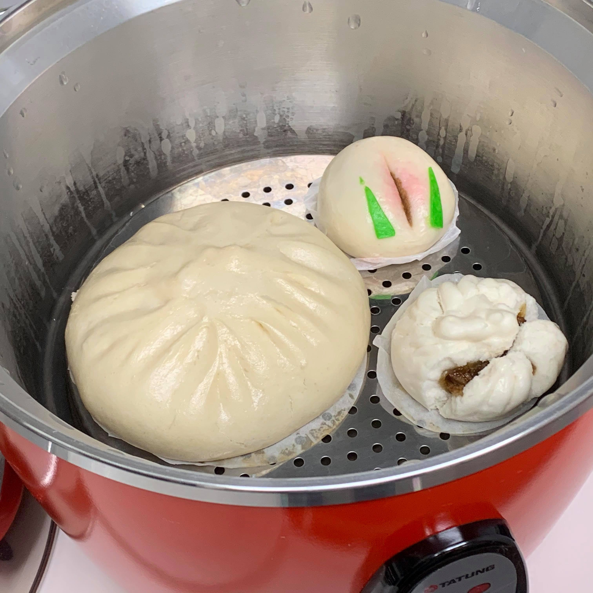
＜写真＞台湾好きならおなじみの大同電鍋に放り込んでおけば、電話会議の合間に蒸かし立ての肉まんが食べられる

コンビニでもスーパー・デパ地下でも買えるほど日本人にこんなに愛されている肉まんですが、専門店の肉まんは値段の差を納得するほどの違いがあります。

中華街で食べ歩きで肉まんを食べてる若者をみると、せっかく交通費をかけてきたのに店に入らないなんて、なんと勿体ないと思うことはありますが、お小遣いが限られてるなら案外いい選択肢かもしれません。

でも、若い80c読者の方なら、ランチで1,000円くらいでもいいから座って中華街らしい味の牛すじ煮込み丼か麺類でも食べて、お土産にデパ地下でも買えない手作り肉まんを買ってダブルで楽しんでほしいところ。大満足できるはずです。


そんな手作り肉まんですが、ストックがあるととても便利。肉まんを買ってきたら冷凍庫に放り込んでしまえば、一ヶ月程度は保存することができます。
食べるときは中華風味を損なわないように、かならず「蒸し器で強火15分以上」蒸かして、ふわふわにして戴いてください。

電子レンジだけで加熱すると堅くなってしまいます。電子レンジは解凍予熱にとどめ、蒸し器で調理するのがおいしさのコツです。


前編からの再掲ですが、手作り肉まんはこんな特徴があります。

**手作り肉まんの特徴**
- 自然発酵のためカッコがちょっとブサカワで個性的
- そもそも中の味付けは店ごとに全然ちがう
- そして、麺のコシと自然発酵による小麦の香りと豊かな味わい

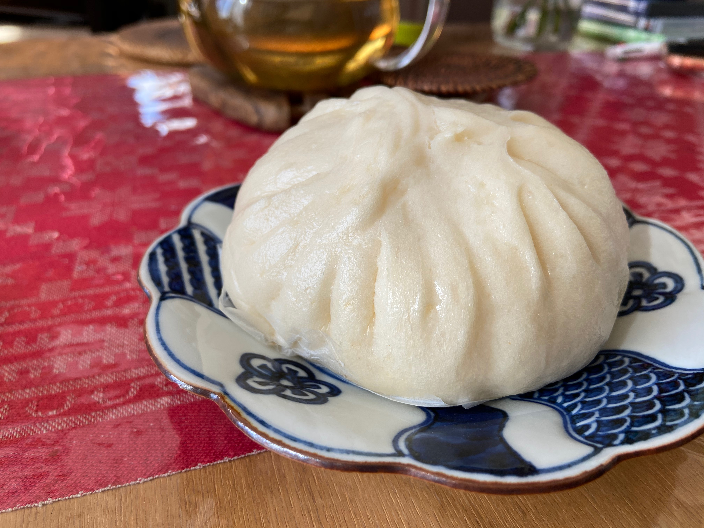
＜写真＞手作りのブサカワな部分は、キューピーちゃんの頭の先っぽような部分でわかる

中華街でたくさん売られている機械製造の肉まん、味は悪くありません。最新の製造機械を使えば、綺麗な肉まんができます。
製造委託して機械を使ってコストを下げ、その分材料費に突っ込むのも一つの方法です。


しかし、なぜ今でも手作りなのか？先年に広東華僑のふるさとの一つ、孫文の故郷で有名な中山市博物館を訪れ展示を見たときにその理由がわかりました。

100年ほど前に日本に渡来してきた華僑の先祖たちは、中国貿易の商館にやとわれてくる高給取りコックたちでした。
どのくらい高給取りかというと、一番の高給取りは買弁とよばれた人たち。いまで言えば一流商社のエリート社員や投資銀行勤務の数千万円の高給取りのような存在だったはずです。

そして2番めに給料が高かったのはなんと料理人でした。長崎・神戸・横浜の港町にやってきたのは高給で雇われた超一流の腕利きコックたち。
そんな先祖から受け継いだ伝統と気概を大切にしている、包むところも手作りの店を紹介したいと思います。もちろんランチも美味しいので、ランチをいただいてからおみやげという趣向です。


では、後編おまたせしました。後編では、中華圏各地方のエッセンスをもった肉まんたちを紹介。北から順番に行きましょう。


## 北京代表　孫文ゆかりの「華都飯店」

まずは、中華街でもひときわ陰の薄い北京から。北京料理を名乗る店は多いのですが、実際に北京の在住経験者を唸らせる店はほとんど無いのです。

こちら華都飯店は、メニュー自体はやはり広東の影響が強いものの、月餅グランプリでも北京で働いていた点心職人に「北京で従業員に配られるものと同じ味」と褒めているのか貶しているのかわからない評価で唸らせた実力派（？）
その肉まんも、北京の包子の風格のある再現性の高いものでした。ちなみに北京より美味しいです。

関帝廟通り　横浜中華学校の横にある大きなお店、華都飯店。この店は面白い歴史ポイントでもあります。

今の中華街、昔の外国人居留地である山下町は孫文が挙兵に失敗し、日本に亡命して住んで革命根拠地にしていた場所。店の上には「中山記念堂」の看板がかかっています。（非公開資料館）
派手派手しい中華街で、この一角だけ落ち着いた雰囲気があります。

こちらの店は担々麺が有名。中華街にもどった喧噪もこちらは一気におちつくので、ランチにおすすめです、。


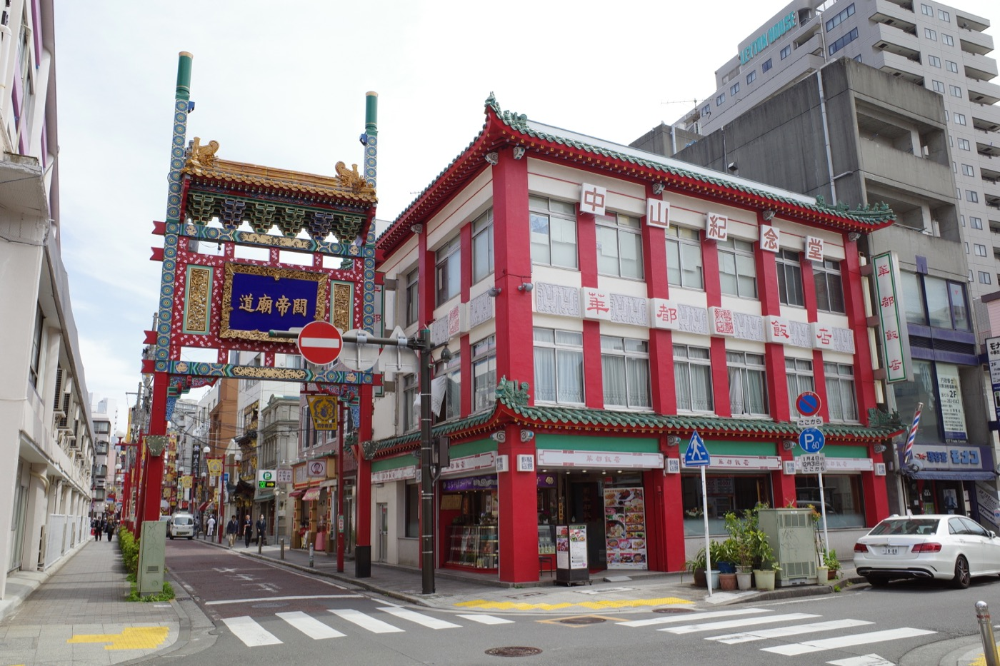
＜写真＞昔ながらの中華街の高級店イメージそのままのお店。三階には孫文の「中山記念堂」の看板

こちらの料理部門は北京料理といいながら食事レポート写真で見かけるメニューは広東系が多く、一人で入っても真価はわからないと思ってノーチェックでした。
横浜の名士が出入りするお店と聞いていますので一度入ってみたいものの、実力を発揮される中華宴会の人数を集めるのが、とくに北京料理となると宴会幹事ベテランの筆者でもなかなか難しいのです。

ところが肉まんを戴いたときに、なるほどこれは北京だと納得することとなりました。

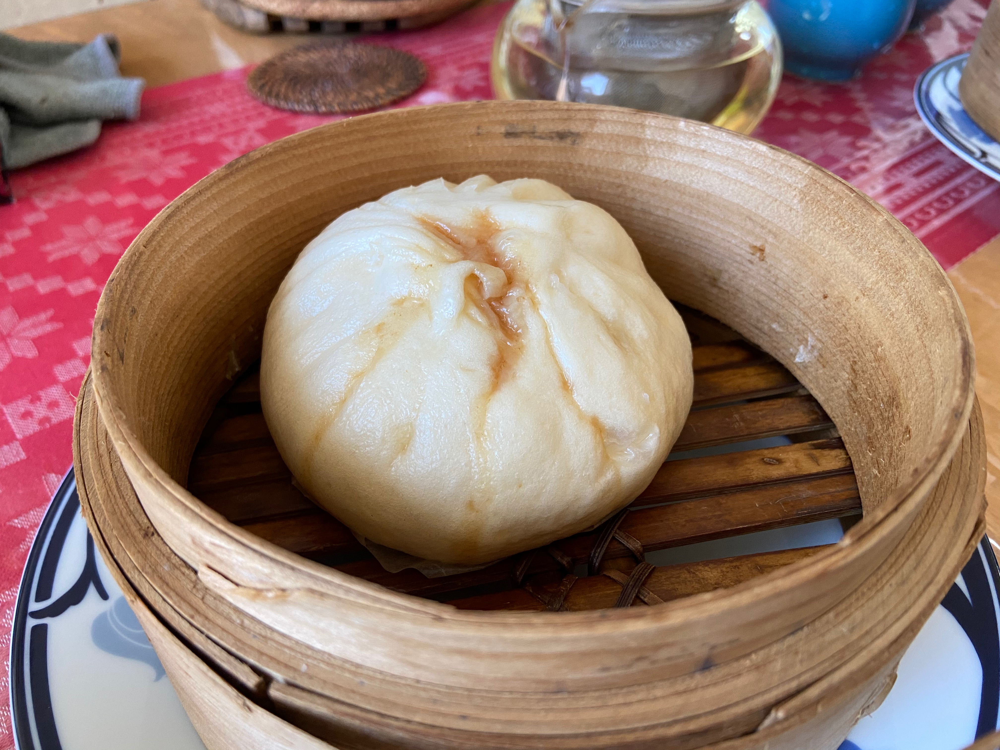
＜写真＞旨味の肉汁が外側まで染み出した、少し不格好で質実剛健なビジュアル

多すぎて滲み出た醤油と肉汁が、生地を茶色くしているあたりが手作り感満載です。
これは日本だと不良品としてはじかれてしまうレベルですが、これが肉汁たっぷりのおいしさの証。北京で食べてたものも茶色くなっていて、こんなビジュアルでした。

てっぺんのねじれも一個一個違って、手でひねったんだなと思わせるビジュアル。
日本人だったらこうしないよね、と妙に納得してしまう、とっても中国らしい質実剛健な作りです。

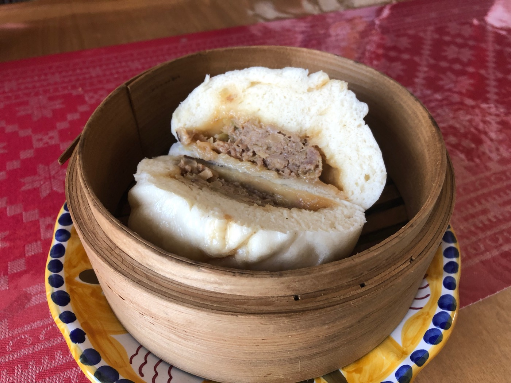
＜写真＞そのビジュアルに肉汁を感じる肉まん


がぶっといってびっくりしました。あ、これは北京で朝食に食べてた味にかなり近い味だと。香味野菜がピシッと強めに立っている気がします。食べてわかる範囲で中身は肉としいたけ、葱の強めの香味も入っています。
ふわっと上がる力強い香り。私は路上で歩きながら食事でしたが、遅刻してきた上に教室で肉まんを食べてた華僑の留学生がいて、教室はこんな匂いがしていました。


そして筆者が北京を感じるニュアンスは、醤油や調味料の味が北方のものだからでしょうか？間をおいて二回食べましたが、やはり印象は変わらず。ただしく中国の北の方の味がします。

他の広東系の肉まんとは違った風味で、北京の朝の寒空の下の肉まん屋台を思い出します。
ああ、ここは北京料理屋なんだと納得しました。いつも中華ばっかり食べてるとよく言われる筆者でさえも日本で食べる北京料理屋で本物の北京を感じたのは、実は非常に少ない経験です。

凍えるような北京の零下の朝に道路でかぶりついた肉まんの記憶がよみがえります。でも、こちらの肉まんは筆者が北京で食べていたものより材料も作りも味わいも100倍上等です。


- 味の系統: 醤油　香味野菜の香り系
- 特徴: 休日の朝食向け　ただし強めの匂いにはご注意
- 合わせたい飲み物　個人的には薄いしぼりたて豆乳　日本のラガービールも合うはず


## 上海代表　上海料理の名店「大三元酒家」

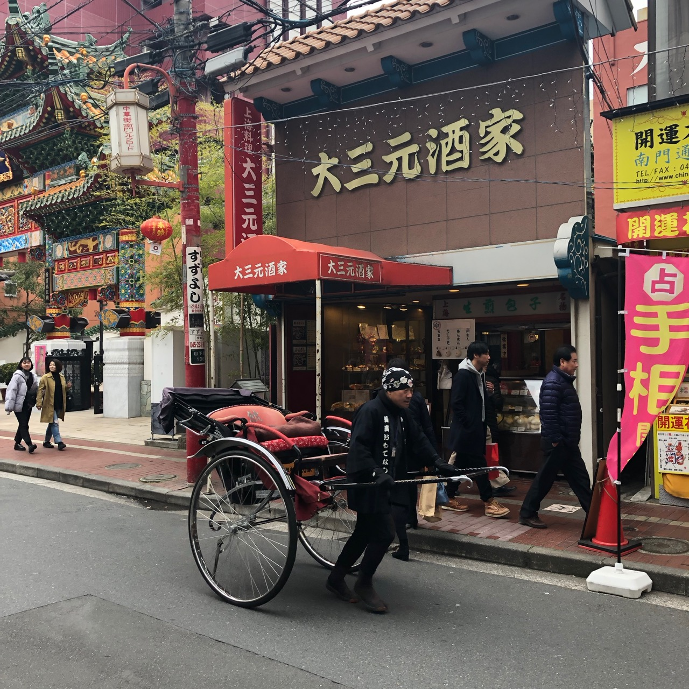

筆者の家人が上海に長く住んでいたので、ときたま上海料理を所望されます。媽祖廟横の上海料理屋　大三元酒家はたまに行く店の一つ。
料理は上海風でありながら横浜らしく広東の影響を感じる横浜中華です。そしてレギュラーメニューに田鶏（カエル）があるあたりに、観光客に媚びない店の本気を感じます。

こちらはなつかしく穏やかな上海料理が美味しい。池袋や新橋の現代の上海ではなく、実に古くさい味。
逆にそれが郷愁を誘い食べて良し居心地は良し。そして店先に並ぶ手作りまんじゅうやちまきが、食後のお土産に手頃で良いのです。


＜写真＞大三元とは縁起の良い名前。噂では初代が麻雀で勝ち取ったお店とか。

この肉まん、表面の部分が景色があっていいですね。無理にひだをつくらずになんとも優しい表情をしています。


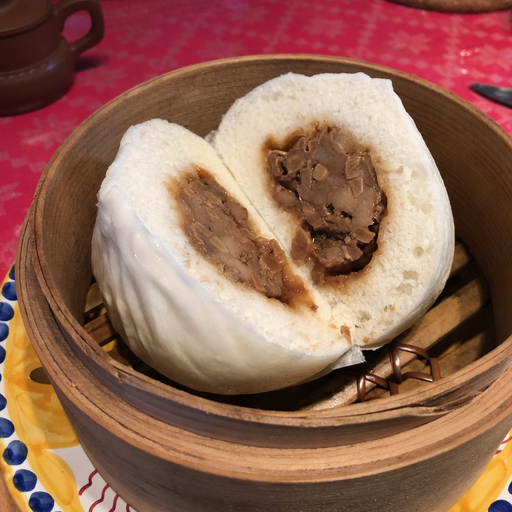

＜写真＞ぎゅっとしていてどさっと固まった餡

中は醤油味の餡がどっさりはいっています。タケノコとひき肉が実にいい味をだしていて、餡が舌の上でころころと転がるのです。
味は家人に言わせれば、この焦点のぼやけた感じが上海だということ。筆者にも塩分控えめな感じが好印象です。


上海系らしく少し甘く醤油味が効いた色濃い目の味は、筆者からすると朝に食べる肉まんとしては、なぜこれと一緒にビールが飲めないか画竜点睛を欠く、いささかの不満を感じます。


＜写真＞綺麗に記事が割れたチャーシューまん

もう一個、チャーシューまんを買ってきたので、こちらも試してみました。広東は食紅をつかったチャーシューですが、上海は醤油の茶色です。

甘みは肉まん以上にかなり強く、それ以上に思い出すのは、たしか上海の福州路にある「老正興菜館」で食べた「草頭圏子」の味です。

上海料理といえば、醤油味で甘いのがごちそう。上海料理で有名所だと豚スネの醤油煮やアヒルの醤油煮などがありますが、この肉まんも同様のニュアンスを持っています。

こんな古めかしいごちそう系の肉まんは、休日の昼ごはんにビールと一緒に、濃い味を洗い流しながら戴くのが正しいのではないかと思います。ぜひとも金曜か土曜に中華街に行き、週末のランチビールのお供にしていただきたいと思います。


- 味の系統: 醤油ひき肉　一昔前のごちそう系
- 特徴: すこしダサめの餡が上海の旅の思い出を誘う、ごろごろ肉系
- 合わせたい飲み物: アルコール度の薄いさっぱり中国ビール！もしくは緑茶


## 台湾代表　懐かしのあの肉まんの味　「台湾美食」（茂園食品）の肉まん

横浜中華街は広東・福建・上海の人たちが多いのですが、台湾系の人も多く住んでいます。台湾料理は中華街でなくても美味しい店が多いので紹介しなかったのですが、コロナの中で新規開店した台湾美食（茂園食品）は街の話題になりました。

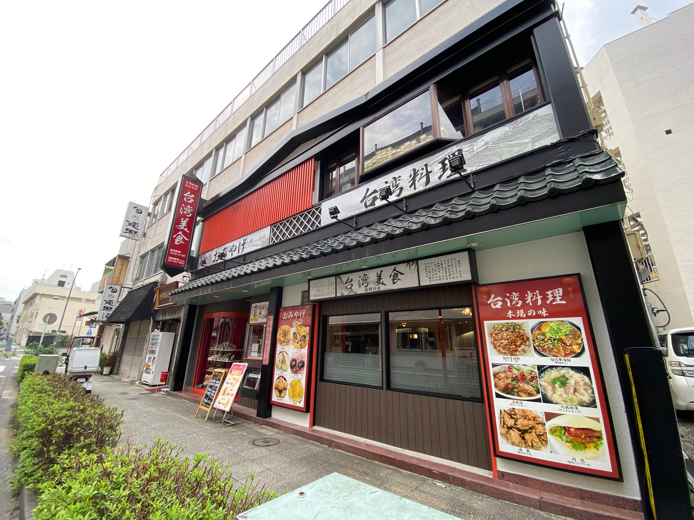

＜写真＞逆風の中で開店した「台湾美食」　いついっても必ずお客さんがいて根強い人気

この店の肉まんを初めて手に入れたのは、おととしのこと。中華街のはずれ、萬来亭の小さな製麺所のガラスケースで見つけたのです。いかにも手作り。

ところが店内に製麺設備は見えても、肉まん製造に必要な蒸し器が見えないので、どこで作ってるの？と気になって聞いてみました。
気さくなお兄ちゃんが答えるには、「ここでは作ってなくて親戚にお願いしている」ということ。

「作ってる親戚はあの有名な＊＊＊の点心師だったから、味は間違いないよ！それも昔のころの手作り時代の味！」というセールトークに期待大です、


＜写真＞　頭の部分がちょっと乱れてるのが手作りの証。ここをみればわかります。

翌朝、さて蒸し器で蒸すぞと思ってラベルを見たら、あれっ、これは先日、茂園の伊勢佐木町店で見かけたものではないですか！
茂園の伊勢佐木町モール売店は2018年開店。工房は中華街のおとなり翁町にあります。そして2020年には本店（工房）から販売を中華街に移転しレストランに。

工房で製造されている方々に伺ったところ、ご出身は台北だそうですので、台湾北部の味ということになります。


＜写真＞台湾美食　

期待してセイロで蒸してみると、店のお兄ちゃんの言う通り、懐かしさを感じるしっかりとした醤油味。


お兄ちゃんがこっそり教えてくれた有名店の味とベースを同じくするニュアンスがありますが、干し椎茸の味が強めに出ていて少しだけ良い意味での古さを感じます。
そして塩分も控えめ。塩分少ないほうが中国人好みです。お兄ちゃんがこっちのほうが美味しいっていうんだから、これが台湾出身者が美味いと思う味なんでしょう。
日本人だと塩分強いのを好みますが、あえて商売を優先して日本人に媚びないあたりが中華街の裏通りらしい。

醤油味とクワイのシャキシャキ食感、しいたけの旨味ががつんと来るので、ゆっくり在宅勤務の朝や、晴れた休日の昼ビールのお供にしたい、そんな特別なお昼に合う肉まんです。


「そうそう、これが私のイメージする肉まんの味だよ」と神戸南京町の味で育った家人が大きな声で言いました。
どうやら我々の評価基準に間違いないですね。ちょっと自信がつきました。

- 味の系統: 醤油肉椎茸　一昔前のごちそう系
- 特徴: これぞ日本人が連想する肉まんらしい肉まん。垢抜けない味だけれど、それが時代を超えた魅力。
- 合わせたい飲み物: ビール！


## 広東代表　中華街大通りのエアポケット「楽園」

中華街の肉まんは、広東スタイルが中心。そんな中で筆者が選ぶとすれば、前編でご紹介した「大珍キッチン」(https://daichin.kitchen)や翠香園・紅棉などお菓子屋系の肉まんが好み。

広東料理の特徴は「清淡」（あっさりさわやか）。どうしても濃い味競争になってしまう外食産業ですが、あえて広東らしい肉まんを選べば、前編の店たちとともにこちらを挙げます。

さて、楽園という店はどんなに中華街が混んでいる時でも、いつも落ち着きのある店。

中華街の門をくぐれば、いつもそこにある「楽園」　でもお店の方々の高齢化で、いつまであるかわからない、いま訪れるべき中華街の本物の楽園なのです。
ちょっと一見の客には入りにくさを感じるかもしれませんが、勇気を出して入ると数メートル先の中華街大通りの喧騒が幻のように覚える癒し系オールド中華の世界が広がっています。

まわりのお客さんたちは美味しい中華を食べ続けて経験値の高そうなベテランばかりです。


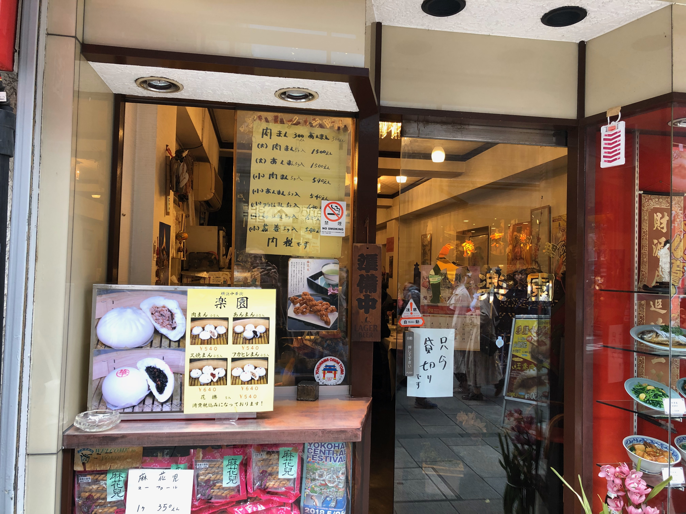
＜写真＞　この店にさらりと入れるようになったらかっこいい、そんな古いお店


こんな素敵な店のドアを開けたのですから、せっかくなのでランチメニューでも、夜なら一品料理をなに食べてから肉まんを買いましょう。

メニューを見てもオーセンティックな料理たちを想像するのはいささか難しいとおもうので、お店のお姐さんに相談してみましょう。
筆者のオススメは、二人で入ったら、筆者が中華街の至宝と思っている巻揚にモツ系のお皿を一品、そして瓶ビールです。


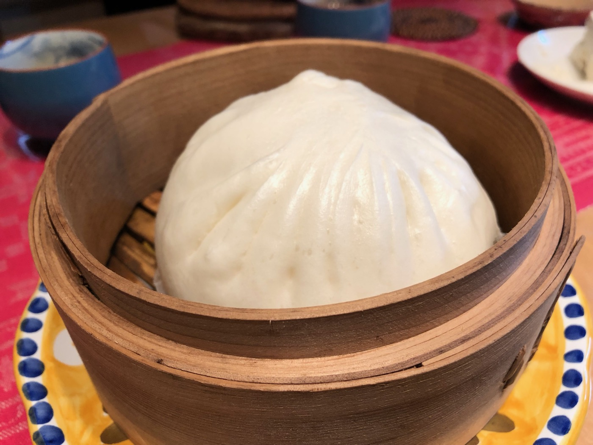

＜写真＞楽園の肉まん　表面の輝きが美しい


楽園の肉まんは華正樓のそれに迫る大サイズで、一個で朝食大満足のボリュームです。
我が家のセイロでは積み重ねするとてっぺんがぶつかってしまい、すこし工夫が必要なほど。

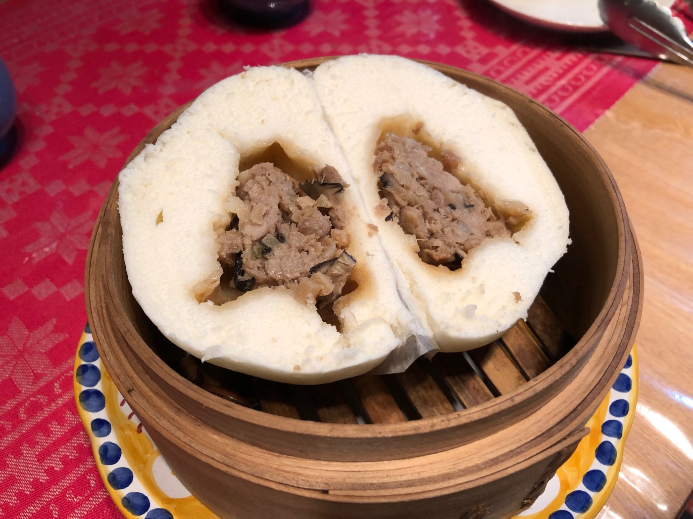
＜写真＞がつっと分厚い皮、少し偏った餡の景色が手作り感を感じます。

醤油味ベースですが、大きさの予想に反して上品な味付けです。味が濃いのに慣れている人には少し物足りなさを感じるかもしれません。
そのとがった特徴の無さが、まさしく長く愛される味なのです。食べているとたまに歯にあたるしいたけから、じゅわっと深い味わいと香りが立ち上ります。

この一口ごとの印象の違いが、味に立体感をあたえています。食べ手側の体調のぶれもあるので、何度か食べないと上品な味に仕立てている肉まんの真価はわからないかもしれません。

口に濃い味が残ることもなく、食べ終わったら仕事にでかけるのにぴったりの朝の肉まんです。

- 味の系統: しいたけの旨味が光るタケノコ醤油系
- 特徴: 朝食向け　薄味でしいたけをかみ当てた瞬間に幸せな風味が爆発
- 合わせたい飲み物: プーアル茶・ウーロン茶・焙じ茶など


## まとめ

中華街にこれほど多くの手作り肉まんがあるとは、ほとんどの人が見落としていると思います。

中華街の古い店はしっかりした客筋がついているので、こういう小さな商売でもリピーターの購買で成り立つのでしょう。
逆に観光客は隠れた宝石を見つけることができず、大通りの商売色の強い店で食べてしまって、期待値との違いにちょっとがっかりして帰るのだと思います。

味の好みは人それぞれ、年齢や運動量・体調によっても美味しいと感じるものは変わるので、中華街に行ったら違った店で二・三種類買い込んで、自分の好みをさがしてみましょう。

そしてぜひ、マイベスト肉まんを探し出してみてください。


## 今回紹介したお店


```
華都飯店
住所：横浜市中区山下町166
TEL：045-641-0335
営業時間：10:30～21:00
水曜定休
```

```
大三元酒家
住所：横浜市中区山下町136（MAP）
TEL：045-641-4402
営業時間：11:00～22:00
不定休
```

```
茂園 台湾美食
住所：横浜市中区山下町220（MAP）
TEL：045-663-0901
営業時間：11:00〜21:00
不定休

工場直売　茂園(モエン)2号店
住所：横浜市中区伊勢佐木町3-106（MAP）イセザキモール
TEL：045-242-6525
営業時間：10:00～19:00
https://www.moensyokuhin.com/
```

```
楽園
住所：横浜市中区山下町154
TEL：045-641-9308
営業時間：11:00～21:00　平日は中休みあり
火曜定休
```


